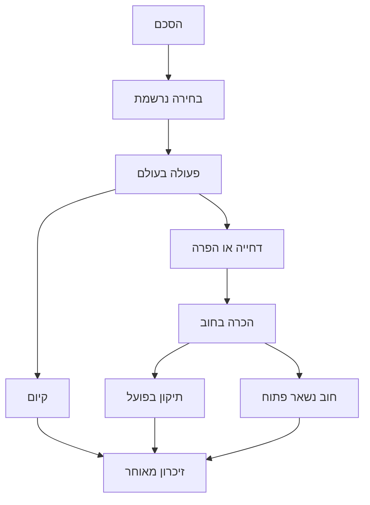

# LIFE — תסריט אוניברסלי 2: מסלולים, דילמות והטמעה

תאריך: 7 באוקטובר 2026. בסיס קוד: `6d97d38149c9d121d1f60fb630c995a97cdf40ab`.

זהו תסריט כתוב ונתוני סיפור שמחוברים למנוע הקיים: **18 פרקים, 54 סצנות, 167 בחירות כתובות**, בעברית ובאנגלית. לכל סצנה יש פתיחה, תשובות, פעולה, תנאים ותוצאה. החבילה כוללת מקור, מחולל פרקי משחק, בדיקות ו־patch. ההטמעה מקומית; היא לא נפרסה באתר.

## הסיפור שאנחנו מספרים

**פעם אבא החזיק את הכרטיסים. הפעם הם בכיס שלי.**

הכדורגל הוא קצב החיים: רדיו בחדר, חולצה שרוצים, חבר שמחכה, משמרת שלא מסתדרת, אדם שרוצה מקום בשבת. לא כל פרק הוא ניצחון או הפסד. האוהד מתבגר כשהוא מסוגל להחזיק הבטחה, לקבל סירוב ולתת לאחר לכתוב זיכרון משלו.

מהכיוון של LIFE בהפועל נשמרים עקרונות החוויה: סיפור דרך חדרים וחפצים, משפחה ודמויות חוזרות, פעולה קטנה לפני הישג גדול, וקופסת זיכרונות. המקומיות ההיסטורית אינה מועתקת למועדון אחר. השמות, הלילות והתוצאות שייכים לארכיון המאושר של המועדון הנבחר.

שלוש מערכות: גילאי 6–12 — איך אהדה נעשית שלי; 16–30 — איך היא חולקת את החיים עם אנשים אחרים; 35–46 — מה אני עושה עם מה שקיבלתי. אלה גילי הגיבור, לא שנות לוח שנה מומצאות. לילות מאומתים יכולים להתווסף ביניהם; הסיום זז קדימה אם הארכיון דורש גיל מאוחר יותר.

## מבנה ההסתעפות

המבנה מתפצל בתוך הפרק ומתכנס לפעולה הבאה. הזיכרון ממשיך אחריו. כך אין צורך לכתוב מאות פרקים כפולים כדי להחזיר חוב, לשנות את הרכב הנסיעה או לתת לתוצאה בבית משמעות מלאה.

| ציר | פתיחה | השפעה חוזרת | מה אינו נכפה |
|---|---|---|---|
| משפחה ואמון | S16–S18: סיפור אמיתי או הסתרה | S19: שיחה אחרת אחרי ההסתרה | עצמאות אינה מחייבת נטישה |
| אדם מהקבוצה היריבה | S11/S14: קשר פתוח | S19: אפשרות לטרמפ מאדם שכבר הכרנו | לא יוצרים חבר יש מאין |
| חוב טרמפ | S19/S21: עזרה והבטחה | S40–S41: הכרה ואז החזרה בפועל | תודה אינה פירעון אוטומטי |
| עבודה | S22–S23: הסכם וביצוע | הכנסה; שיחה אחרת; תיקון משמרת | בחירה לעבוד אינה כבר עבודה |
| קשר אישי | S25–S27: רצון, הסכמה וערב ממשי | S40–S41: תיקון ערב שהופר | זוגיות והורות אינן ברירת מחדל חובה |
| מרחק | S34: אני נוסע / חבר נוסע / נשארים | S35–S36: הקשר של שיחת המסך | חו״ל אינו תנאי לסיפור |
| אדם חדש | S43–S45: ילד / חבר / סירוב | S46: הרכב שלושה; S54: הצעת קופסה | ילד אינו חייב לאהוד כמוני |
| כסף | שכר בפעולות S23/S39/S41 | S47: ארוך 40 / מקומי 20 / חינמי | כסף שלילי ונסיעה שלא שולמה |
| הכנת נסיעה | S46–S48: אנשים, כסף, דרך | S49–S51: התאמה ותוצאה | תוכנית מושלמת אינה תוצאה |
| מורשת | החפצים והמעשים שנשמרו | S52–S54: זיכרון וסוף | אין ציון מוסרי כולל |

## קריאה ובימוי

כל פרק מתחיל בפרט קטן ובמשפט שאפשר לומר בבית. אין נאום זהות בכל בחירה. נותנים להומור להגיע מהתיק, הסנדוויץ׳, השעון והאדם שמעמיד פנים שרק עבר. הרגע הרגשי מגיע אחרי פעולה, במשפט קצר. לא מניחים שניצחון של הקבוצה פותר חוב אישי.

המסלול המשפחתי הראשי כתוב במלואו. המסלולים בלי הורות, עם אדם חדש, עם חבר שנסע ובתקציב חינמי נמצאים בקוד. גרסאות ילדות שבהן ההיכרות הראשונה היא דרך חבר או לבד עדיין אינן ממומשות: פתיחת הסיפור הנוכחית היא עם אבא. לא מציגים אותן ככיסוי מלא רק מפני שהוזכרו בטיוטה קודמת.

## חוזה הפעולה

השחקן בוחר כוונה, מקבל תשובה, ואז ניגש למוקד הפעולה בחדר. רק השלמת הפעולה קובעת את דגלי התוצאה, הכסף והקשר. ניתן לסגור דיאלוג ולחזור. בחירה שכבר נבחרה אינה מאופסת בגלל סגירת תשובתה; אפשר להמשיך לפעולה. פעולה שהושלמה אינה מעניקה שוב שכר.

משחקוני הרדיו, הספירה, הנשיאה והקצב משתמשים במנגנון הקיים. הם אינם מערכות כישלון חדשות: אין טענה שהדיוק בהם קובע סוף אחר. ההסתעפות נובעת מבחירה מפורשת ומביצוע שנרשם, ולא מתוצאה מומצאת של משחקון. גם אפס אנרגיה אינו חוסם את התסריט החדש.

## התסריט המלא

בכל בחירה: השם הוא מה שהשחקן רואה; תנאי הפתיחה הוא השער; התשובה נאמרת לפני הפעולה; תוצאת המצב נרשמת לאחריה. תיאור פעולה משותף מופיע פעם אחת בסצנה. כשיש פעולה ייחודית למסלול היא כתובה גם תחת הבחירה. מצבים פנימיים מפורטים כדי לאפשר הטמעה וביקורת, ולא מיועדים להופיע לשחקן כשמות משתנים.

## 1. הצבעים — גיל 6, מערכה 1

מזהה: `c1-colours`. מזכרת: **הצעיף הראשון**.

אבא הביט בשעון ארבע פעמים. אתה יודע לספור עד ארבע.

**מהלך דרמטי ובימוי:** הדמות בת שש. הכדורגל עוד אינו טבלה אלא שעה שבה אבא משתנה. מתחילים בבדיחת הסוללות, עוברים לתפקיד קטן ולבסוף נותנים לשחקן לבחור מה הוא זוכר. אין מבחן ידע ואין בחירה שמוכיחה אהדה טובה יותר.

### S01: השעה שלו

מקום: `room`. משימה: **להביא רדיו וסוללות**.

> **אני:** למה אנחנו מחכים?
>
> **אבא:** לאלה שלנו. תביא את הרדיו.
>
> **אמא:** וגם סוללות. אבא חושב שהן גדלות בפנים.

**הפעולה בעולם — משחקון `tune`:**

> **תיאור:** אתה פותח מגירה, מוצא סוללות ומביא את שניהם.
>
> **אבא:** אתה אחראי על הקול. תפקיד רציני.

#### בחירה `ask`: לשאול מה הופך אותם לשלנו

**פתיחה:** פתוח תמיד.

> **אבא:** תישאר לידי. נגלה ביחד.

**אחרי השלמת הפעולה:** קובע `life:first:question` = `asked`. בנוסף נשמר `life:decision:S01` = `ask`.

**המשך:** נשמר בזיכרון ובסיום המקומי; אינו פותח כרגע שער נוסף בפרק עתידי.

#### בחירה `joke`: לשאול אם הם בכלל מכירים אותנו

**פתיחה:** פתוח תמיד.

> **אבא:** עדיין לא. תהיה מספיק חזק.

**אחרי השלמת הפעולה:** קובע `life:first:question` = `joked`. בנוסף נשמר `life:decision:S01` = `joke`.

**המשך:** נשמר בזיכרון ובסיום המקומי; אינו פותח כרגע שער נוסף בפרק עתידי.

#### בחירה `listen`: לשבת לידו ולהקשיב

**פתיחה:** פתוח תמיד.

> **אמא:** הוא שומר לך את המקום כל הבוקר.

**אחרי השלמת הפעולה:** קובע `life:first:question` = `quiet`. בנוסף נשמר `life:decision:S01` = `listen`.

**המשך:** נשמר בזיכרון ובסיום המקומי; אינו פותח כרגע שער נוסף בפרק עתידי.

**יציאה מהסצנה:** לאחר ביצוע עוברים ל־S02, הקופסה מעליך.

### S02: הקופסה מעליך

מקום: `bedroom`. משימה: **לפתוח את הקופסה ולקחת צעיף**.

> **אבא:** המדף העליון. הקופסה עכשיו שלך.
>
> **אני:** הקופסה או מה שיש בפנים?
>
> **אבא:** לא מפרידים את העסקה.

**הפעולה בעולם — משחקון `carry`:**

> **תיאור:** אתה מוריד את קופסת הנעליים. הצעיף ארוך יותר ממך.

#### בחירה `wear`: לעטוף את עצמך

**פתיחה:** פתוח תמיד.

> **אבא:** תשאיר מקום לנשום. נצטרך את זה.

**אחרי השלמת הפעולה:** קובע `life:scarf:way` = `worn`. בנוסף נשמר `life:decision:S02` = `wear`.

**המשך:** נשמר בזיכרון ובסיום המקומי; אינו פותח כרגע שער נוסף בפרק עתידי.

#### בחירה `share`: לתת לאבא קצה אחד

**פתיחה:** פתוח תמיד.

> **אבא:** זאת דרך אחת לשבת ביחד.

**אחרי השלמת הפעולה:** קובע `life:scarf:way` = `shared`; קשר עם אבא: +5. בנוסף נשמר `life:decision:S02` = `share`.

**המשך:** נשמר בזיכרון ובסיום המקומי; אינו פותח כרגע שער נוסף בפרק עתידי.

#### בחירה `carry`: לקחת אותו ביד

**פתיחה:** פתוח תמיד.

> **אמא:** אף אחד לא אמר שאתה צריך להפוך לקולב.

**אחרי השלמת הפעולה:** קובע `life:scarf:way` = `carried`. בנוסף נשמר `life:decision:S02` = `carry`.

**המשך:** נשמר בזיכרון ובסיום המקומי; אינו פותח כרגע שער נוסף בפרק עתידי.

**יציאה מהסצנה:** לאחר ביצוע עוברים ל־S03, הרעש הראשון.

### S03: הרעש הראשון

מקום: `room`. משימה: **להישאר ליד אבא עד שהחדר נרגע**.

> **תיאור:** הרדיו פתאום לא יכול להכיל את כל הרעש. אבא קם לפני שאתה מבין.
>
> **אמא:** השכנים!
>
> **אבא:** גם להם יש רדיו.

**הפעולה בעולם — משחקון `clap`:**

> **תיאור:** הוא מרים אותך. התקרה מתקרבת והרצפה הופכת לזיכרון.

#### בחירה `face`: להסתכל על הפנים שלו

**פתיחה:** פתוח תמיד.

> **תיאור:** לרגע אתה רואה את הילד שהוא היה.

**אחרי השלמת הפעולה:** קובע `life:first:memory` = `face`. בנוסף נשמר `life:decision:S03` = `face`.

**המשך:** נקרא בהמשך ב־S08.

#### בחירה `noise`: לקפוץ ולהצטרף לרעש

**פתיחה:** פתוח תמיד.

> **אבא:** טוב. הבנת את העוצמה.

**אחרי השלמת הפעולה:** קובע `life:first:memory` = `noise`. בנוסף נשמר `life:decision:S03` = `noise`.

**המשך:** נקרא בהמשך ב־S08.

#### בחירה `scarf`: להרים את הצעיף ביניכם

**פתיחה:** פתוח תמיד.

> **תיאור:** שתי ידיים לכל אחד. משהו שייך לשניכם.

**אחרי השלמת הפעולה:** קובע `life:first:memory` = `scarf`. בנוסף נשמר `life:decision:S03` = `scarf`.

**המשך:** נקרא בהמשך ב־S08.

**יציאה מהסצנה:** לאחר ביצוע נשמרת המזכרת והפרק מסתיים בגרסה של הבחירה האחרונה.

**שורת המזכרת:** זה התחיל בחדר, לא בטבלה.

## 2. החולצה — גיל 8, מערכה 1

מזהה: `c2-shirt`. מזכרת: **החולצה הראשונה**.

החולצה בחלון תפסה לך את כל השבוע.

**מהלך דרמטי ובימוי:** החולצה היא חפץ שרוצים, לא פרס סטטיסטי. מציבים חוסר קטן, נותנים שלוש דרכים לגיטימיות להשלים אותו, ומאפשרים גם ללבוש בשקט. מסלול היד השנייה חוזר בסיום כפרט בחפץ.

### S04: הקופסה שמרשרשת

מקום: `bedroom`. משימה: **לספור מטבעות ולקחת את הקופסה**.

> **אני:** נראה לי שיש לי מספיק.
>
> **אמא:** לחשוב זה בחינם. תספור.
>
> **תיאור:** יש ארבע עשרה מטבעות. ספרת אותם בשלוש שיטות.

**הפעולה בעולם — משחקון `count`:**

> **תיאור:** אתה סופר פעם אחת כמו שצריך ושם את המטבעות בכיס.

#### בחירה `alone`: לשמור את התוכנית לעצמך

**פתיחה:** פתוח תמיד.

> **אמא:** אני מכירה את הפרצוף הזה. תלבש משהו שאפשר ללכלך.

**אחרי השלמת הפעולה:** קובע `life:shirt:asked` = `alone`. בנוסף נשמר `life:decision:S04` = `alone`.

**המשך:** נשמר בזיכרון ובסיום המקומי; אינו פותח כרגע שער נוסף בפרק עתידי.

#### בחירה `ask`: לספר לאמא מה אתה רוצה

**פתיחה:** פתוח תמיד.

> **אמא:** קודם תגיד מחיר. לרצות זה החלק הקל.

**אחרי השלמת הפעולה:** קובע `life:shirt:asked` = `mum`. בנוסף נשמר `life:decision:S04` = `ask`.

**המשך:** נשמר בזיכרון ובסיום המקומי; אינו פותח כרגע שער נוסף בפרק עתידי.

#### בחירה `dad`: לשאול את אבא על הישנה שלו

**פתיחה:** פתוח תמיד.

> **אבא:** היא לא תמיד הייתה ישנה. גם אני לא.

**אחרי השלמת הפעולה:** קובע `life:shirt:asked` = `dad`. בנוסף נשמר `life:decision:S04` = `dad`.

**המשך:** נשמר בזיכרון ובסיום המקומי; אינו פותח כרגע שער נוסף בפרק עתידי.

**יציאה מהסצנה:** לאחר ביצוע עוברים ל־S05, חסרים שישה.

### S05: חסרים שישה

מקום: `street`. משימה: **לבצע את הדרך שבחרת להשגת החולצה**.

> **kiosk:** עשרים. כולל שרוולים.
>
> **אני:** ארבע עשרה. בלי שרוולים?
>
> **kiosk:** לא גוזרים את ההיסטוריה לפי התקציב שלך.

**הפעולה בעולם — משחקון `carry`:**

> **תיאור:** אתה מסיים את הסידור, מקבל עזרה או נושא את הישנה הביתה. אף אחד לא קורא לה חולצה פחות טובה.

#### בחירה `earned`: להרוויח את ההפרש עם הארגזים

**פתיחה:** פתוח תמיד.

> **kiosk:** קודם ארגזים. אחר כך חולצה. תשמור על הסדר.

**אחרי השלמת הפעולה:** קובע `life:shirt:origin` = `earned`. בנוסף נשמר `life:decision:S05` = `earned`.

**המשך:** נקרא בהמשך ב־S52.

#### בחירה `gift`: לקבל את העזרה השקטה של אמא

**פתיחה:** פתוח תמיד.

> **אמא:** תספור שוב. הפעם לאט.

**אחרי השלמת הפעולה:** קובע `life:shirt:origin` = `gift`. בנוסף נשמר `life:decision:S05` = `gift`.

**המשך:** נקרא בהמשך ב־S52.

#### בחירה `handed`: לקחת את הישנה של אבא

**פתיחה:** פתוח תמיד.

> **אבא:** השרוולים מכירים את הדרך חזרה. תקפל אותם.

**אחרי השלמת הפעולה:** קובע `life:shirt:origin` = `handed`; קשר עם אבא: +4. בנוסף נשמר `life:decision:S05` = `handed`.

**המשך:** נקרא בהמשך ב־S52.

**יציאה מהסצנה:** לאחר ביצוע עוברים ל־S06, גדולה מדי.

### S06: גדולה מדי

מקום: `room`. משימה: **ללבוש אותה ולצאת**.

> **החבר / האדם הקרוב:** היא ענקית.
>
> **אני:** אני גדל.
>
> **החבר / האדם הקרוב:** אז מהר. חסר שוער.

**הפעולה בעולם:**

> **תיאור:** אתה מקפל שרוולים. הרחוב רואה אותה לפני שהוא רואה אותך.

#### בחירה `proud`: לצאת ראשון

**פתיחה:** פתוח תמיד.

> **תיאור:** אתה זוכר גם את ההליכה, לא רק את החולצה.

**אחרי השלמת הפעולה:** קובע `life:shirt:show` = `proud`. בנוסף נשמר `life:decision:S06` = `proud`.

**המשך:** נשמר בזיכרון ובסיום המקומי; אינו פותח כרגע שער נוסף בפרק עתידי.

#### בחירה `together`: לבקש מהחבר לצאת איתך

**פתיחה:** פתוח תמיד.

> **החבר / האדם הקרוב:** בכל מקרה באתי. רק רציתי שתבקש.

**אחרי השלמת הפעולה:** קובע `life:shirt:show` = `together`. בנוסף נשמר `life:decision:S06` = `together`.

**המשך:** נשמר בזיכרון ובסיום המקומי; אינו פותח כרגע שער נוסף בפרק עתידי.

#### בחירה `quiet`: ללבוש אותה מתחת למעיל היום

**פתיחה:** פתוח תמיד.

> **אמא:** אין מועד אחרון להראות לכולם.

**אחרי השלמת הפעולה:** קובע `life:shirt:show` = `quiet`. בנוסף נשמר `life:decision:S06` = `quiet`.

**המשך:** נשמר בזיכרון ובסיום המקומי; אינו פותח כרגע שער נוסף בפרק עתידי.

**יציאה מהסצנה:** לאחר ביצוע נשמרת המזכרת והפרק מסתיים בגרסה של הבחירה האחרונה.

**שורת המזכרת:** איך היא הגיעה אליך חשוב כמו הצבע שלה.

## 3. השבת הראשונה — גיל 9, מערכה 1

מזהה: `c3-saturday`. מזכרת: **הכרטיס הקרוע הראשון**.

אבא נוגע שוב ושוב בכיס עם הכרטיסים.

**מהלך דרמטי ובימוי:** הכניסה הראשונה נבנית בחדר, במנהרה וביציע. אבא אינו מספר את ההיסטוריה; הוא בודק כיסים. נותנים זכות לעצור, להחזיק יד או להוביל. שלושת המצבים נשארים רגעים של קרבה.

### S07: אצל מי הכרטיסים?

מקום: `room`. משימה: **לארוז צעיף ולבדוק כרטיסים**.

> **אבא:** מוכן?
>
> **אני:** אני מוכן מאתמול.
>
> **אמא:** אחד מכם בכל זאת צריך לבדוק כרטיסים.

**הפעולה בעולם — משחקון `count`:**

> **תיאור:** אתה מרים את הכרטיסים, סופר שניים ומחזיר.

#### בחירה `me`: להחזיק את הכרטיס שלך

**פתיחה:** פתוח תמיד.

> **אבא:** כיס אחד. תזכור איזה.

**אחרי השלמת הפעולה:** קובע `life:ticket:holder` = `me`. בנוסף נשמר `life:decision:S07` = `me`.

**המשך:** נשמר בזיכרון ובסיום המקומי; אינו פותח כרגע שער נוסף בפרק עתידי.

#### בחירה `dad`: לבקש מאבא לשמור את שניהם

**פתיחה:** פתוח תמיד.

> **אבא:** עשיתי את זה פעם. עדיין בודק.

**אחרי השלמת הפעולה:** קובע `life:ticket:holder` = `dad`. בנוסף נשמר `life:decision:S07` = `dad`.

**המשך:** נשמר בזיכרון ובסיום המקומי; אינו פותח כרגע שער נוסף בפרק עתידי.

#### בחירה `check`: לבדוק יחד ולחלוק את האחריות

**פתיחה:** פתוח תמיד.

> **אמא:** ועדה. עוד לפני ארוחת בוקר.

**אחרי השלמת הפעולה:** קובע `life:ticket:holder` = `both`. בנוסף נשמר `life:decision:S07` = `check`.

**המשך:** נשמר בזיכרון ובסיום המקומי; אינו פותח כרגע שער נוסף בפרק עתידי.

**יציאה מהסצנה:** לאחר ביצוע עוברים ל־S08, אל האור.

### S08: אל האור

מקום: `tunnel`. משימה: **ללכת יחד את הקטע האחרון**.

> **תיאור:** הרעש הופך למקום. אתה נעצר בלי להחליט.
>
> **אבא:** לא ממהרים. הוא עדיין שם.

**חזרה מן העבר — life:first:memory = face:**

> **אבא:** אתה ממשיך להסתכל עליי. תסתכל גם לשם.

**הפעולה בעולם:**

> **תיאור:** אתה עושה צעד. ועוד אחד. המנהרה נפתחת.

#### בחירה `hand`: לקחת את היד שלו

**פתיחה:** פתוח תמיד.

> **אבא:** ככה.

**אחרי השלמת הפעולה:** קובע `life:tunnel:way` = `hand`. בנוסף נשמר `life:decision:S08` = `hand`.

**המשך:** נשמר בזיכרון ובסיום המקומי; אינו פותח כרגע שער נוסף בפרק עתידי.

#### בחירה `lead`: ללכת קצת לפניו

**פתיחה:** פתוח תמיד.

> **אבא:** אני מאחוריך.

**אחרי השלמת הפעולה:** קובע `life:tunnel:way` = `lead`. בנוסף נשמר `life:decision:S08` = `lead`.

**המשך:** נשמר בזיכרון ובסיום המקומי; אינו פותח כרגע שער נוסף בפרק עתידי.

#### בחירה `pause`: לבקש רגע להסתכל

**פתיחה:** פתוח תמיד.

> **אבא:** רעיון טוב. אני שוכח לעשות את זה.

**אחרי השלמת הפעולה:** קובע `life:tunnel:way` = `pause`. בנוסף נשמר `life:decision:S08` = `pause`.

**המשך:** נשמר בזיכרון ובסיום המקומי; אינו פותח כרגע שער נוסף בפרק עתידי.

**יציאה מהסצנה:** לאחר ביצוע עוברים ל־S09, מספיקה שורה אחת.

### S09: מספיקה שורה אחת

מקום: `terrace`. משימה: **להצטרף לקצב בדרך שלך**.

> **האוהד הוותיק:** אתה מכיר את המילים?
>
> **אני:** שורה אחת.
>
> **האוהד הוותיק:** אז כל השאר פה שימושיים.

**הפעולה בעולם — משחקון `clap`:**

> **תיאור:** הידיים נפגשות. אתה מוצא מקום בתוך הקול.

#### בחירה `sang`: לשיר את השורה שלך

**פתיחה:** פתוח תמיד.

> **אבא:** שמעתי אותך.

**אחרי השלמת הפעולה:** קובע `life:sang` = `true`; קובע `life:first:voice` = `sang`. בנוסף נשמר `life:decision:S09` = `sang`.

**המשך:** נשמר בזיכרון ובסיום המקומי; אינו פותח כרגע שער נוסף בפרק עתידי.

#### בחירה `watched`: להסתכל על אבא

**פתיחה:** פתוח תמיד.

> **תיאור:** פעם אחת הוא לא שם לב שמסתכלים עליו.

**אחרי השלמת הפעולה:** קובע `life:first:voice` = `watched`. בנוסף נשמר `life:decision:S09` = `watched`.

**המשך:** נשמר בזיכרון ובסיום המקומי; אינו פותח כרגע שער נוסף בפרק עתידי.

#### בחירה `clapped`: למחוא כפיים וללמוד מילים אחר כך

**פתיחה:** פתוח תמיד.

> **האוהד הוותיק:** בפעם הבאה, שורה שנייה.

**אחרי השלמת הפעולה:** קובע `life:first:voice` = `clapped`. בנוסף נשמר `life:decision:S09` = `clapped`.

**המשך:** נשמר בזיכרון ובסיום המקומי; אינו פותח כרגע שער נוסף בפרק עתידי.

**יציאה מהסצנה:** לאחר ביצוע נשמרת המזכרת והפרק מסתיים בגרסה של הבחירה האחרונה.

**שורת המזכרת:** הדשא היה אמיתי. היד הייתה מוכרת.

## 4. המשבצת החסרה — גיל 10, מערכה 1

מזהה: `c3a-album`. מזכרת: **האלבום**.

תשעים ותשע פנים ומשבצת אחת שמשאירה את האלבום פתוח.

**מהלך דרמטי ובימוי:** האוסף מייצר כלכלה קטנה של החלפות. אין חובה להשלים את האלבום: גם משבצת ריקה יכולה להישמר. הפגישה עם אוהד יריב מכינה קשר אנושי שיכול לפתוח טרמפ בפרק מאוחר.

### S10: הכפולים

מקום: `bedroom`. משימה: **לסדר כפולים להחלפה**.

> **החבר / האדם הקרוב:** יש לך את השוער הזה פעמיים.
>
> **אני:** שלוש. הולך לו יותר טוב מלקפטן.

**הפעולה בעולם — משחקון `count`:**

> **תיאור:** אתה מכין ערימה קטנה. המשבצת הריקה נשארת פתוחה.

#### בחירה `fair`: לקחת את הכפולים שאפשר לוותר עליהם

**פתיחה:** פתוח תמיד.

> **החבר / האדם הקרוב:** סוף סוף. סגל עם תוכנית.

**אחרי השלמת הפעולה:** קובע `life:album:offer` = `fair`. בנוסף נשמר `life:decision:S10` = `fair`.

**המשך:** נשמר בזיכרון ובסיום המקומי; אינו פותח כרגע שער נוסף בפרק עתידי.

#### בחירה `favourite`: להציע כפול שאתה אוהב

**פתיחה:** פתוח תמיד.

> **החבר / האדם הקרוב:** אתה באמת רוצה את האחרון.

**אחרי השלמת הפעולה:** קובע `life:album:offer` = `favourite`. בנוסף נשמר `life:decision:S10` = `favourite`.

**המשך:** נשמר בזיכרון ובסיום המקומי; אינו פותח כרגע שער נוסף בפרק עתידי.

#### בחירה `look`: לבדוק לפני שמציעים

**פתיחה:** פתוח תמיד.

> **החבר / האדם הקרוב:** סקאוטינג. נהיינו מקצוענים.

**אחרי השלמת הפעולה:** קובע `life:album:offer` = `look`. בנוסף נשמר `life:decision:S10` = `look`.

**המשך:** נשמר בזיכרון ובסיום המקומי; אינו פותח כרגע שער נוסף בפרק עתידי.

**יציאה מהסצנה:** לאחר ביצוע עוברים ל־S11, מישהו בצד השני.

### S11: מישהו בצד השני

מקום: `schoolyard`. משימה: **לבצע החלפה או לעזור עם הכדור**.

> **אוהד היריבה:** יש לי את זה שחסר לך.
>
> **אני:** פעמיים?
>
> **אוהד היריבה:** אחד בשבילי. אחד למשא ומתן.

**הפעולה בעולם — משחקון `carry`:**

> **תיאור:** אתה מבצע את מה שסיכמתם. אף אחד לא צריך להעמיד פנים שזה היה מזל.

#### בחירה `trade`: לבצע החלפה הוגנת

**פתיחה:** פתוח תמיד.

> **אוהד היריבה:** סגור. תשמור על הפינות.

**אחרי השלמת הפעולה:** קובע `life:album:result` = `traded`; קובע `life:rival:link` = `open`. בנוסף נשמר `life:decision:S11` = `trade`.

**המשך:** נקרא בהמשך ב־S19.

#### בחירה `earn`: לעזור להחזיר את הכדור קודם

**פתיחה:** פתוח תמיד.

> **אוהד היריבה:** חמש דקות. לא חוב לכל החיים.

**אחרי השלמת הפעולה:** קובע `life:album:result` = `earned`; קובע `life:rival:link` = `open`. בנוסף נשמר `life:decision:S11` = `earn`.

**המשך:** נקרא בהמשך ב־S19.

#### בחירה `gap`: לשמור את שלך ולהשאיר משבצת ריקה

**פתיחה:** פתוח תמיד.

> **אוהד היריבה:** תגיד אם תשנה את דעתך.

**אחרי השלמת הפעולה:** קובע `life:album:result` = `gap`; קובע `life:rival:link` = `neutral`. בנוסף נשמר `life:decision:S11` = `gap`.

**המשך:** נקרא בהמשך ב־S19.

**יציאה מהסצנה:** לאחר ביצוע עוברים ל־S12, לקחת הביתה.

### S12: לקחת הביתה

מקום: `street`. משימה: **לשים את האלבום בקופסה**.

> **kiosk:** מלא?
>
> **אני:** תלוי מה נחשב.
>
> **kiosk:** השאלה הזאת עולה יותר מהחבילה.

**הפעולה בעולם:**

> **תיאור:** אתה סוגר בזהירות. בעוד שנים הוא ייפתח באותו עמוד.

#### בחירה `show`: להראות איך השגת את המדבקה

**פתיחה:** פתוח תמיד.

> **החבר / האדם הקרוב:** שיחה בתוך משבצת.

**אחרי השלמת הפעולה:** קובע `life:album:memory` = `person`. בנוסף נשמר `life:decision:S12` = `show`.

**המשך:** נשמר בזיכרון ובסיום המקומי; אינו פותח כרגע שער נוסף בפרק עתידי.

#### בחירה `tell`: לספר לאבא על ההחלפה

**פתיחה:** פתוח תמיד.

> **אבא:** אז את מי פגשת?

**אחרי השלמת הפעולה:** קובע `life:album:memory` = `told`. בנוסף נשמר `life:decision:S12` = `tell`.

**המשך:** נשמר בזיכרון ובסיום המקומי; אינו פותח כרגע שער נוסף בפרק עתידי.

#### בחירה `keep`: לשמור את היום לעצמך

**פתיחה:** פתוח תמיד.

> **תיאור:** אתה יודע מה קרה. זה מספיק להערב.

**אחרי השלמת הפעולה:** קובע `life:album:memory` = `private`. בנוסף נשמר `life:decision:S12` = `keep`.

**המשך:** נשמר בזיכרון ובסיום המקומי; אינו פותח כרגע שער נוסף בפרק עתידי.

**יציאה מהסצנה:** לאחר ביצוע נשמרת המזכרת והפרק מסתיים בגרסה של הבחירה האחרונה.

**שורת המזכרת:** לא כל חוסר צריך להסתיר.

## 5. יום שני — גיל 12, מערכה 1

מזהה: `c4-yard`. מזכרת: **רצועת הדבק**.

סוף השבוע הגיע לבית הספר לפניך.

**מהלך דרמטי ובימוי:** היריבות נשארת מצחיקה בלי להפוך לאלימות. היריב הוא אדם שישחק איתנו או מולנו. יחסי החצר קובעים אם יהיה אדם שאפשר להתקשר אליו כשהאוטובוס נעלם.

### S13: הבדיחה הראשונה

מקום: `classroom`. משימה: **לסיים את השיעור ולצאת**.

> **אוהד היריבה:** עדיין אוהד אותם?
>
> **אני:** עדיין שואל?
>
> **המורה:** שניכם. גם לשיעור יש לוח משחקים.

**הפעולה בעולם:**

> **תיאור:** הצלצול עוצר את הוויכוח. אף צד לא מכריז ניצחון.

#### בחירה `serious`: להגיד שהם שלך

**פתיחה:** פתוח תמיד.

> **אוהד היריבה:** בסדר. שמעתי.

**אחרי השלמת הפעולה:** קובע `life:yard:answer` = `serious`. בנוסף נשמר `life:decision:S13` = `serious`.

**המשך:** נשמר בזיכרון ובסיום המקומי; אינו פותח כרגע שער נוסף בפרק עתידי.

#### בחירה `joke`: להגיד שחתמת לפני שלמדת לקרוא

**פתיחה:** פתוח תמיד.

> **אוהד היריבה:** עורך דין גרוע. חוזה טוב.

**אחרי השלמת הפעולה:** קובע `life:yard:answer` = `joke`. בנוסף נשמר `life:decision:S13` = `joke`.

**המשך:** נשמר בזיכרון ובסיום המקומי; אינו פותח כרגע שער נוסף בפרק עתידי.

#### בחירה `quiet`: להשאיר את הצעיף ולשתוק

**פתיחה:** פתוח תמיד.

> **המורה:** לא כל שאלה צריכה דיון כיתתי.

**אחרי השלמת הפעולה:** קובע `life:yard:answer` = `quiet`. בנוסף נשמר `life:decision:S13` = `quiet`.

**המשך:** נשמר בזיכרון ובסיום המקומי; אינו פותח כרגע שער נוסף בפרק עתידי.

**יציאה מהסצנה:** לאחר ביצוע עוברים ל־S14, חסר שחקן.

### S14: חסר שחקן

מקום: `schoolyard`. משימה: **לארגן משחק ולשחק יחד**.

> **החבר / האדם הקרוב:** חסר שוער.
>
> **אוהד היריבה:** אני יכול.
>
> **החבר / האדם הקרוב:** אתה יכול להפסיק לדבר תוך כדי?

**הפעולה בעולם — משחקון `clap`:**

> **תיאור:** אתה מסמן צדדים, מביא כדור ומתחיל. צבעים אינם עמדות.

#### בחירה `invite`: להזמין את היריב לצד שלך

**פתיחה:** פתוח תמיד.

> **אוהד היריבה:** אל תיראה מופתע אם אעצור כדור.

**אחרי השלמת הפעולה:** קובע `life:rival:link` = `open`; קשר עם אוהד היריבה: +6. בנוסף נשמר `life:decision:S14` = `invite`.

**המשך:** נקרא בהמשך ב־S19.

#### בחירה `compete`: לשחק נגדו, בהגינות

**פתיחה:** פתוח תמיד.

> **אוהד היריבה:** עכשיו זה ויכוח כמו שצריך.

**אחרי השלמת הפעולה:** קובע `life:rival:link` = `open`. בנוסף נשמר `life:decision:S14` = `compete`.

**המשך:** נקרא בהמשך ב־S19.

#### בחירה `watch`: לתת לאחרים לשחק ולשמור תוצאה

**פתיחה:** פתוח תמיד.

> **החבר / האדם הקרוב:** תהיה שופט. אף אחד לא אוהב את התפקיד.

**אחרי השלמת הפעולה:** קובע `life:rival:link` = `neutral`. בנוסף נשמר `life:decision:S14` = `watch`.

**המשך:** נקרא בהמשך ב־S19.

**יציאה מהסצנה:** לאחר ביצוע עוברים ל־S15, הדרך הביתה.

### S15: הדרך הביתה

מקום: `street`. משימה: **ללכת הביתה עם מישהו**.

> **החבר / האדם הקרוב:** אותה שעה מחר?
>
> **אוהד היריבה:** אלא אם לאלה שלך יש עוד אסון.
>
> **החבר / האדם הקרוב:** הכדור לא קורא עיתון.

**הפעולה בעולם:**

> **תיאור:** אתה בוחר ברחוב הארוך. מישהו מוסר לך בלי לעצור.

#### בחירה `both`: ללכת עם שניהם

**פתיחה:** פתוח תמיד.

> **אוהד היריבה:** אני עדיין אספר את הבדיחה.

**אחרי השלמת הפעולה:** קובע `life:yard:walk` = `both`. בנוסף נשמר `life:decision:S15` = `both`.

**המשך:** נשמר בזיכרון ובסיום המקומי; אינו פותח כרגע שער נוסף בפרק עתידי.

#### בחירה `friend`: ללכת עם החבר הוותיק

**פתיחה:** פתוח תמיד.

> **החבר / האדם הקרוב:** הוא היה בסדר, אתה יודע.

**אחרי השלמת הפעולה:** קובע `life:yard:walk` = `friend`. בנוסף נשמר `life:decision:S15` = `friend`.

**המשך:** נשמר בזיכרון ובסיום המקומי; אינו פותח כרגע שער נוסף בפרק עתידי.

#### בחירה `alone`: לקחת קצת זמן לבד

**פתיחה:** פתוח תמיד.

> **תיאור:** הצבעים נשארים שלך גם בלי קהל.

**אחרי השלמת הפעולה:** קובע `life:yard:walk` = `alone`. בנוסף נשמר `life:decision:S15` = `alone`.

**המשך:** נשמר בזיכרון ובסיום המקומי; אינו פותח כרגע שער נוסף בפרק עתידי.

**יציאה מהסצנה:** לאחר ביצוע נשמרת המזכרת והפרק מסתיים בגרסה של הבחירה האחרונה.

**שורת המזכרת:** צבעים שונים, קבוצה אחת לאחר צהריים.

## 6. בלי אבא — גיל 16, מערכה 2

מזהה: `c5-away`. מזכרת: **חצי כרטיס החוץ**.

התיק ארוז מיום חמישי. אף אחד לא שאל.

**מהלך דרמטי ובימוי:** העצמאות הראשונה אינה מחיקת המשפחה. מתכננים, עולים לאוטובוס וחוזרים לשיחה שלא הסתיימה. אפשר להסתיר ולתקן, או להמשיך להסתיר. אבא מחכה בלי להודות שהוא מחכה.

### S16: לאן?

מקום: `kitchen`. משימה: **לארוז מעיל ולספר למישהו את התוכנית**.

> **אמא:** התלבשת מוקדם.
>
> **אני:** זה יום גדול.
>
> **אמא:** אז תשתמש במשפט שלם.

**הפעולה בעולם — משחקון `carry`:**

> **תיאור:** אתה לוקח את החבילה מהשיש. היא הייתה בשבילך לפני שענית.

#### בחירה `tell`: לספר על אוטובוס החוץ

**פתיחה:** פתוח תמיד.

> **אמא:** אני דואגת יותר טוב כשאני יודעת לאן.

**אחרי השלמת הפעולה:** קובע `life:home:trust` = `open`. בנוסף נשמר `life:decision:S16` = `tell`.

**המשך:** נקרא בהמשך ב־S19.

#### בחירה `dodge`: להגיד שתהיה אצל חבר

**פתיחה:** פתוח תמיד.

> **אמא:** תמסור לאמא שלו שלום.

**אחרי השלמת הפעולה:** קובע `life:home:trust` = `hidden`. בנוסף נשמר `life:decision:S16` = `dodge`.

**המשך:** נקרא בהמשך ב־S19.

#### בחירה `later`: להודות שאתה לחוץ ולהסביר

**פתיחה:** פתוח תמיד.

> **אבא:** גם אני הייתי. אוטובוס אחר. אותן ידיים.

**אחרי השלמת הפעולה:** קובע `life:home:trust` = `open`; קשר עם אבא: +4. בנוסף נשמר `life:decision:S16` = `later`.

**המשך:** נקרא בהמשך ב־S19.

**יציאה מהסצנה:** לאחר ביצוע עוברים ל־S17, שני מושבים, תיק אחד.

### S17: שני מושבים, תיק אחד

מקום: `bus-station`. משימה: **לעלות יחד ולמצוא מושבים**.

> **החבר / האדם הקרוב:** התיק שלי שומר לך מקום.
>
> **אני:** איך הולך לו?
>
> **החבר / האדם הקרוב:** מפסיד. מהר.

**הפעולה בעולם — משחקון `count`:**

> **תיאור:** אתה סופר את דמי הנסיעה ומרים תיקים. האוטובוס מריח כמו יום שכבר התחיל.

#### בחירה `help`: לעזור לחבר שנלחץ

**פתיחה:** פתוח תמיד.

> **החבר / האדם הקרוב:** תישאר עד שאעלה. אחר כך תצחק.

**אחרי השלמת הפעולה:** קובע `life:away:help` = `helped`; קשר עם החבר / האדם הקרוב: +6. בנוסף נשמר `life:decision:S17` = `help`.

**המשך:** נשמר בזיכרון ובסיום המקומי; אינו פותח כרגע שער נוסף בפרק עתידי.

#### בחירה `seat`: לתפוס מושבים לפני שייעלמו

**פתיחה:** פתוח תמיד.

> **החבר / האדם הקרוב:** תשמור אחד שאינו בגודל מזוודה.

**אחרי השלמת הפעולה:** קובע `life:away:help` = `seats`. בנוסף נשמר `life:decision:S17` = `seat`.

**המשך:** נשמר בזיכרון ובסיום המקומי; אינו פותח כרגע שער נוסף בפרק עתידי.

#### בחירה `share`: לבקש ממישהו ותיק להצטרף

**פתיחה:** פתוח תמיד.

> **האוהד הוותיק:** חיכיתי שמישהו יבקש.

**אחרי השלמת הפעולה:** קובע `life:away:help` = `elder`. בנוסף נשמר `life:decision:S17` = `share`.

**המשך:** נשמר בזיכרון ובסיום המקומי; אינו פותח כרגע שער נוסף בפרק עתידי.

**יציאה מהסצנה:** לאחר ביצוע עוברים ל־S18, רק עברתי.

### S18: רק עברתי

מקום: `bus-stop`. משימה: **ללכת הביתה ולסיים את השיחה**.

> **אבא:** אה. אתה. רק עברתי.
>
> **אני:** בתחנה האחרונה?
>
> **אבא:** לאט.

**הפעולה בעולם:**

> **תיאור:** התיק מחליף כתף. האור במטבח עדיין דולק.

#### בחירה `honest`: לספר איפה באמת היית

**פתיחה:** פתוח תמיד.

> **אבא:** בפעם הבאה תגיד קודם. אולי אני מכיר תחנה טובה יותר.

**אחרי השלמת הפעולה:** קובע `life:home:trust` = `repaired`. בנוסף נשמר `life:decision:S18` = `honest`.

**המשך:** נקרא בהמשך ב־S19.

#### בחירה `quiet`: להישאר עם הסיפור שסיפרת

**פתיחה:** פתוח תמיד.

> **אבא:** שמור את חצי הכרטיס במקום שלא יכבסו.

**אחרי השלמת הפעולה:** קובע `life:home:trust` = `hidden`. בנוסף נשמר `life:decision:S18` = `quiet`.

**המשך:** נקרא בהמשך ב־S19.

#### בחירה `thanks`: להודות שחיכה ולהסביר

**פתיחה:** פתוח תמיד.

> **אבא:** עברתי. לאט. סיכמנו.

**אחרי השלמת הפעולה:** קובע `life:home:trust` = `open`; קשר עם אבא: +5. בנוסף נשמר `life:decision:S18` = `thanks`.

**המשך:** נקרא בהמשך ב־S19.

**יציאה מהסצנה:** לאחר ביצוע נשמרת המזכרת והפרק מסתיים בגרסה של הבחירה האחרונה.

**שורת המזכרת:** הנסיעה הראשונה שהיית צריך להסביר בעצמך.

## 7. האוטובוס האחרון — גיל 18, מערכה 2

מזהה: `c5a-last-bus`. מזכרת: **מספר טלפון מקופל**.

לוח התחנה כבה. הצעיפים עדיין על הצוואר. אף אחד לא זוכר מי הציע לעצור לאכול.

**מהלך דרמטי ובימוי:** זה פרק הרפתקה, לא שיעור באחריות: לוח כבוי, תיק רטוב, אוכל שהאריך את העצירה. עזרה יכולה להגיע ממשפחה, מחבר, מיריב מוכר או מהמתנה משותפת. חוב הדלק נשמר רק במסלול שיוצר אותו.

### S19: אין אוטובוס

מקום: `bus-station`. משימה: **לבצע את השיחה**.

> **החבר / האדם הקרוב:** תגיד לי שכתוב שם עיכוב ולא מחר.
>
> **תיאור:** החבר צוחק, ואז בודק שוב את אותו כיס ריק.

**חזרה מן העבר — life:home:trust = hidden:**

> **החבר / האדם הקרוב:** אם אתה מתקשר הביתה, הפעם תגיד איפה אנחנו באמת.

**הפעולה בעולם:**

> **תיאור:** הטלפון הציבורי בולע את המטבע. אתה מחכה שמישהו יענה.

#### בחירה `dad`: להתקשר לאבא ולספר הכול

**פתיחה:** פתוח תמיד.

> **אבא:** אני בא. תעמדו איפה שיש אור. על הסנדוויץ׳ נדבר אחר כך.

**אחרי השלמת הפעולה:** קובע `life:ride:helper` = `dad`; קובע `life:home:trust` = `open`; קשר עם אבא: +3. בנוסף נשמר `life:decision:S19` = `dad`.

**המשך:** נשמר בזיכרון ובסיום המקומי; אינו פותח כרגע שער נוסף בפרק עתידי.

#### בחירה `friend`: לקבל טרמפ מהחבר ולהחזיר על הדלק

**פתיחה:** פתוח תמיד.

> **החבר / האדם הקרוב:** אחי יכול לאסוף. אתה חייב לי דלק, לא את החיים שלך.

**אחרי השלמת הפעולה:** קובע `life:ride:helper` = `friend`; קובע `life:promise:ride` = `open`. בנוסף נשמר `life:decision:S19` = `friend`.

**המשך:** נקרא בהמשך ב־S21, S40.

#### בחירה `rival`: להתקשר לאוהד היריבה שכבר הכרנו

**פתיחה:** life:rival:link = open.

> **אוהד היריבה:** טרמפ עם הצעיף הזה? טוב. הצעיף בתא המטען. סתם, תעלה.

**אחרי השלמת הפעולה:** קובע `life:ride:helper` = `rival`; קובע `life:promise:ride` = `open`; קשר עם אוהד היריבה: +4. בנוסף נשמר `life:decision:S19` = `rival`.

**המשך:** נקרא בהמשך ב־S21, S40.

#### בחירה `wait`: לחכות יחד לקו הראשון

**פתיחה:** פתוח תמיד.

> **החבר / האדם הקרוב:** אז מתחלקים בספסל. אתה מקבל את החצי בלי השלולית.

**אחרי השלמת הפעולה:** קובע `life:ride:helper` = `morning`. בנוסף נשמר `life:decision:S19` = `wait`.

**המשך:** נשמר בזיכרון ובסיום המקומי; אינו פותח כרגע שער נוסף בפרק עתידי.

**יציאה מהסצנה:** לאחר ביצוע עוברים ל־S20, נקודת המפגש.

### S20: נקודת המפגש

מקום: `bus-stop`. משימה: **להעביר את התיקים ולפגוש את כולם**.

> **החבר / האדם הקרוב:** מישהו צריך לקחת את התיקים. מישהו צריך להישאר ליד השלט.

**הפעולה בעולם — משחקון `carry`:**

> **תיאור:** אתה בודק את השלט, התיקים והאנשים. זו נסיעה, לא בריחה.

#### בחירה `carry`: לקחת גם את התיק הנוסף

**פתיחה:** פתוח תמיד.

> **החבר / האדם הקרוב:** הבאת חצי יציע בתיק הזה. תודה.

**אחרי השלמת הפעולה:** קובע `life:ride:care` = `carried`; קשר עם החבר / האדם הקרוב: +2. בנוסף נשמר `life:decision:S20` = `carry`.

**המשך:** נשמר בזיכרון ובסיום המקומי; אינו פותח כרגע שער נוסף בפרק עתידי.

#### בחירה `check`: לספור אנשים לפני שיוצאים

**פתיחה:** פתוח תמיד.

> **תיאור:** כולם עונים. תשובה אחת מגיעה מתוך צעיף.

**אחרי השלמת הפעולה:** קובע `life:ride:care` = `counted`. בנוסף נשמר `life:decision:S20` = `check`.

**המשך:** נשמר בזיכרון ובסיום המקומי; אינו פותח כרגע שער נוסף בפרק עתידי.

#### בחירה `shelter`: להעביר את המחכים למחסה

**פתיחה:** פתוח תמיד.

> **החבר / האדם הקרוב:** החילוף הטקטי המועיל הראשון של הערב.

**אחרי השלמת הפעולה:** קובע `life:ride:care` = `sheltered`. בנוסף נשמר `life:decision:S20` = `shelter`.

**המשך:** נשמר בזיכרון ובסיום המקומי; אינו פותח כרגע שער נוסף בפרק עתידי.

**יציאה מהסצנה:** לאחר ביצוע עוברים ל־S21, בבוקר שאחרי.

### S21: בבוקר שאחרי

מקום: `kitchen`. משימה: **להשאיר פתק על הלילה**.

> **אבא:** אתה נראה כמו אדם שרב כל הלילה עם לוח זמנים.

**הפעולה בעולם:**

> **תיאור:** הקומקום נוקש. אתה מניח פתק ליד הסוכר, במקום שבאמת יראו.

#### בחירה `repay`: להחזיר את הדלק עכשיו בעזרה בסידור

**פתיחה:** life:promise:ride קיים ואינו false.

> **החבר / האדם הקרוב:** סחבת ארגזים כל הבוקר. אנחנו בסדר. עדיין מותר לי לספר את הסיפור.

**אחרי השלמת הפעולה:** קובע `life:promise:ride` = `kept`. בנוסף נשמר `life:decision:S21` = `repay`.

**המשך:** נקרא בהמשך ב־S40.

#### בחירה `later`: לכתוב הבטחה להחזיר בהמשך

**פתיחה:** life:promise:ride קיים ואינו false.

> **החבר / האדם הקרוב:** תרשום. ליד קופת כרטיסים הזיכרון שלך משתפר פלאים.

**אחרי השלמת הפעולה:** קובע `life:promise:ride` = `open`. בנוסף נשמר `life:decision:S21` = `later`.

**המשך:** נקרא בהמשך ב־S40.

#### בחירה `tell`: לספר בבית מה באמת קרה

**פתיחה:** פתוח תמיד.

> **אבא:** טעות בדרך אפשר לתקן. בן אדם שנעלם יותר קשה. בפעם הבאה תתקשר מוקדם.

**אחרי השלמת הפעולה:** קובע `life:ride:account` = `told`; קשר עם אבא: +2. בנוסף נשמר `life:decision:S21` = `tell`.

**המשך:** נשמר בזיכרון ובסיום המקומי; אינו פותח כרגע שער נוסף בפרק עתידי.

**יציאה מהסצנה:** לאחר ביצוע נשמרת המזכרת והפרק מסתיים בגרסה של הבחירה האחרונה.

**שורת המזכרת:** טרמפ יכול להישאר איתך הרבה אחרי הנסיעה.

## 8. המשמרת — גיל 21, מערכה 2

מזהה: `c6-work`. מזכרת: **פתק משמרת**.

לוח המשמרות והמודעה על המשחק מכסים את אותה שבת. הבוס כבר הקיף את השם שלך.

**מהלך דרמטי ובימוי:** עבודה מציבה אדם אחר מול לוח המשחקים. הבחירה הראשונית היא הסכם; הסצנה הבאה בודקת ביצוע. משכורת נכנסת רק אחרי הפעולה, והפרה נשארת חוב שניתן לתקן שנים אחר כך.

### S22: שתי שבתות

מקום: `workshop`. משימה: **לרשום את המשמרת שסוכמה**.

> **הבוס:** אפשר להחליף. אל תכתוב שם של מישהו אחר במקומו.
>
> **העמית:** תשאל אותי. אני עומד ממש פה.

**הפעולה בעולם:**

> **תיאור:** אתה לוקח עיפרון ובודק את הלוח עם האנשים שהסיכום נוגע להם.

#### בחירה `swap`: לסכם החלפה ומשמרת החזרה

**פתיחה:** פתוח תמיד.

> **העמית:** אני מכסה הפעם. אתה בשבוע הבא. סגור?

**אחרי השלמת הפעולה:** קובע `life:promise:shift` = `open`; קובע `life:work:route` = `swap`. בנוסף נשמר `life:decision:S22` = `swap`.

**המשך:** נקרא בהמשך ב־S24, S40.

#### בחירה `stay`: להישאר במשמרת ולהתעדכן אחר כך

**פתיחה:** פתוח תמיד.

> **הבוס:** קודם עבודה. אחר כך תגביר רדיו. לא ליד המסור.

**אחרי השלמת הפעולה:** קובע `life:work:route` = `stay`. בנוסף נשמר `life:decision:S22` = `stay`.

**המשך:** נשמר בזיכרון ובסיום המקומי; אינו פותח כרגע שער נוסף בפרק עתידי.

#### בחירה `half`: לסכם משמרת קצרה לפני המשחק

**פתיחה:** פתוח תמיד.

> **הבוס:** תסיים את המדפים האלה ואז צא. מדף חצי גמור זו לא משמרת קצרה.

**אחרי השלמת הפעולה:** קובע `life:work:route` = `half`. בנוסף נשמר `life:decision:S22` = `half`.

**המשך:** נשמר בזיכרון ובסיום המקומי; אינו פותח כרגע שער נוסף בפרק עתידי.

**יציאה מהסצנה:** לאחר ביצוע עוברים ל־S23, החצי השני של ההסכם.

### S23: החצי השני של ההסכם

מקום: `workshop`. משימה: **לסיים את העבודה או לדווח על ההיעדרות**.

> **תיאור:** מגיע יום עבודה נוסף. אין מודעת משחק שהופכת אותו למרגש.

**הפעולה בעולם — משחקון `count`:**

> **תיאור:** אתה חוזר ללוח. עכשיו ההסכם צריך מעשה.

#### בחירה `work`: לעבוד את השעות שסוכמו

**פתיחה:** פתוח תמיד.

> **העמית:** הנה אתה. שים סינר. הרדיו כבר מכוון.

**ביצוע ייחודי:**

> **תיאור:** אתה משלים את השעות, מחזיר כלים ומקבל רק את השכר שסוכם.

**אחרי השלמת הפעולה:** קובע `life:promise:shift` = `kept`; כסף: +24 יחידות משחק; קשר עם העמית: +3. בנוסף נשמר `life:decision:S23` = `work`.

**המשך:** נקרא בהמשך ב־S24, S40.

#### בחירה `renegotiate`: לבקש מועד חדש לפני המשמרת

**פתיחה:** פתוח תמיד.

> **העמית:** שלישי אפשר. תרשום ותתקשר אם זה משתנה.

**ביצוע ייחודי:**

> **תיאור:** אתה מתקשר לפני המשמרת, מסכם את השינוי ומבצע את העבודה הקצרה שבתשלום.

**אחרי השלמת הפעולה:** קובע `life:promise:shift` = `open`; כסף: +12 יחידות משחק. בנוסף נשמר `life:decision:S23` = `renegotiate`.

**המשך:** נקרא בהמשך ב־S24, S40.

#### בחירה `miss`: לא להגיע ולהתמודד עם השיחה

**פתיחה:** פתוח תמיד.

> **העמית:** חיכיתי. בפעם הבאה השם שלך על הלוח צריך להיות שווה משהו.

**ביצוע ייחודי:**

> **תיאור:** אתה לא מבצע את המשמרת. לא מתקבל שכר. השיחה מהעמית מחכה לתשובה.

**אחרי השלמת הפעולה:** קובע `life:promise:shift` = `broken`; קשר עם העמית: -5. בנוסף נשמר `life:decision:S23` = `miss`.

**המשך:** נקרא בהמשך ב־S24, S40.

**יציאה מהסצנה:** לאחר ביצוע עוברים ל־S24, אחרי המשמרת.

### S24: אחרי המשמרת

מקום: `street`. משימה: **לבחור איפה ממשיכים את הערב**.

> **החבר / האדם הקרוב:** איך היה? בעבודה, התכוונתי. אתה תמיד עונה עם כדורגל.

**חזרה מן העבר — life:promise:shift = broken:**

> **החבר / האדם הקרוב:** העמית שלך התקשר. כדאי שתענה לו לפני שמדברים על המשחק.

**הפעולה בעולם:**

> **תיאור:** אתה מקפל את הפתק בכיס ומפנה מקום לערב.

#### בחירה `ground`: להיפגש ליד המגרש

**פתיחה:** פתוח תמיד.

> **החבר / האדם הקרוב:** אני אביא אוכל. אתה תביא סיפור שלא קשור לשופט.

**אחרי השלמת הפעולה:** קובע `life:work:evening` = `ground`. בנוסף נשמר `life:decision:S24` = `ground`.

**המשך:** נשמר בזיכרון ובסיום המקומי; אינו פותח כרגע שער נוסף בפרק עתידי.

#### בחירה `home`: להזמין את החבר הביתה

**פתיחה:** פתוח תמיד.

> **החבר / האדם הקרוב:** כיסא עם משענת. סוף סוף הצלחנו בחיים.

**אחרי השלמת הפעולה:** קובע `life:work:evening` = `home`. בנוסף נשמר `life:decision:S24` = `home`.

**המשך:** נשמר בזיכרון ובסיום המקומי; אינו פותח כרגע שער נוסף בפרק עתידי.

#### בחירה `quiet`: לקחת ערב לעצמך

**פתיחה:** פתוח תמיד.

> **תיאור:** אתה הולך לאט. הכדורגל יהיה שם גם מחר.

**אחרי השלמת הפעולה:** קובע `life:work:evening` = `quiet`. בנוסף נשמר `life:decision:S24` = `quiet`.

**המשך:** נשמר בזיכרון ובסיום המקומי; אינו פותח כרגע שער נוסף בפרק עתידי.

**יציאה מהסצנה:** לאחר ביצוע נשמרת המזכרת והפרק מסתיים בגרסה של הבחירה האחרונה.

**שורת המזכרת:** בהסכם יש עוד אדם.

## 9. השבת שלנו — גיל 24, מערכה 2

מזהה: `c6b-our-saturday`. מזכרת: **דף מלוח השנה**.

מישהו קרוב רוצה מקום בלוח שלך, לא כיסא שנשאר אחרי כל השאר.

**מהלך דרמטי ובימוי:** החיים האישיים אינם עונש על כדורגל. אפשר לבחור זוגיות בהסכמה, חברות או מרחב אישי. שיקול הורות פותח אפשרות עתידית, בלי ללדת ילד בעקבות כפתור ובלי לחייב את השחקן לממש אותה.

### S25: הזמנה אמיתית

מקום: `room`. משימה: **לכתוב שעה יחד**.

> **החבר / האדם הקרוב:** כשאתה אומר נתראה בשבת, זה לפני המשחק, אחריו או בחיים אחרים?

**הפעולה בעולם:**

> **תיאור:** הלוח נשאר פתוח. אף אחד לא מסכים בשם האדם השני.

#### בחירה `relationship`: לשוחח על בניית חיים משותפים

**פתיחה:** פתוח תמיד.

> **החבר / האדם הקרוב:** גם אני רוצה. בוא נדבר איך זה ייראה באמת.

**אחרי השלמת הפעולה:** קובע `life:household:kind` = `partner`. בנוסף נשמר `life:decision:S25` = `relationship`.

**המשך:** נקרא בהמשך ב־S26.

#### בחירה `friendship`: לקבוע זמן קבוע לחברות

**פתיחה:** פתוח תמיד.

> **החבר / האדם הקרוב:** ערב אחד שלא מתחיל בזה שאתה בודק תוצאה. סגור.

**אחרי השלמת הפעולה:** קובע `life:household:kind` = `friend`. בנוסף נשמר `life:decision:S25` = `friendship`.

**המשך:** נקרא בהמשך ב־S26.

#### בחירה `space`: להגיד בכנות שצריך מרחב אישי

**פתיחה:** פתוח תמיד.

> **החבר / האדם הקרוב:** בסדר. אז תזמין כשיש לך מקום ותתכוון לזה.

**אחרי השלמת הפעולה:** קובע `life:household:kind` = `solo`. בנוסף נשמר `life:decision:S25` = `space`.

**המשך:** נקרא בהמשך ב־S26.

**יציאה מהסצנה:** לאחר ביצוע עוברים ל־S26, מה שסיכמנו.

### S26: מה שסיכמנו

מקום: `kitchen`. משימה: **להעלות את התוכנית המשותפת על הנייר**.

> **החבר / האדם הקרוב:** בית הוא יותר מלוח משחקים. למה אתה רוצה לפנות מקום?

**הפעולה בעולם:**

> **תיאור:** אתה כותב, עוצר ובודק שגם האדם השני רוצה את אותו הדבר.

#### בחירה `children`: להסכים יחד לשקול הורות בעתיד

**פתיחה:** life:household:kind = partner.

> **החבר / האדם הקרוב:** אני רוצה שנבדוק את זה יחד. רצון הוא עדיין לא ילד; יש לנו שנים להחליט.

**אחרי השלמת הפעולה:** קובע `life:family:intent` = `parent`. בנוסף נשמר `life:decision:S26` = `children`.

**המשך:** נקרא בהמשך ב־S43.

#### בחירה `nochildren`: לבחור חיים משותפים בלי הורות

**פתיחה:** life:household:kind = partner.

> **החבר / האדם הקרוב:** אז גם זה הבית שלנו. הוא לא צריך להעתיק בית של אף אחד.

**אחרי השלמת הפעולה:** קובע `life:family:intent` = `nochild`. בנוסף נשמר `life:decision:S26` = `nochildren`.

**המשך:** נקרא בהמשך ב־S43.

#### בחירה `people`: לפנות מקום לאנשים בלי תוכנית משפחתית

**פתיחה:** פתוח תמיד.

> **החבר / האדם הקרוב:** שולחן, כיסא נוסף והזמנה שבאמת מתקיימת. נתחיל בזה.

**אחרי השלמת הפעולה:** קובע `life:family:intent` = `open`. בנוסף נשמר `life:decision:S26` = `people`.

**המשך:** נקרא בהמשך ב־S43.

**יציאה מהסצנה:** לאחר ביצוע עוברים ל־S27, התוספת שלא סוכמה.

### S27: התוספת שלא סוכמה

מקום: `gate`. משימה: **לקיים את התוכנית או לשנות אותה בכנות**.

> **תיאור:** הטלפון מצלצל. אמרת שתחזור בשבע. חבר מציע עוד עצירה אחת.

**הפעולה בעולם:**

> **תיאור:** אתה יוצא מהתור ומתקשר לפני שאתה מחליט.

#### בחירה `leave`: לחזור בזמן שסוכם

**פתיחה:** פתוח תמיד.

> **החבר / האדם הקרוב:** הגעת. שמרתי לך את הכיסא הטוב, לא את התוצאה הטובה.

**אחרי השלמת הפעולה:** קובע `life:promise:home` = `kept`; קשר עם החבר / האדם הקרוב: +3. בנוסף נשמר `life:decision:S27` = `leave`.

**המשך:** נקרא בהמשך ב־S40.

#### בחירה `ask`: לסכם ערב אחר עם האדם השני

**פתיחה:** פתוח תמיד.

> **החבר / האדם הקרוב:** מחר מתאים לי. זה שינוי ששנינו עשינו.

**אחרי השלמת הפעולה:** קובע `life:promise:home` = `open`. בנוסף נשמר `life:decision:S27` = `ask`.

**המשך:** נקרא בהמשך ב־S40.

#### בחירה `late`: להישאר ולהגיע אחרי שכולם הלכו

**פתיחה:** פתוח תמיד.

> **החבר / האדם הקרוב:** האוכל במקרר. הערב כבר לא.

**אחרי השלמת הפעולה:** קובע `life:promise:home` = `broken`; קשר עם החבר / האדם הקרוב: -4. בנוסף נשמר `life:decision:S27` = `late`.

**המשך:** נקרא בהמשך ב־S40.

**יציאה מהסצנה:** לאחר ביצוע נשמרת המזכרת והפרק מסתיים בגרסה של הבחירה האחרונה.

**שורת המזכרת:** שני אנשים כתבו בדף הזה.

## 10. הצעיף האחר — גיל 25, מערכה 2

מזהה: `c6c-world-opens`. מזכרת: **מפה בשני כתבי יד**.

אוהד אורח שואל שאלה פשוטה. אתה מגלה כמה מהעיר שלך מעולם לא היית צריך להסביר.

**מהלך דרמטי ובימוי:** העולם נפתח דרך אדם, לא דרך המצאת השתתפות באירופה. הטעות בדרך מאפשרת הומור והתאמה. קשר אפשר לשמור, להשאיר כאפשרות או לסגור בתודה; שום בחירה אינה מייצרת משחק היסטורי.

### S28: לאן הולכים?

מקום: `street`. משימה: **לסמן נקודת מפגש ברורה**.

> **המוכר:** שאלו אותי איפה המגרש. שלחתי למאפייה. להגנתי, זו מאפייה מצוינת.

**הפעולה בעולם:**

> **תיאור:** אתה מצייר מסלול בגב קבלה. יש מקום לשם ולשעת מפגש.

#### בחירה `guide`: ללוות את האורח ברגל

**פתיחה:** פתוח תמיד.

> **תיאור:** האורח מצביע על הצעיף שלך ואז על שלו. השמות כבר קלים יותר.

**אחרי השלמת הפעולה:** קובע `life:visitor:route` = `guide`. בנוסף נשמר `life:decision:S28` = `guide`.

**המשך:** נשמר בזיכרון ובסיום המקומי; אינו פותח כרגע שער נוסף בפרק עתידי.

#### בחירה `introduce`: להכיר להם מישהו שיוכל ללוות

**פתיחה:** פתוח תמיד.

> **החבר / האדם הקרוב:** אני יכול לעזור. קודם תשאל אם הם רוצים חברה.

**אחרי השלמת הפעולה:** קובע `life:visitor:route` = `introduce`. בנוסף נשמר `life:decision:S28` = `introduce`.

**המשך:** נשמר בזיכרון ובסיום המקומי; אינו פותח כרגע שער נוסף בפרק עתידי.

#### בחירה `map`: לתת הוראות ברורות ומספר קשר

**פתיחה:** פתוח תמיד.

> **תיאור:** אתה בודק שההוראות מובנות גם מהצד שלהם של הדף.

**אחרי השלמת הפעולה:** קובע `life:visitor:route` = `map`. בנוסף נשמר `life:decision:S28` = `map`.

**המשך:** נשמר בזיכרון ובסיום המקומי; אינו פותח כרגע שער נוסף בפרק עתידי.

**יציאה מהסצנה:** לאחר ביצוע עוברים ל־S29, הכניסה הסגורה.

### S29: הכניסה הסגורה

מקום: `gate`. משימה: **לקרוא את השלט ולתקן את הדרך**.

> **הסדרן:** הכניסה הזו סגורה היום. תשתמשו בזו שמסומנת על הלוח.

**הפעולה בעולם:**

> **תיאור:** אתה משווה את השלט לקבלה. החץ הבטוח היה שגוי.

#### בחירה `admit`: להודות בטעות ולעשות את הסיבוב

**פתיחה:** פתוח תמיד.

> **תיאור:** האורח צוחק איתך. עכשיו שניכם הולכים לפי השלט.

**אחרי השלמת הפעולה:** קובע `life:visitor:trust` = `open`. בנוסף נשמר `life:decision:S29` = `admit`.

**המשך:** נשמר בזיכרון ובסיום המקומי; אינו פותח כרגע שער נוסף בפרק עתידי.

#### בחירה `ask`: לבקש מהסדרן להסביר את המסלול הנגיש

**פתיחה:** פתוח תמיד.

> **הסדרן:** קצת יותר ארוך, פחות מדרגות. כאן פונים.

**אחרי השלמת הפעולה:** קובע `life:visitor:trust` = `care`. בנוסף נשמר `life:decision:S29` = `ask`.

**המשך:** נשמר בזיכרון ובסיום המקומי; אינו פותח כרגע שער נוסף בפרק עתידי.

#### בחירה `handoff`: להעביר את הליווי למי שהכרתם

**פתיחה:** פתוח תמיד.

> **החבר / האדם הקרוב:** הם איתי. החץ שלך מוביל עכשיו לסיפור, שזה שיפור.

**אחרי השלמת הפעולה:** קובע `life:visitor:trust` = `shared`. בנוסף נשמר `life:decision:S29` = `handoff`.

**המשך:** נשמר בזיכרון ובסיום המקומי; אינו פותח כרגע שער נוסף בפרק עתידי.

**יציאה מהסצנה:** לאחר ביצוע עוברים ל־S30, נשמור על קשר.

### S30: נשמור על קשר

מקום: `room`. משימה: **לשלוח את ההודעה שהבטחת**.

> **החבר / האדם הקרוב:** יש לך שם ועיר, לא חופשה חינם. מה הלאה?

**הפעולה בעולם:**

> **תיאור:** אתה כותב הודעה קצרה ובאמת שולח אותה.

#### בחירה `regular`: להתחיל קשר מדי פעם

**פתיחה:** פתוח תמיד.

> **תיאור:** מגיעה תשובה: גם הצעיף שלהם מתייבש על כיסא.

**אחרי השלמת הפעולה:** קובע `life:visitor:contact` = `regular`. בנוסף נשמר `life:decision:S30` = `regular`.

**המשך:** נשמר בזיכרון ובסיום המקומי; אינו פותח כרגע שער נוסף בפרק עתידי.

#### בחירה `visit`: לומר שאולי תבקר, בלי להזמין נסיעה

**פתיחה:** פתוח תמיד.

> **תיאור:** אתה שומר כתובת. אפשרות היא אפשרות, לא כרטיס.

**אחרי השלמת הפעולה:** קובע `life:visitor:contact` = `possible`. בנוסף נשמר `life:decision:S30` = `visit`.

**המשך:** נשמר בזיכרון ובסיום המקומי; אינו פותח כרגע שער נוסף בפרק עתידי.

#### בחירה `thanks`: להודות ולהשאיר מפגש טוב אחד

**פתיחה:** פתוח תמיד.

> **תיאור:** המפה נכנסת לקופסה. לא כל מפגש טוב צריך המשך.

**אחרי השלמת הפעולה:** קובע `life:visitor:contact` = `closed`. בנוסף נשמר `life:decision:S30` = `thanks`.

**המשך:** נשמר בזיכרון ובסיום המקומי; אינו פותח כרגע שער נוסף בפרק עתידי.

**יציאה מהסצנה:** לאחר ביצוע נשמרת המזכרת והפרק מסתיים בגרסה של הבחירה האחרונה.

**שורת המזכרת:** לא רשומים בה משחק מומצא או תואר אירופי שלא היה.

## 11. הכיסא הריק — גיל 26, מערכה 2

מזהה: `c6a-empty`. מזכרת: **הזמנה בלי תאריך תפוגה**.

החבר מחמיץ כמה שבתות. הקבוצה עדיין משחקת. החיים שלו נהיו גדולים יותר מהיציע.

**מהלך דרמטי ובימוי:** כיסא ריק אומר שחבר לא בא, לא שהקבוצה ננטשה. האוהד לומד להזמין בלי לגייס. הטון נשאר ביתי וקל: קומקום, תיק ועשר דקות של שטויות רגילות.

### S31: בלי פנקס נוכחות

מקום: `terrace`. משימה: **לשלוח הזמנה שאפשר גם לסרב לה**.

> **החבר / האדם הקרוב:** יש לי דברים בבית. אני לא צריך משפט בכל פעם שאני מפסיד משחק.

**הפעולה בעולם:**

> **תיאור:** אתה מוציא את ההאשמה מההודעה לפני שאתה שולח.

#### בחירה `seat`: לשמור מקום כשירצה לחזור

**פתיחה:** פתוח תמיד.

> **החבר / האדם הקרוב:** זה עוזר. רק אל תמכור את זה כמבצע חילוץ.

**אחרי השלמת הפעולה:** קובע `life:friend:distance` = `seat`. בנוסף נשמר `life:decision:S31` = `seat`.

**המשך:** נשמר בזיכרון ובסיום המקומי; אינו פותח כרגע שער נוסף בפרק עתידי.

#### בחירה `home`: להציע ביקור שלא קשור לכדורגל

**פתיחה:** פתוח תמיד.

> **החבר / האדם הקרוב:** חמישי. תה. בלי קול של שדרן במטבח שלי.

**אחרי השלמת הפעולה:** קובע `life:friend:distance` = `visit`. בנוסף נשמר `life:decision:S31` = `home`.

**המשך:** נשמר בזיכרון ובסיום המקומי; אינו פותח כרגע שער נוסף בפרק עתידי.

#### בחירה `space`: לתת מרחב ודרך ברורה לחזור לקשר

**פתיחה:** פתוח תמיד.

> **החבר / האדם הקרוב:** אני אתקשר. תודה שלא הפכת את השקט לרועש יותר.

**אחרי השלמת הפעולה:** קובע `life:friend:distance` = `space`. בנוסף נשמר `life:decision:S31` = `space`.

**המשך:** נשמר בזיכרון ובסיום המקומי; אינו פותח כרגע שער נוסף בפרק עתידי.

**יציאה מהסצנה:** לאחר ביצוע עוברים ל־S32, לעשות את הדבר הקטן.

### S32: לעשות את הדבר הקטן

מקום: `kitchen`. משימה: **לבצע את ההזמנה**.

> **תיאור:** מגיע היום שסוכם. אין קהל שימחא כפיים על זה שהגעת.

**הפעולה בעולם:**

> **תיאור:** אתה מפעיל קומקום, בודק את ההודעה ופועל לפי תנאי ההזמנה.

#### בחירה `listen`: להקשיב בלי לתקן לו את החיים

**פתיחה:** פתוח תמיד.

> **החבר / האדם הקרוב:** לא הייתי צריך תשובה. הייתי צריך שתישאר עד שאסיים.

**אחרי השלמת הפעולה:** קובע `life:friend:care` = `listened`; קשר עם החבר / האדם הקרוב: +4. בנוסף נשמר `life:decision:S32` = `listen`.

**המשך:** נשמר בזיכרון ובסיום המקומי; אינו פותח כרגע שער נוסף בפרק עתידי.

#### בחירה `practical`: להציע עזרה אחת ולשאול לפני שעושים

**פתיחה:** פתוח תמיד.

> **החבר / האדם הקרוב:** את התיק תוכל להביא מחר. זה באמת יעזור.

**אחרי השלמת הפעולה:** קובע `life:friend:care` = `practical`. בנוסף נשמר `life:decision:S32` = `practical`.

**המשך:** נשמר בזיכרון ובסיום המקומי; אינו פותח כרגע שער נוסף בפרק עתידי.

#### בחירה `light`: לשתף משהו מצחיק ולשמור על ביקור קצר

**פתיחה:** פתוח תמיד.

> **החבר / האדם הקרוב:** עשר דקות של שטויות רגילות. לזה התגעגעתי.

**אחרי השלמת הפעולה:** קובע `life:friend:care` = `light`. בנוסף נשמר `life:decision:S32` = `light`.

**המשך:** נשמר בזיכרון ובסיום המקומי; אינו פותח כרגע שער נוסף בפרק עתידי.

**יציאה מהסצנה:** לאחר ביצוע עוברים ל־S33, הכיסא הוא לא פסק דין.

### S33: הכיסא הוא לא פסק דין

מקום: `bedroom`. משימה: **לשמור זיכרון בלי להחליט עבור החבר**.

> **אבא:** אנשים משנים את השבתות שלהם. זה לא מוחק את השבתות שהיו לכם.

**הפעולה בעולם:**

> **תיאור:** אתה מקפל את הפתק. אין עליו תאריך חזרה.

#### בחירה `open`: להשאיר הזמנה פתוחה

**פתיחה:** פתוח תמיד.

> **תיאור:** יש מקום, ואין פנקס נוכחות.

**אחרי השלמת הפעולה:** קובע `life:friend:return` = `open`. בנוסף נשמר `life:decision:S33` = `open`.

**המשך:** נשמר בזיכרון ובסיום המקומי; אינו פותח כרגע שער נוסף בפרק עתידי.

#### בחירה `different`: לבנות חברות מסוג אחר

**פתיחה:** פתוח תמיד.

> **תיאור:** בפגישה הבאה אף אחד לא שואל על הטבלה.

**אחרי השלמת הפעולה:** קובע `life:friend:return` = `different`. בנוסף נשמר `life:decision:S33` = `different`.

**המשך:** נשמר בזיכרון ובסיום המקומי; אינו פותח כרגע שער נוסף בפרק עתידי.

#### בחירה `accept`: להסכים שהקשר יהיה מדי פעם

**פתיחה:** פתוח תמיד.

> **תיאור:** השנים הטובות נשארות שנים טובות.

**אחרי השלמת הפעולה:** קובע `life:friend:return` = `occasional`. בנוסף נשמר `life:decision:S33` = `accept`.

**המשך:** נשמר בזיכרון ובסיום המקומי; אינו פותח כרגע שער נוסף בפרק עתידי.

**יציאה מהסצנה:** לאחר ביצוע נשמרת המזכרת והפרק מסתיים בגרסה של הבחירה האחרונה.

**שורת המזכרת:** מרחב הוא לא אותו דבר כמו היעדרות.

## 12. מרחק — גיל 30, מערכה 2

מזהה: `c7-far`. מזכרת: **שתי שעות על שעון אחד**.

מזוודה עומדת ליד הדלת. היא יכולה להיות שלך או של החבר. המרחק צריך תוכנית בכל מקרה.

**מהלך דרמטי ובימוי:** מעבר לחו״ל אינו מסלול חובה. המזוודה יכולה להיות של החבר. אותה סצנת מסך שייכת למי שנסע ולמי שנשאר; השיחה מקבלת הקשר מתאים. מתרגלים קשר שדורש זמן מוסכם.

### S34: של מי המזוודה?

מקום: `room`. משימה: **לסמן את המזוודה או לסגור אותה**.

> **החבר / האדם הקרוב:** דיברנו על מעבר חודשים. בוא נחליט ממה אנחנו באמת נפרדים.

**הפעולה בעולם:**

> **תיאור:** אתה כותב שם על תג המזוודה. מעבר אפשרי הופך למסלול שנבחר.

#### בחירה `abroad`: לקחת את ההזדמנות שסוכמה בחו״ל

**פתיחה:** פתוח תמיד.

> **החבר / האדם הקרוב:** אז קובעים זמן לשיחה. לא מתי שהמשחק ייגמר.

**אחרי השלמת הפעולה:** קובע `life:home:place` = `abroad`. בנוסף נשמר `life:decision:S34` = `abroad`.

**המשך:** נקרא בהמשך ב־S36.

#### בחירה `stay`: להישאר כשהחבר עובר

**פתיחה:** פתוח תמיד.

> **החבר / האדם הקרוב:** אתה תכיר את הרחובות הישנים. אני אספר על החדשים.

**אחרי השלמת הפעולה:** קובע `life:home:place` = `home`. בנוסף נשמר `life:decision:S34` = `stay`.

**המשך:** נקרא בהמשך ב־S36.

#### בחירה `defer`: לדחות את המעבר ולבחור בחיים כאן

**פתיחה:** פתוח תמיד.

> **החבר / האדם הקרוב:** אז תפרוק. מזוודה סגורה היא לא תוכנית לחיים.

**אחרי השלמת הפעולה:** קובע `life:home:place` = `home`. בנוסף נשמר `life:decision:S34` = `defer`.

**המשך:** נקרא בהמשך ב־S36.

**יציאה מהסצנה:** לאחר ביצוע עוברים ל־S35, השיחה האמיתית הראשונה.

### S35: השיחה האמיתית הראשונה

מקום: `flat-abroad`. משימה: **לקיים את השיחה שנקבעה**.

> **תיאור:** החדר במסך לא מוכר. מישהו שם; מישהו מתקשר מהבית.
>
> **החבר / האדם הקרוב:** חמש דקות בלי להעמיד פנים שהכול נפלא?

**הפעולה בעולם:**

> **תיאור:** אתה מניח את השעון בצד ונותן לאדם השני לסיים.

#### בחירה `honest`: לספר מה באמת קשה

**פתיחה:** פתוח תמיד.

> **החבר / האדם הקרוב:** טוב. עכשיו אפשר לדבר עם אדם ולא עם גלויה.

**אחרי השלמת הפעולה:** קובע `life:distance:talk` = `honest`; קשר עם החבר / האדם הקרוב: +3. בנוסף נשמר `life:decision:S35` = `honest`.

**המשך:** נשמר בזיכרון ובסיום המקומי; אינו פותח כרגע שער נוסף בפרק עתידי.

#### בחירה `routine`: לקבוע שגרה קטנה משותפת

**פתיחה:** פתוח תמיד.

> **החבר / האדם הקרוב:** ארוחה אחת, שיחה אחת. הכדורגל יכול להצטרף לפעמים.

**אחרי השלמת הפעולה:** קובע `life:distance:talk` = `routine`. בנוסף נשמר `life:decision:S35` = `routine`.

**המשך:** נשמר בזיכרון ובסיום המקומי; אינו פותח כרגע שער נוסף בפרק עתידי.

#### בחירה `short`: לקצר הפעם ולקבוע את השיחה הבאה

**פתיחה:** פתוח תמיד.

> **החבר / האדם הקרוב:** אז ביום ראשון הבא. אשים את זה במקום שאוכל לראות.

**אחרי השלמת הפעולה:** קובע `life:distance:talk` = `short`. בנוסף נשמר `life:decision:S35` = `short`.

**המשך:** נשמר בזיכרון ובסיום המקומי; אינו פותח כרגע שער נוסף בפרק עתידי.

**יציאה מהסצנה:** לאחר ביצוע עוברים ל־S36, מקום ליד השולחן.

### S36: מקום ליד השולחן

מקום: `kitchen`. משימה: **לקיים שיחה או ביקור משפחתי**.

> **אבא:** אפשר להיות רחוק ועדיין להתקשר. אפשר לגור ליד ולשכוח.

**חזרה מן העבר — life:home:place = abroad:**

> **תיאור:** המטבח המוכר נמצא היום במסך, לא מעבר לדלת שלך.

**הפעולה בעולם:**

> **תיאור:** אתה יוצר קשר לפני שאתה מניח את הטלפון. מרחק לא נמדד רק בקילומטרים.

#### בחירה `regular`: לקבוע שיחה קבועה עם אבא

**פתיחה:** פתוח תמיד.

> **אבא:** אני אענה. אל תפתח בזה שתשאל אם ראיתי את השער.

**אחרי השלמת הפעולה:** קובע `life:dad:contact` = `regular`; קשר עם אבא: +3. בנוסף נשמר `life:decision:S36` = `regular`.

**המשך:** נשמר בזיכרון ובסיום המקומי; אינו פותח כרגע שער נוסף בפרק עתידי.

#### בחירה `visit`: לסכם ביקור עתידי בלי להבטיח כרטיס

**פתיחה:** פתוח תמיד.

> **אבא:** כשנדע תאריך ועלות נעשה תוכנית.

**אחרי השלמת הפעולה:** קובע `life:dad:contact` = `visit`. בנוסף נשמר `life:decision:S36` = `visit`.

**המשך:** נשמר בזיכרון ובסיום המקומי; אינו פותח כרגע שער נוסף בפרק עתידי.

#### בחירה `photo`: לשלוח תמונה ומכתב אמיתי

**פתיחה:** פתוח תמיד.

> **אבא:** שמתי על המקרר. המגנט חזק יותר מכתב היד שלך.

**אחרי השלמת הפעולה:** קובע `life:dad:contact` = `letter`. בנוסף נשמר `life:decision:S36` = `photo`.

**המשך:** נשמר בזיכרון ובסיום המקומי; אינו פותח כרגע שער נוסף בפרק עתידי.

**יציאה מהסצנה:** לאחר ביצוע נשמרת המזכרת והפרק מסתיים בגרסה של הבחירה האחרונה.

**שורת המזכרת:** גם להישאר יכול לשנות חיים.

## 13. השולחן המתקפל — גיל 35, מערכה 3

מזהה: `c7a-meeting`. מזכרת: **דף עם הבטחות מחוקות**.

פרויקט אוהדים צריך ידיים, לא עוד נאום. שלושה אנשים מביאים שלוש בעיות שונות.

**מהלך דרמטי ובימוי:** העשייה הציבורית מאפשרת שלושה תפקידים ממשיים. לא ממציאים מספרים כדי להיראות יעילים. עבודת ההקמה בתשלום היא הכנסה אישית מהסדנה, ולא שליחת יד לקופת פרויקט האוהדים.

### S37: מה חסר?

מקום: `workshop`. משימה: **לקחת אחריות על משימה אחת**.

> **האוהד הוותיק:** אנשים, מסמכים או חומרים. תבחר דבר אחד שאתה יכול לסיים.
>
> **העמית:** גם השולחן עצמו ישמח למתנדב.

**הפעולה בעולם:**

> **תיאור:** אתה רושם שם ליד משימה אחת ושואל מי צריך להסכים לפני שמתחילים.

#### בחירה `people`: לארגן מתנדבים ולבקש הסכמה

**פתיחה:** פתוח תמיד.

> **האוהד הוותיק:** שמות, שעות, הסכמה. קהל הוא לא סידור עבודה.

**אחרי השלמת הפעולה:** קובע `life:project:role` = `people`. בנוסף נשמר `life:decision:S37` = `people`.

**המשך:** נקרא בהמשך ב־S39.

#### בחירה `archive`: לסדר מסמכים ואת המקורות שלהם

**פתיחה:** פתוח תמיד.

> **האוהד הוותיק:** תשמור את המקור ליד הטענה. תשאיר תאריך ריק אם אי אפשר לאמת אותו.

**אחרי השלמת הפעולה:** קובע `life:project:role` = `archive`. בנוסף נשמר `life:decision:S37` = `archive`.

**המשך:** נקרא בהמשך ב־S39.

#### בחירה `materials`: לרשום חומרים ותקציב מציאותי

**פתיחה:** פתוח תמיד.

> **העמית:** תמדוד לפני שמזמינים. במיוחד כשהכסף של מישהו אחר.

**אחרי השלמת הפעולה:** קובע `life:project:role` = `materials`. בנוסף נשמר `life:decision:S37` = `materials`.

**המשך:** נקרא בהמשך ב־S39.

**יציאה מהסצנה:** לאחר ביצוע עוברים ל־S38, קיצור הדרך המפתה.

### S38: קיצור הדרך המפתה

מקום: `workshop`. משימה: **לבדוק את הרשומה לפני שסוגרים**.

> **העמית:** אפשר לכתוב פה מספר משכנע ולהגיד שסיימנו.
>
> **האוהד הוותיק:** משכנע ומאומת הן מילים שונות.

**הפעולה בעולם — משחקון `count`:**

> **תיאור:** אתה משווה את הרשימה, האסמכתאות והמשאבים שיש באמת. הפער נעשה גלוי.

#### בחירה `check`: לאמת את הפרט החסר

**פתיחה:** פתוח תמיד.

> **האוהד הוותיק:** לזה יש אסמכתא. השני נשאר בהמתנה.

**אחרי השלמת הפעולה:** קובע `life:project:method` = `verified`. בנוסף נשמר `life:decision:S38` = `check`.

**המשך:** נשמר בזיכרון ובסיום המקומי; אינו פותח כרגע שער נוסף בפרק עתידי.

#### בחירה `reduce`: להקטין את ההיקף למה שאפשר לבצע

**פתיחה:** פתוח תמיד.

> **העמית:** דבר קטן יותר שהושלם. עם זה אני יכול לעבוד.

**אחרי השלמת הפעולה:** קובע `life:project:method` = `scoped`. בנוסף נשמר `life:decision:S38` = `reduce`.

**המשך:** נשמר בזיכרון ובסיום המקומי; אינו פותח כרגע שער נוסף בפרק עתידי.

#### בחירה `pending`: לסמן את החסר בכנות ולבקש עזרה

**פתיחה:** פתוח תמיד.

> **האוהד הוותיק:** עכשיו האדם הבא יודע מה לחפש.

**אחרי השלמת הפעולה:** קובע `life:project:method` = `pending`. בנוסף נשמר `life:decision:S38` = `pending`.

**המשך:** נשמר בזיכרון ובסיום המקומי; אינו פותח כרגע שער נוסף בפרק עתידי.

**יציאה מהסצנה:** לאחר ביצוע עוברים ל־S39, הבטחה עם אחראי.

### S39: הבטחה עם אחראי

מקום: `room`. משימה: **למסור את החלק הקטן שהושלם**.

> **החבר / האדם הקרוב:** הפגישה יצרה עבודה או רק עוד פגישות?

**הפעולה בעולם:**

> **תיאור:** אתה מוסר את הרשימה יחד עם המגבלות שלה. אפשר להשתמש בה כי מישהו מסוגל להבין אותה.

#### בחירה `continue`: להמשיך במשימה קבועה אחת

**פתיחה:** פתוח תמיד.

> **החבר / האדם הקרוב:** אז תשאיר לעצמך זמן להישאר גם בן אדם.

**אחרי השלמת הפעולה:** קובע `life:project:future` = `regular`. בנוסף נשמר `life:decision:S39` = `continue`.

**המשך:** נשמר בזיכרון ובסיום המקומי; אינו פותח כרגע שער נוסף בפרק עתידי.

#### בחירה `handover`: להעביר הלאה עם הוראות ברורות

**פתיחה:** פתוח תמיד.

> **האוהד הוותיק:** אני יודע איפה האסמכתאות. זו העברה כמו שצריך.

**אחרי השלמת הפעולה:** קובע `life:project:future` = `handed`. בנוסף נשמר `life:decision:S39` = `handover`.

**המשך:** נשמר בזיכרון ובסיום המקומי; אינו פותח כרגע שער נוסף בפרק עתידי.

#### בחירה `pause`: לסיים את החלק הזה ולקחת צעד אחורה

**פתיחה:** פתוח תמיד.

> **תיאור:** המשימה הסתיימה. אתה לא צריך להפוך לכל הארגון.

**אחרי השלמת הפעולה:** קובע `life:project:future` = `paused`. בנוסף נשמר `life:decision:S39` = `pause`.

**המשך:** נשמר בזיכרון ובסיום המקומי; אינו פותח כרגע שער נוסף בפרק עתידי.

#### בחירה `paid`: לבצע עבודת הקמה בתשלום שסוכם

**פתיחה:** life:project:role = materials.

> **העמית:** המדפים הורכבו. זה השכר שסוכם, מהסדנה ולא מתקציב האוהדים.

**ביצוע ייחודי:**

> **תיאור:** אתה מסיים את ההרכבה שנמדדה לפני שאתה מקבל שכר.

**אחרי השלמת הפעולה:** כסף: +24 יחידות משחק; קובע `life:project:future` = `paid`. בנוסף נשמר `life:decision:S39` = `paid`.

**המשך:** נשמר בזיכרון ובסיום המקומי; אינו פותח כרגע שער נוסף בפרק עתידי.

**יציאה מהסצנה:** לאחר ביצוע נשמרת המזכרת והפרק מסתיים בגרסה של הבחירה האחרונה.

**שורת המזכרת:** השורה שנמחקה הוחלפה במשהו שיכולנו לבצע.

## 14. אותו שולחן — גיל 37, מערכה 3

מזהה: `c7b-same-table`. מזכרת: **קבלה שכבר לא חייבים לשמור**.

החבורה נפגשת שוב. מישהו מביא אותה בדיחה. מישהו זוכר את הסיכום שקיווית ששכחו.

**מהלך דרמטי ובימוי:** פגישה חוזרת אינה כפתור שמנקה את העבר. קודם מכירים בחוב, אחר כך עוברת סצנה לזמן שנקבע ורק אז מבצעים. אפשר גם להיכשל שוב. התיקון החדש אינו מוחק את ההפרה שהייתה.

### S40: מה חזר איתך?

מקום: `room`. משימה: **לתת שם לדבר שלא הסתיים**.

> **החבר / האדם הקרוב:** שב. ספר דבר אחד שהוא לא התוצאה האחרונה של הקבוצה שלך.

**חזרה מן העבר — life:promise:ride = open:**

> **החבר / האדם הקרוב:** הפתק על הדלק עדיין אצלי. לא, לא מסגרתי. עדיין.

**חזרה מן העבר — life:promise:shift = broken:**

> **העמית:** יש משבצת ריקה בלוח המשמרות שלי עם השם שלך בתוכה.

**חזרה מן העבר — life:promise:home = broken:**

> **החבר / האדם הקרוב:** יש לנו עוד ערב לדבר עליו לפני שמתכננים ערב חדש.

**הפעולה בעולם:**

> **תיאור:** אתה מניח את הפתק הישן על השולחן לפני שמישהו צריך לבקש.

#### בחירה `ride`: להודות בחוב הדלק מהאוטובוס האחרון

**פתיחה:** life:promise:ride = open.

> **החבר / האדם הקרוב:** אני זוכר את הטרמפ. אני מעדיף חברות על ריבית.

**אחרי השלמת הפעולה:** קובע `life:repair:target` = `ride`. בנוסף נשמר `life:decision:S40` = `ride`.

**המשך:** נקרא בהמשך ב־S41.

#### בחירה `shift`: להודות במשמרת שעדיין חייבים

**פתיחה:** אחד מאלה: life:promise:shift = open / life:promise:shift = broken.

> **העמית:** אני פה. תדבר איתי, לא עליי.

**אחרי השלמת הפעולה:** קובע `life:repair:target` = `shift`. בנוסף נשמר `life:decision:S40` = `shift`.

**המשך:** נקרא בהמשך ב־S41.

#### בחירה `home`: להודות בערב שלא קיימת

**פתיחה:** אחד מאלה: life:promise:home = open / life:promise:home = broken.

> **החבר / האדם הקרוב:** אפשר לתקן משהו. אי אפשר לחזור ולהעמיד פנים שהגעת.

**אחרי השלמת הפעולה:** קובע `life:repair:target` = `home`. בנוסף נשמר `life:decision:S40` = `home`.

**המשך:** נקרא בהמשך ב־S41.

#### בחירה `new`: לסכם הסכם קטן חדש

**פתיחה:** פתוח תמיד.

> **החבר / האדם הקרוב:** הליכה בשבוע הבא. בלי הבטחות גבורה.

**אחרי השלמת הפעולה:** קובע `life:repair:target` = `new`. בנוסף נשמר `life:decision:S40` = `new`.

**המשך:** נקרא בהמשך ב־S41.

**יציאה מהסצנה:** לאחר ביצוע עוברים ל־S41, בשבוע שאחרי.

### S41: בשבוע שאחרי

מקום: `street`. משימה: **להגיע לתיקון שסוכם**.

> **תיאור:** השבוע הבא מגיע. כאן התנצלות הופכת למשהו שעושים או נשארת משפט.

**הפעולה בעולם — משחקון `carry`:**

> **תיאור:** היום שסוכם מגיע. הפעולה הבאה תקבע אם התיקון הזה בוצע.

#### בחירה `ride`: לבצע את הסידור שסוגר את הטרמפ

**פתיחה:** life:repair:target = ride.

> **החבר / האדם הקרוב:** סיימנו. תשמור את הפתק אם תרצה. את הטרמפ אתה כבר לא חייב.

**ביצוע ייחודי:**

> **תיאור:** אתה מגיע ומשלים את המשימה המסוימת שסיכמת עליה.

**אחרי השלמת הפעולה:** קובע `life:promise:ride` = `repaired`; קובע `life:repair:done` = `ride`; קשר עם החבר / האדם הקרוב: +4. בנוסף נשמר `life:decision:S41` = `ride`.

**המשך:** נשמר בזיכרון ובסיום המקומי; אינו פותח כרגע שער נוסף בפרק עתידי.

#### בחירה `shift`: לכסות את העבודה שסוכמה ולקבל שכר

**פתיחה:** life:repair:target = shift.

> **העמית:** המשמרת הזו התקיימה. זה מה שהייתי צריך.

**ביצוע ייחודי:**

> **תיאור:** אתה מגיע ומשלים את המשימה המסוימת שסיכמת עליה.

**אחרי השלמת הפעולה:** קובע `life:promise:shift` = `repaired`; קובע `life:repair:done` = `shift`; כסף: +24 יחידות משחק; קשר עם העמית: +4. בנוסף נשמר `life:decision:S41` = `shift`.

**המשך:** נשמר בזיכרון ובסיום המקומי; אינו פותח כרגע שער נוסף בפרק עתידי.

#### בחירה `home`: לקיים את הערב החדש שסוכם

**פתיחה:** life:repair:target = home.

> **החבר / האדם הקרוב:** הנחת את הטלפון. עכשיו אתה פה.

**ביצוע ייחודי:**

> **תיאור:** אתה מגיע ומשלים את המשימה המסוימת שסיכמת עליה.

**אחרי השלמת הפעולה:** קובע `life:promise:home` = `repaired`; קובע `life:repair:done` = `home`; קשר עם החבר / האדם הקרוב: +4. בנוסף נשמר `life:decision:S41` = `home`.

**המשך:** נשמר בזיכרון ובסיום המקומי; אינו פותח כרגע שער נוסף בפרק עתידי.

#### בחירה `walk`: לצאת להליכה שסיכמתם

**פתיחה:** life:repair:target = new.

> **החבר / האדם הקרוב:** רחוב שלם בלי לבדוק תוצאה. צריך לשים שלט.

**ביצוע ייחודי:**

> **תיאור:** אתה מגיע ומשלים את המשימה המסוימת שסיכמת עליה.

**אחרי השלמת הפעולה:** קובע `life:repair:done` = `new`. בנוסף נשמר `life:decision:S41` = `walk`.

**המשך:** נשמר בזיכרון ובסיום המקומי; אינו פותח כרגע שער נוסף בפרק עתידי.

#### בחירה `fail`: לא לקיים גם את ההסכם הזה

**פתיחה:** פתוח תמיד.

> **החבר / האדם הקרוב:** אז כרגע אני מפסיק לתכנן לפי ההבטחות שלך.

**ביצוע ייחודי:**

> **תיאור:** אתה לא מגיע. אחר כך אתה מכיר בכך שהחמצת את הסיכום.

**אחרי השלמת הפעולה:** קובע `life:repair:done` = `failed`; קשר עם החבר / האדם הקרוב: -3. בנוסף נשמר `life:decision:S41` = `fail`.

**המשך:** נשמר בזיכרון ובסיום המקומי; אינו פותח כרגע שער נוסף בפרק עתידי.

**יציאה מהסצנה:** לאחר ביצוע עוברים ל־S42, בלי נאום גדול.

### S42: בלי נאום גדול

מקום: `kitchen`. משימה: **להניח את הקבלה בקופסה**.

> **אבא:** חזרת עם פנים אחרות. מה עשית בפועל?

**הפעולה בעולם:**

> **תיאור:** אתה כותב מה קרה, ולא מה התכוונת לעשות.

#### בחירה `plain`: לספר לו בפשטות מה קרה

**פתיחה:** פתוח תמיד.

> **אבא:** זה סיפור שאני מבין. גם אם הוא עוד לא גמור.

**אחרי השלמת הפעולה:** קובע `life:repair:account` = `plain`. בנוסף נשמר `life:decision:S42` = `plain`.

**המשך:** נשמר בזיכרון ובסיום המקומי; אינו פותח כרגע שער נוסף בפרק עתידי.

#### בחירה `ask`: לשאול על סיפור שלו שלא הסתיים

**פתיחה:** פתוח תמיד.

> **אבא:** יש אחד. תפעיל קומקום לפני שאני מתחיל.

**אחרי השלמת הפעולה:** קובע `life:repair:account` = `asked`; קשר עם אבא: +3. בנוסף נשמר `life:decision:S42` = `ask`.

**המשך:** נשמר בזיכרון ובסיום המקומי; אינו פותח כרגע שער נוסף בפרק עתידי.

#### בחירה `private`: לשמור את הסיפור הזה לעצמך

**פתיחה:** פתוח תמיד.

> **תיאור:** הקבלה נשארת כנה גם בלי קהל.

**אחרי השלמת הפעולה:** קובע `life:repair:account` = `private`. בנוסף נשמר `life:decision:S42` = `private`.

**המשך:** נשמר בזיכרון ובסיום המקומי; אינו פותח כרגע שער נוסף בפרק עתידי.

**יציאה מהסצנה:** לאחר ביצוע נשמרת המזכרת והפרק מסתיים בגרסה של הבחירה האחרונה.

**שורת המזכרת:** לסגור חוב זה שונה מלנצח בוויכוח.

## 15. פעם ראשונה של מישהו אחר — גיל 40, מערכה 3

מזהה: `c8-seat`. מזכרת: **כרטיס עם שם אחר**.

עברו שנים. הורות, אם שניהם בחרו בה והיא נעשתה חלק מחייהם, היא עכשיו יום־יום. יש גם ביקור ראשון בלי להיות הורה.

**מהלך דרמטי ובימוי:** בגיל ארבעים השחקן מזמין אדם אחר. ילד אפשרי רק אחרי האפשרות המשפחתית שנבחרה, ואינו חובה. חבר חדש או סירוב הם מסלולים שלמים. זכות האדם החדש לעצור חשובה יותר מרצון האוהד להעביר מסורת.

### S43: את מי מזמינים?

מקום: `kitchen`. משימה: **לשאול את האדם החדש מה הוא רוצה**.

> **אבא:** אתה מזמין מישהו או מגייס אותו? יש הבדל.

**חזרה מן העבר — life:family:intent = parent:**

> **תיאור:** במסלול הזה אפשר לבחור בהמשך בהורות משותפת אחרי שנים של חיים. הרצון לשקול זאת בעבר לא מחייב אותך לבחור בכך.

**הפעולה בעולם:**

> **תיאור:** אתה מסביר על הרעש, ההליכה והאפשרות לצאת. ואז מקשיב לתשובה.

#### בחירה `child`: לבוא עם הילד שלך, שרוצה לנסות

**פתיחה:** life:family:intent = parent.

> **הילד:** אפשר לצאת החוצה אם יהיה רועש מדי?

**אחרי השלמת הפעולה:** קובע `life:family` = `child`. בנוסף נשמר `life:decision:S43` = `child`.

**המשך:** נקרא בהמשך ב־S44, S45, S46, S49, S51, S54.

#### בחירה `newfan`: להזמין חבר שמנסה כדורגל בפעם הראשונה

**פתיחה:** פתוח תמיד.

> **החבר / האדם הקרוב:** אני רוצה לנסות. שומר לעצמי זכות לשאלות טיפשיות.

**אחרי השלמת הפעולה:** קובע `life:family` = `newfan`. בנוסף נשמר `life:decision:S43` = `newfan`.

**המשך:** נקרא בהמשך ב־S44, S45, S46, S49, S51, S54.

#### בחירה `none`: לכבד סירוב וללכת בלי מצטרף חדש

**פתיחה:** פתוח תמיד.

> **אבא:** גם לא זו תשובה. הכיסא יכול לחכות.

**אחרי השלמת הפעולה:** קובע `life:family` = `none`. בנוסף נשמר `life:decision:S43` = `none`.

**המשך:** נקרא בהמשך ב־S44, S45, S46, S49, S51, S54.

**יציאה מהסצנה:** לאחר ביצוע עוברים ל־S44, הזכות לעצור.

### S44: הזכות לעצור

מקום: `tunnel`. משימה: **לבדוק יציאות ולקבוע קצב**.

> **הסדרן:** אף אחד לא צריך להוכיח משהו בשער הזה. הנה הדרך החוצה אם צריך.

**הפעולה בעולם:**

> **תיאור:** אתה מוצא את הצד השקט יותר של המעבר לפני הכניסה.

#### בחירה `slow`: לעשות את הדרך לאט

**פתיחה:** פתוח תמיד.

> **תיאור:** לביקור הראשון מותר לקחת יותר זמן משלך.

**אחרי השלמת הפעולה:** קובע `life:newcomer:pace` = `slow`. בנוסף נשמר `life:decision:S44` = `slow`.

**המשך:** נשמר בזיכרון ובסיום המקומי; אינו פותח כרגע שער נוסף בפרק עתידי.

#### בחירה `explain`: להסביר דבר אחד ולתת לשאר להיות חדש

**פתיחה:** אחד מאלה: life:family = child / life:family = newfan.

> **תיאור:** אתה נותן שם לדשא. האדם שלצידך מוצא את השמיים בלי עזרה.

**אחרי השלמת הפעולה:** קובע `life:newcomer:pace` = `explain`. בנוסף נשמר `life:decision:S44` = `explain`.

**המשך:** נשמר בזיכרון ובסיום המקומי; אינו פותח כרגע שער נוסף בפרק עתידי.

#### בחירה `outside`: להישאר בחוץ ולהחליט אם להיכנס

**פתיחה:** פתוח תמיד.

> **תיאור:** ביקור ראשון יכול להיות מבט מהשער. אף אחד לא לוקח את הכרטיס.

**אחרי השלמת הפעולה:** קובע `life:newcomer:pace` = `outside`. בנוסף נשמר `life:decision:S44` = `outside`.

**המשך:** נשמר בזיכרון ובסיום המקומי; אינו פותח כרגע שער נוסף בפרק עתידי.

**יציאה מהסצנה:** לאחר ביצוע עוברים ל־S45, של מי הזיכרון?.

### S45: של מי הזיכרון?

מקום: `room`. משימה: **לשמור את התשובה, כולל לא**.

> **אבא:** אל תגיד להם מה היה החלק הכי טוב. תשאל.

**הפעולה בעולם:**

> **תיאור:** אתה משאיר מקום על הכרטיס לכתב יד אחר. או משאיר אותו ריק.

#### בחירה `ask`: לשאול מה ירצו בפעם הבאה

**פתיחה:** אחד מאלה: life:family = child / life:family = newfan.

> **תיאור:** התשובה שייכת למי שהוזמן. היא יכולה לכלול לחזור או לא.

**אחרי השלמת הפעולה:** קובע `life:newcomer:agency` = `asked`. בנוסף נשמר `life:decision:S45` = `ask`.

**המשך:** נשמר בזיכרון ובסיום המקומי; אינו פותח כרגע שער נוסף בפרק עתידי.

#### בחירה `draw`: להציע ציור במקום פסק דין

**פתיחה:** אחד מאלה: life:family = child / life:family = newfan.

> **תיאור:** בציור יש סנדוויץ׳ ענקי. אי אפשר להתווכח עם האסמכתא.

**אחרי השלמת הפעולה:** קובע `life:newcomer:agency` = `draw`. בנוסף נשמר `life:decision:S45` = `draw`.

**המשך:** נשמר בזיכרון ובסיום המקומי; אינו פותח כרגע שער נוסף בפרק עתידי.

#### בחירה `wait`: לתת ליום לשקוע בלי עוד שאלה

**פתיחה:** פתוח תמיד.

> **תיאור:** הכרטיס נכנס לקופסה בלי להפוך לחוזה.

**אחרי השלמת הפעולה:** קובע `life:newcomer:agency` = `wait`. בנוסף נשמר `life:decision:S45` = `wait`.

**המשך:** נשמר בזיכרון ובסיום המקומי; אינו פותח כרגע שער נוסף בפרק עתידי.

**יציאה מהסצנה:** לאחר ביצוע נשמרת המזכרת והפרק מסתיים בגרסה של הבחירה האחרונה.

**שורת המזכרת:** הזמנה היא לא חובת ירושה.

## 16. הפעם, בכיס שלי — גיל 45, מערכה 3

מזהה: `c8a-plan`. מזכרת: **תוכנית עם שוליים**.

פעם אבא החזיק את הכרטיסים. הפעם הם בכיס שלך. לפני שנסיעה הופכת לזיכרון צריך תאריך, כסף ואנשים שרוצים לבוא.

**מהלך דרמטי ובימוי:** זוהי ההכנה לסיום, לא הסיום עצמו: הסכמה של המשתתפים, תקציב שאפשר לשלם ודרך שנבדקה. מסלול חינמי נשאר עשיר מבחינה אנושית. כאשר אבא מסרב, אין ריכוך של הסירוב כדי להשלים תמונה יפה.

### S46: לשאול לפני שקונים

מקום: `kitchen`. משימה: **לסכם מי בא**.

> **אבא:** כבר יש לך תוכנית? ספר על ההליכה לפני שאתה מספר על המושבים.

**הפעולה בעולם:**

> **תיאור:** אתה שואל כל אדם בנפרד. הזמנה אינה קונה את ההסכמה שלו.

#### בחירה `pair`: לצאת עם אבא; הוא מסכים

**פתיחה:** פתוח תמיד.

> **אבא:** כן. רק תשאיר זמן לשבת לפני שנגיע.

**אחרי השלמת הפעולה:** קובע `life:trip:party` = `dad`. בנוסף נשמר `life:decision:S46` = `pair`.

**המשך:** נקרא בהמשך ב־S49, S51.

#### בחירה `three`: להזמין את אבא ואת המצטרף שרוצה

**פתיחה:** אחד מאלה: life:family = child / life:family = newfan.

> **אבא:** אז שלושה כרטיסים. תשאל גם אותם על הקצב.

**אחרי השלמת הפעולה:** קובע `life:trip:party` = `three`. בנוסף נשמר `life:decision:S46` = `three`.

**המשך:** נקרא בהמשך ב־S49, S51.

#### בחירה `solo`: לכבד את הרצון של אבא להישאר בבית

**פתיחה:** פתוח תמיד.

> **אבא:** תביא לי סיפור אחר כך. זו הנסיעה שאני רוצה הפעם.

**אחרי השלמת הפעולה:** קובע `life:trip:party` = `solo`. בנוסף נשמר `life:decision:S46` = `solo`.

**המשך:** נקרא בהמשך ב־S49, S51.

**יציאה מהסצנה:** לאחר ביצוע עוברים ל־S47, תקציב אמיתי.

### S47: תקציב אמיתי

מקום: `bedroom`. משימה: **לספור כסף ולסגור תוכנית שאפשר לממן**.

> **תיאור:** אלה יחידות כסף במשחק, לא הבטחה למחירי כרטיסים במציאות. בדוק מה הרווחת בפועל.

**הפעולה בעולם — משחקון `count`:**

> **תיאור:** אתה מניח כסף ליד המסלול. אי אפשר לבחור תוכנית שמוציאה כסף שאין לך.

#### בחירה `far`: לממן נסיעה ארוכה ב־40 יחידות

**פתיחה:** coins לפחות 40.

> **תיאור:** המסלול הארוך מומן. זו אינה טענה על משחק חוץ היסטורי.

**אחרי השלמת הפעולה:** כסף: -40 יחידות משחק; קובע `life:trip:budget` = `paid`; קובע `life:trip:route` = `far`; קובע `life:trip:free` = `false`. בנוסף נשמר `life:decision:S47` = `far`.

**המשך:** נקרא בהמשך ב־S51.

#### בחירה `local`: לממן יציאה מקומית ב־20 יחידות

**פתיחה:** coins לפחות 20.

> **אבא:** קרוב זה טוב. אני זוכר קרוב היטב.

**אחרי השלמת הפעולה:** כסף: -20 יחידות משחק; קובע `life:trip:budget` = `paid`; קובע `life:trip:route` = `local`; קובע `life:trip:free` = `false`. בנוסף נשמר `life:decision:S47` = `local`.

**המשך:** נקרא בהמשך ב־S51.

#### בחירה `shared`: לבחור הליכה חינמית ליד המגרש וערב בבית

**פתיחה:** פתוח תמיד.

> **אבא:** אם בחרתי לבוא, עדיין הולכים יחד. לא קנית זיכרון פחות טוב.

**אחרי השלמת הפעולה:** קובע `life:trip:budget` = `free`; קובע `life:trip:route` = `walk`; קובע `life:trip:free` = `true`. בנוסף נשמר `life:decision:S47` = `shared`.

**המשך:** נקרא בהמשך ב־S51.

**יציאה מהסצנה:** לאחר ביצוע עוברים ל־S48, גם הדרך חשובה.

### S48: גם הדרך חשובה

מקום: `street`. משימה: **לבדוק את הדרך ולארוז**.

> **האוהד הוותיק:** בדרך הקצרה יש מדרגות. באיטית יש ספסל. תשאל מי צריך מה.

**הפעולה בעולם — משחקון `carry`:**

> **תיאור:** אתה בודק את התיק, הקצב שסוכם ותוכנית הגיבוי.

#### בחירה `slow`: לבחור דרך איטית עם הפסקות

**פתיחה:** פתוח תמיד.

> **אבא:** טוב. עכשיו אני לא צריך להעמיד פנים שהקצב שלך הוא שלי.

**אחרי השלמת הפעולה:** קובע `life:trip:pace` = `slow`; קובע `life:trip:prepared` = `true`; קובע `life:trip:at-home` = `false`. בנוסף נשמר `life:decision:S48` = `slow`.

**המשך:** נקרא בהמשך ב־S50, S51.

#### בחירה `direct`: לבחור בדרך הישירה עם אפשרות לעצירה

**פתיחה:** פתוח תמיד.

> **תיאור:** עצירה נשארת חלק מהתוכנית גם אם לא צריך אותה.

**אחרי השלמת הפעולה:** קובע `life:trip:pace` = `direct`; קובע `life:trip:prepared` = `true`; קובע `life:trip:at-home` = `false`. בנוסף נשמר `life:decision:S48` = `direct`.

**המשך:** נקרא בהמשך ב־S50, S51.

#### בחירה `home`: לשנות לערב בבית עוד לפני היציאה

**פתיחה:** פתוח תמיד.

> **אבא:** אז אנחנו יודעים מה עושים. בלי הפתעה דרמטית בשער.

**אחרי השלמת הפעולה:** קובע `life:trip:pace` = `home`; קובע `life:trip:prepared` = `true`; קובע `life:trip:at-home` = `true`. בנוסף נשמר `life:decision:S48` = `home`.

**המשך:** נקרא בהמשך ב־S50, S51.

**יציאה מהסצנה:** לאחר ביצוע נשמרת המזכרת והפרק מסתיים בגרסה של הבחירה האחרונה.

**שורת המזכרת:** היה מקום לשנות את דעתנו.

## 17. התור שלך — גיל 46, מערכה 3

מזהה: `c8b-your-turn`. מזכרת: **הכרטיס בכיס שלי**.

התיק מוכן. אתה לא צריך להוכיח שהתוכנית מושלמת. אתה צריך לדאוג לאנשים שהסכימו לה.

**מהלך דרמטי ובימוי:** הפעולה הופכת תפקידים: פעם אבא סחב ובדק, עכשיו אני. מתחשבים בקצב ומשנים תוכנית בעת הצורך. המסלול בבית נשאר במטבח; אבא שנשאר בבית מדבר בטלפון ואינו מופיע פיזית ביציאה.

### S49: ליד הדלת

מקום: `room`. משימה: **לבדוק את הסיכום לפני שמתחיל היום**.

> **תיאור:** אתה בודק את התוכנית פעם אחרונה. אם אבא נשאר בבית, השיחה מתקיימת בטלפון.
>
> **אבא:** איפה שמת את הכרטיסים?

**נוכחות פיזית של הדובר:** אף אחד מאלה: life:trip:party = solo. במצב האחר השיחה נכתבת כהקשר מרחוק.

**חזרה מן העבר — life:trip:party = solo:**

> **תיאור:** אבא בחר להישאר בבית. אתה בודק איתו בטלפון לפני היציאה שלך.

**חזרה מן העבר — life:trip:party = three:**

> **תיאור:** גם המצטרף הוזמן. הקצב שלו הוא חלק מהתוכנית.

**הפעולה בעולם:**

> **תיאור:** אתה בודק שמות, תיק והמסלול שנבחר.

#### בחירה `carry`: לסחוב את מה שסיכמתם שתסחב

**פתיחה:** פתוח תמיד.

> **אבא:** גם אני סחבתי פעם. כנראה התיק עולה במשקל כבר ארבעים שנה.

**אחרי השלמת הפעולה:** קובע `life:trip:care` = `carried`. בנוסף נשמר `life:decision:S49` = `carry`.

**המשך:** נשמר בזיכרון ובסיום המקומי; אינו פותח כרגע שער נוסף בפרק עתידי.

#### בחירה `share`: לחלק את התיק בהסכמה

**פתיחה:** פתוח תמיד.

> **תיאור:** אף אחד לא מקבל משקל כמבחן נאמנות.

**אחרי השלמת הפעולה:** קובע `life:trip:care` = `shared`. בנוסף נשמר `life:decision:S49` = `share`.

**המשך:** נשמר בזיכרון ובסיום המקומי; אינו פותח כרגע שער נוסף בפרק עתידי.

#### בחירה `light`: להשאיר דברים מיותרים בבית

**פתיחה:** פתוח תמיד.

> **אבא:** שלושה צעיפים ורדיו. אנחנו עוברים לגור שם?

**אחרי השלמת הפעולה:** קובע `life:trip:care` = `light`. בנוסף נשמר `life:decision:S49` = `light`.

**המשך:** נשמר בזיכרון ובסיום המקומי; אינו פותח כרגע שער נוסף בפרק עתידי.

**יציאה מהסצנה:** לאחר ביצוע עוברים ל־S50, התוכנית פוגשת את היום.

### S50: התוכנית פוגשת את היום

מקום: `bus-stop`. משימה: **לבצע את ההתאמה בפועל**.

> **תיאור:** התוכנית פוגשת יום אמיתי. כיסא, הפסקה או כניסה סגורה חשובים יותר מהביטחון שלך.

**מקומות חלופיים:** `kitchen` כאשר life:trip:at-home קיים ואינו false; `bus-stop` כאשר life:trip:at-home חסר או false.

**חזרה מן העבר — life:trip:pace = home:**

> **תיאור:** המסלול היום הוא ערב בבית. מפעילים קומקום במקום לצאת לתחנה.

**חזרה מן העבר — life:trip:pace = slow:**

> **האוהד הוותיק:** הספסל שבדקת נמצא כאן. תשתמש בו לפני שמישהו יצטרך לבקש.

**הפעולה בעולם:**

> **תיאור:** אתה עוצר לפני החלק הבא. שואלים את האנשים שההחלטה נוגעת להם, לא מודיעים להם אחרי שהתקבלה.

#### בחירה `pause`: לעצור ואז להמשיך אם כולם מסכימים

**פתיחה:** life:trip:at-home חסר או false.

> **תיאור:** ההפסקה הופכת לחלק מהיום. אף אחד לא קורא לזה הפסד.

**אחרי השלמת הפעולה:** קובע `life:trip:adjustment` = `pause`; קובע `life:trip:returned` = `false`. בנוסף נשמר `life:decision:S50` = `pause`.

**המשך:** נקרא בהמשך ב־S51.

#### בחירה `accessible`: להשתמש בדרך החלופית שנבדקה

**פתיחה:** life:trip:at-home חסר או false.

> **תיאור:** אתה משתמש בדרך המסומנת, לא בקיצור דרך שהמצאת במקום.

**אחרי השלמת הפעולה:** קובע `life:trip:adjustment` = `alternative`; קובע `life:trip:returned` = `false`. בנוסף נשמר `life:decision:S50` = `accessible`.

**המשך:** נקרא בהמשך ב־S51.

#### בחירה `return`: לבחור לחזור או להישאר יחד בבית

**פתיחה:** פתוח תמיד.

> **תיאור:** אתה משנה יעד ומעדכן את כולם. גם דאגה היא מעשה.

**אחרי השלמת הפעולה:** קובע `life:trip:adjustment` = `home`; קובע `life:trip:returned` = `true`. בנוסף נשמר `life:decision:S50` = `return`.

**המשך:** נקרא בהמשך ב־S51.

**יציאה מהסצנה:** לאחר ביצוע עוברים ל־S51, אחר כך.

### S51: אחר כך

מקום: `room`. משימה: **לסיים את היום, לא משחק מדומיין**.

> **אבא:** נו. ספר מה ראית.
>
> **תיאור:** התשובה שייכת למסלול שביצעת בפועל. לא מוסיפים תוצאה מומצאת לארכיון.

**נוכחות פיזית של הדובר:** אף אחד מאלה: life:trip:party = solo. במצב האחר השיחה נכתבת כהקשר מרחוק.

**חזרה מן העבר — life:trip:party = solo:**

> **תיאור:** אתה מספר לאבא בטלפון על היציאה שלך. הוא לא היה איתך במגרש.

**חזרה מן העבר — life:trip:adjustment = home:**

> **אבא:** לחזור הביתה הייתה ההחלטה הנכונה ליום הזה.

**הפעולה בעולם:**

> **תיאור:** התיק יורד מהכתף. אתה כותב את היעד שבאמת היה.

#### בחירה `attended`: לזכור את היציאה שהשלמת

**פתיחה:** life:trip:at-home חסר או false וגם life:trip:free חסר או false וגם אחד מאלה: life:trip:adjustment = pause / life:trip:adjustment = alternative.

> **אבא:** דאגת ליום הזה. זה מה שאני זוכר.

**אחרי השלמת הפעולה:** קובע `life:trip:result` = `outing`. בנוסף נשמר `life:decision:S51` = `attended`.

**המשך:** נקרא בהמשך ב־S52.

#### בחירה `walk`: לזכור את ההליכה ואת הערב בבית

**פתיחה:** life:trip:free קיים ואינו false וגם life:trip:at-home חסר או false וגם life:trip:returned חסר או false.

> **אבא:** לא צריך קרוסלה כדי שיהיה סיפור.

**אחרי השלמת הפעולה:** קובע `life:trip:result` = `walk`. בנוסף נשמר `life:decision:S51` = `walk`.

**המשך:** נקרא בהמשך ב־S52.

#### בחירה `home`: לשמור את הערב בבית כסיום בפני עצמו

**פתיחה:** פתוח תמיד.

> **אבא:** אז זה היה היום שלנו. תכניס לקופסה כמו שהוא.

**ביצוע ייחודי:**

> **תיאור:** אתה מבלה את שאר הערב בבית.

**אחרי השלמת הפעולה:** קובע `life:trip:result` = `home`. בנוסף נשמר `life:decision:S51` = `home`.

**המשך:** נקרא בהמשך ב־S52.

**יציאה מהסצנה:** לאחר ביצוע נשמרת המזכרת והפרק מסתיים בגרסה של הבחירה האחרונה.

**שורת המזכרת:** האדם חשוב יותר מהשלמת המסלול.

## 18. הקופסה נשארת פתוחה — גיל 46, מערכה 3

מזהה: `finale`. מזכרת: **תווית ריקה**.

יש כאן כרטיסים ודברים שמעולם לא עברו בקרוסלה. צעיף. פתק. שם בכתב יד של מישהו אחר.

**מהלך דרמטי ובימוי:** הקופסה מסכמת חפצים ואנשים במקום ציון כולל. התוצאה האחרונה נקראת כמו שהתרחשה. אפשר להציע את הקופסה, לשמור אותה פתוחה או לתת לאחר קופסה משלו. אין חובה לייצר העתק של האוהד.

### S52: מה מוציאים קודם?

מקום: `bedroom`. משימה: **להוציא מזכרת אחת אמיתית**.

> **אבא:** הדבר הכי ישן הוא לא תמיד הדבר שאליו היד הולכת.

**חזרה מן העבר — life:trip:result = home:**

> **תיאור:** הפתק האחרון מתעד ערב בבית, לא נסיעה שלא השלמת.

**חזרה מן העבר — life:shirt:origin = earned:**

> **אבא:** החולצה הזו? עבדת בשבילה. אני זוכר שסָפרת פעמיים.

**חזרה מן העבר — life:shirt:origin = handed:**

> **אבא:** בחולצה הישנה עדיין יש את התיקון ליד השרוול.

**הפעולה בעולם:**

> **תיאור:** אתה מוציא חפץ מהקופסה, לא סיכום של הניקוד שלך.

#### בחירה `scarf`: להוציא את הצעיף הראשון

**פתיחה:** פתוח תמיד.

> **אבא:** פעם לבשת אותו כמו שמיכה.

**אחרי השלמת הפעולה:** קובע `life:legacy:object` = `scarf`. בנוסף נשמר `life:decision:S52` = `scarf`.

**המשך:** נשמר בזיכרון ובסיום המקומי; אינו פותח כרגע שער נוסף בפרק עתידי.

#### בחירה `debt`: להוציא את הפתק על ההסכם

**פתיחה:** פתוח תמיד.

> **תיאור:** חלק מהשורות סגורות. אחרות נשארות תזכורת כנה.

**אחרי השלמת הפעולה:** קובע `life:legacy:object` = `agreement`. בנוסף נשמר `life:decision:S52` = `debt`.

**המשך:** נשמר בזיכרון ובסיום המקומי; אינו פותח כרגע שער נוסף בפרק עתידי.

#### בחירה `trip`: להוציא את הכרטיס או הפתק מהיום האחרון

**פתיחה:** פתוח תמיד.

> **אבא:** הפעם אתה החזקת את התוכנית.

**אחרי השלמת הפעולה:** קובע `life:legacy:object` = `trip`. בנוסף נשמר `life:decision:S52` = `trip`.

**המשך:** נשמר בזיכרון ובסיום המקומי; אינו פותח כרגע שער נוסף בפרק עתידי.

**יציאה מהסצנה:** לאחר ביצוע עוברים ל־S53, הגרסה שאתה מספר.

### S53: הגרסה שאתה מספר

מקום: `room`. משימה: **לספר סיפור אחד עם התוצאה האמיתית שלו**.

> **החבר / האדם הקרוב:** אפשר לספר סיפור בלי להפוך את עצמך לגיבור בכל סצנה.

**הפעולה בעולם:**

> **תיאור:** אתה מספר מי עזר, מה השתבש ומה נשאר לא גמור.

#### בחירה `thanks`: לספר אותו כתודה

**פתיחה:** פתוח תמיד.

> **תיאור:** השמות הופכים למרכז הסיפור.

**אחרי השלמת הפעולה:** קובע `life:legacy:voice` = `thanks`. בנוסף נשמר `life:decision:S53` = `thanks`.

**המשך:** נשמר בזיכרון ובסיום המקומי; אינו פותח כרגע שער נוסף בפרק עתידי.

#### בחירה `funny`: לספר את החלק המצחיק בלי למחוק את המחיר

**פתיחה:** פתוח תמיד.

> **החבר / האדם הקרוב:** תשאיר את הסנדוויץ׳ בסיפור. תשאיר לי קצת כבוד.

**אחרי השלמת הפעולה:** קובע `life:legacy:voice` = `funny`. בנוסף נשמר `life:decision:S53` = `funny`.

**המשך:** נשמר בזיכרון ובסיום המקומי; אינו פותח כרגע שער נוסף בפרק עתידי.

#### בחירה `honest`: לספר בכנות את החלק שלא הסתיים

**פתיחה:** פתוח תמיד.

> **תיאור:** אף אחד לא מעניק גביע. מישהו מבין.

**אחרי השלמת הפעולה:** קובע `life:legacy:voice` = `honest`. בנוסף נשמר `life:decision:S53` = `honest`.

**המשך:** נשמר בזיכרון ובסיום המקומי; אינו פותח כרגע שער נוסף בפרק עתידי.

**יציאה מהסצנה:** לאחר ביצוע עוברים ל־S54, להשאיר מקום.

### S54: להשאיר מקום

מקום: `bedroom`. משימה: **לבחור איך הקופסה ממשיכה**.

> **אבא:** אל תמלא את כל הקופסה. מי שיבוא אחריך צריך מקום לדברים שלו.

**הפעולה בעולם:**

> **תיאור:** אתה מניח תווית ריקה ליד המזכרות. החלק הריק מכוון.

#### בחירה `give`: להציע את הקופסה בלי לדרוש אותם צבעים

**פתיחה:** אחד מאלה: life:family = child / life:family = newfan.

> **תיאור:** אפשר לקחת סיפור, צעיף או בינתיים כלום. ההזמנה נשארת שלהם לענות עליה.

**אחרי השלמת הפעולה:** קובע `life:legacy` = `offered`. בנוסף נשמר `life:decision:S54` = `give`.

**המשך:** נשמר בזיכרון ובסיום המקומי; אינו פותח כרגע שער נוסף בפרק עתידי.

#### בחירה `open`: לשמור קופסה פתוחה למי שיבוא

**פתיחה:** פתוח תמיד.

> **תיאור:** יש מקום למישהו שעוד לא פגשת.

**אחרי השלמת הפעולה:** קובע `life:legacy` = `open`. בנוסף נשמר `life:decision:S54` = `open`.

**המשך:** נשמר בזיכרון ובסיום המקומי; אינו פותח כרגע שער נוסף בפרק עתידי.

#### בחירה `own`: לשמור את שלך ולהציע למישהו קופסה חדשה

**פתיחה:** פתוח תמיד.

> **תיאור:** החיים שלך לא צריכים להפוך להוראות של מישהו אחר.

**אחרי השלמת הפעולה:** קובע `life:legacy` = `new-box`. בנוסף נשמר `life:decision:S54` = `own`.

**המשך:** נשמר בזיכרון ובסיום המקומי; אינו פותח כרגע שער נוסף בפרק עתידי.

**יציאה מהסצנה:** לאחר ביצוע נשמרת המזכרת והפרק מסתיים בגרסה של הבחירה האחרונה.

**שורת המזכרת:** יש מקום לחיים שאינם שלנו.

## הטמעה בקוד הקיים

| קובץ | אחריות |
|---|---|
| lib/life/universal/screenplay/types.ts | נתוני כתיבה: שתי שפות, סצנה, תנאי, פעולה, זיכרון |
| childhood.ts / adulthood.ts / later.ts | 18 הפרקים ו־54 הסצנות הכתובות |
| compile.ts | מתרגם סצנות ל־Talk, Branch, Effect, Objective, Ending של המנוע |
| compose.ts | מרכיב את הגרסה הנבחרת ואת הלילות מהארכיון |
| lib/clubs/life/pack.ts | מטמון נפרד לפי מועדון, גרסת סיפור ושפה |
| engine.ts / types.ts | סימון מהדורה ומפתח שמירה נפרד |
| app/clubs/[slug]/life/page.tsx | בחירת גרסה באותו מסך LIFE |
| LifeGame.tsx / CityMap.tsx / MeSheet.tsx | עברית ו־RTL של הטקסט החדש |
| tests/clubs/universal-screenplay.test.ts | מסלולים, פעולות, תקציב, שמירות והיסטוריה |
| scripts/life/export-universal-story2.ts | ייצוא חוזר של המסמך וה־JSON מאותם נתונים |

כניסה אחרי החלת החבילה בסביבת evaluation קיימת: `/clubs/hapoel-tel-aviv/life?lang=he&story=2`. החלף את המזהה למועדון אחר שכבר קיים במערכת. השער של evaluation נשמר; הקישור אינו הבטחה שהגרסה הזאת כבר פורסמה בפרודקשן.

כדי לחזור לסיפור המקורי, מסירים `story=2` או משתמשים בבורר. המקור נשאר ברירת המחדל. שמירות מקוריות נשארות ב־`fan-life:club:<id>:life`; תסריט 2 משתמש ב־`fan-life:club:<id>:life:story2`. מעבר שפה אינו פותח חיים חדשים; מזהי הסצנות והאפשרויות זהים. אין המרה אוטומטית של שמירה מקורית לסיפור הארוך, משום שאין התאמה חד־חד־ערכית בין ההחלטות הישנות לחדשות.

המצבים הזמניים `story:<chapter>:stage`, `...:pick`, `...:done` נשמרים בתוך הפרק ונמחקים בפתיחת הבא. `life:*` שורד בין פרקים. התוצאה הציבורית של כל פעולה נמצאת ב־`life:decision:Sxx`. שינוי במהדורה שכבר הושקה שמסיר סצנה מחייב בעתיד מדיניות מעבר; הפרדה מגרסה 1 אינה תחליף להגירה בין גרסאות עתידיות של תסריט 2.

הקומפיילר משתמש בחדרים ובמשחקונים הקיימים. אין צורך בתמונות או בשירות AI כדי להריץ את הסיפור. חפצי מזכרת חדשים מקבלים את התצוגה הגנרית הקיימת כשאין איור ייעודי. עיצוב שלהם יכול להיות שכבה נוספת, בלי לחסום את ההטמעה.

הפרקים החדשים נכתבו בשתי שפות. דיאלוגי הלילות ההיסטוריים של המנוע נשארו בשפת המקור האנגלית; במסך העברי הם ממשיכים להשתמש בכיווניות ובסימון השפה המקוריים. טקסטים מצוטטים מן הארכיון נשארים בשפה שבה נשמרו. זו מגבלה מפורשת של הכיסוי הלשוני, ולא הבטחה שכל תוכן הארכיון תורגם.

## הוראות להעברה לקלוד

1. לעבוד על ענף חדש מה־SHA המופיע בראש המסמך, או לבדוק את ה־patch מול הגרסה העדכנית לפני החלה.
2. להריץ `git apply --check story2.patch`. אם יש קונפליקט, לקרוא את הקבצים בחבילת `changed-files` ולשלב את אותן נקודות חיבור; אין להחליף קובץ חדש יותר באופן עיוור.
3. להחיל `git apply story2.patch`. הקובץ כולל גם קבצים חדשים. אין תלות npm חדשה, מפתח API, שינוי מסד או בקשת מידע חיצונית.
4. להריץ בדיקות ואימות טיפוסים לפי `VERIFICATION.md` שבחבילה.
5. לבדוק בנייד את הרדיו הראשון, סגירת תשובה באמצע, תשלום פעם אחת, מסלול בלי ילד, מסלול חינמי, אבא שנשאר בבית וסיום הקופסה. זו בדיקה שעדיין לא בוצעה בדפדפן במסגרת העבודה הזו.
6. להראות את המהדורה בסביבת evaluation לפני שמחליפים את ברירת המחדל או מפרסמים. החלפת ברירת מחדל ופריסה לא כלולות בהטמעה המקומית הזו.

## גבולות האימות

הבדיקות מכסות ולידציה של כל הנתונים בשתי שפות, סריקת מצבי כל פרק עם אפס כסף ואנרגיה, ארבעה מסלולים בין־פרקיים, תשלום פעם אחת, בידוד שמירות, והלחנת תסריט 2 לצד הארכיון של חמשת המועדונים הקיימים. זה אינו מיצוי של כל צירוף החלטות אפשרי לאורך כל החיים, ולא בדיקת דפדפן בנייד. תוצאות ההרצה בפועל מפורטות בקובץ האימות בחבילה.

הטקסטים הם בדיון. תקציבי 20/40 הם יחידות במשחק. אין משחקי חוץ, הישגים, שערים, הרכבים או שנות היסטוריה שנוספו כתוצאה מבחירה. לילות אמיתיים ותוצאותיהם ממשיכים להגיע רק מנתוני הארכיון המאושרים. בנוסח המקומי דרושה עדיין עבודת תרבות של כל מועדון; מוכנות המנוע נשארת PARTIAL בהתאם לכך.
