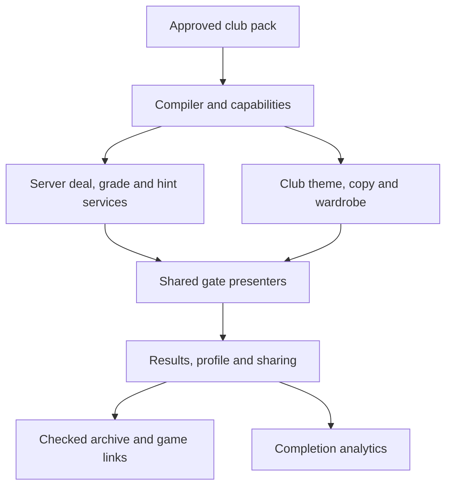

# FAN LIFE vs The Worker — Gate-by-gate experience audit

**Date:** 8 October 2026  
**Purpose:** An implementation handoff for bringing every FAN LIFE gate to The Worker’s level of gameplay, graphics and usability, with FAN LIFE branding and support for any club.  
**Scope:** All 13 numbered gates, their mounted secondary modes, mobile and desktop presentation, accessibility, data requirements, results, sharing, progress and connected destinations. No production changes were made.

## 1. Decision

**Keep FAN LIFE’s magazine identity. Bring across The Worker’s complete game experiences, not just their names or simplified mechanics.**

FAN LIFE currently has three different layers: the original Hapoel routes inherited from The Worker; universal club data and engines; and the newer shared club screens. The original routes are still available in the repository, but club hub links generally open the newer, substantially simpler screens. An inherited component being present does not mean that a club can use it.

The strongest adaptation is Royal Rumble: it carries across a recognisable draft, reveal, match and full-time show. That approach should guide the other gates. However, even Royal Rumble has missing modes and a verified opponent-selection mismatch, so it should be the presentation benchmark rather than a claim of complete parity.

Three particularly large gaps:

1. **Gate 5:** The Worker’s shirt studio and earned collection became a static shirt shelf.
2. **Gate 11:** The rivalry wall game and Black File became a derby statistics page.
3. **Gate 13:** The Red Thread connection game is absent from the shared route; only chronology is exposed.

The repair should extract and parameterise the existing presenters, connect them to club-aware services, and retain the universal engines where they already work. Rewriting 13 games from scratch would discard the most valuable existing work.

## 2. Version and evidence boundaries

| Project | Pinned source | Commit timestamp |
| --- | --- | --- |
| FAN LIFE | `e30fcc7b47a4aca5b6b5e8058de589f23f6fd4ef` | 8 October 2026, 09:32 +03:00 |
| The Worker | `edaa80bd300435d31223a8538f52ba27fef2231f` | 1 October 2026, 18:27 +03:00 |

Source roots: [FAN LIFE pinned tree](https://github.com/maordubel/fanlife/tree/e30fcc7b47a4aca5b6b5e8058de589f23f6fd4ef) and [The Worker pinned tree](https://github.com/maordubel/The-Worker/tree/edaa80bd300435d31223a8538f52ba27fef2231f).

**Evidence used:** current route entry points, mounted components, server actions, universal data contracts, readiness computation, CSS and tracked asset paths. Live desktop inspection compared Hapoel’s XI, shirts, rivalry, timeline and Royal Rumble on both sites, using the same club to separate presentation gaps from missing club data. The Worker’s live homepage also confirmed the numbered gate destinations.

**Limits:** The live deployment’s exact commit was not attested by a deployment API. Source findings apply to the pinned commits; live observations support the stated representative comparisons. This was not a completed live playthrough of all 13 games. Real phone viewport, touch-device, screen-reader, account, multiplayer and commerce testing remain release acceptance work. Mobile findings below are based on the implementation and layout contracts, not a claim that every phone screen was visually tested. No new full build or full test-suite pass is claimed here.

For source references below, `W:` means the pinned Worker tree and `F:` means the pinned FAN LIFE tree. Paths refer to repository files, including brackets exactly as used by Next.js.

## 3. What is already reusable

A byte comparison found **104 distinct TSX files** under the original numbered gate app folders in The Worker. All 104 paths exist in FAN LIFE; **100 are byte-identical**. The four changed files are the kit admin page and three timeline files. This inventory includes secondary routes and older component variants; it is not a count of 104 mounted screens, nor proof that every dependency is universal.

All **2,046 tracked `public/` paths** in The Worker also exist in FAN LIFE. This is a path inventory, not a byte comparison or confirmation that every asset is appropriate for every club.

| Existing material | Recommended use | Required adaptation |
| --- | --- | --- |
| `components/stage/FitBox.tsx`, `SlideSheet.tsx`, drag helpers, shirt tokens | Shared stage sizing, bottom sheets, tap/drag alternatives | Inject English copy and club tokens; keep usable hit areas when scaling |
| Native XI and lineup presenters | Restore pitch, scout/locker interaction and outcomes | Replace direct Hapoel services, identities, wardrobe and global storage |
| `KitGameRun.tsx`, `KitDesignerV5.tsx`, `KitWing.tsx` | Restore kit assembly, creative studio and collection | Club kit schema, marks, source grants, ownership and storage adapters |
| Trivia run, answer controls, HUD and report | Restore the game’s pacing and rich outcomes | Club-specific deal/grade/hint and marks services |
| Archive cards, drawers, sheets and ThreadBoard | Restore exploration and connection gameplay | A generic club entity graph and checked relationships |
| Share artefact renderers and result components | Consistent branded results and challenges | Club/version/mode-aware URLs, names and metadata |
| Existing fonts and SVG/kit renderers | Code-buildable retro graphics | English typography and club palettes; no Hapoel defaults for another club |
| Shared chronology board and Rumble adaptation | Retain working universal work | Complete missing integration and parity gaps rather than replace blindly |

**Use the components mounted by the current entry points.** Gate 4 mounts `KitGameRun`, and Gate 5 mounts `KitDesignerV5` through `KitWing`. Earlier V3/V5/V13 kit-game files are not interchangeable specifications of the current experience.

## 4. Whole-gate comparison

Statuses are editorial assessments of experience parity, not automated readiness labels. **Partial** means a playable equivalent exists with substantial missing UX or features. **Different** means the shared route replaces a central mode with another experience.

| Gate | The Worker’s mounted experience | FAN LIFE shared route | Assessment | Main work |
| --- | --- | --- | --- | --- |
| 1 | All-time XI, worst XI, manager challenges, scout drawer, shirt pitch, poster | XI selection, formation, search, fit labels, captain, local save | Partial | Restore the full builder and mobile scout flow |
| 2 | Quick Pick, rich answer controls, timed/practice/personal run paths, HUD, match report | Topic/era/hard filters, timed quiz, basic report | Partial | Restore pregame, hints, pacing and report |
| 3 | Historical XI with lockers, four pitch bands, locks, coach and programme result | Pick 11 name chips and grade membership | Partial | Restore locker room and band-based interaction |
| 4 | Five-part shirt assembly, Quick/Full runs, review, hints, evidence reveal and unlock | Identify season, maker and design from a visible shirt | Different | Restore assembly; keep identification only as an optional named mode |
| 5 | Creative shirt studio and earned collection, collector connections | Static approved shirt collection | Different | Restore studio and connect collection/closet |
| 6 | Archive memory cards, preview, pair fusion, streaks, souvenirs and outcome | Flip pairs, moves, matched facts, replay | Partial | Restore the visual memory game and discoveries |
| 7 | Supporter identity ballot plus terrace debates | Local multiple-poll ballot | Partial | Restore sequential voting, identity artefact and debates |
| 8 | Build and animate a sourced goal, three-goal run, hints, verdict, links | Interactive zone pitch, actor/action sequence, grade and truth paths | Partial | Retain current pitch foundation; restore replay and run presentation |
| 9 | Draft, reveal, staged match, full-time, Solo and Live H2H | Adapted Solo show with shirt cards and recent results | Closest | Correct opponent contract; add sharing and live mode |
| 10 | Blind Cow Solo, Daily, Duel, clue stack, search drawer and result | Server-timed Solo with clues, guesses, evidence and resume service | Partial | Restore arena presentation; add Daily/Duel explicitly |
| 11 | Eight-duel rivalry wall plus Black File factual game | Rival meetings, wins/draws/losses, decade statistics | Different | Restore games; retain statistics as a useful third tab |
| 12 | Living Archive: Today, Time, Dig, Search, Mine, related trails | Search, on-this-day filter, paginated facts, sources and Been There | Partial | Restore archive exploration and entity drawers |
| 13 | Red Thread connection routes plus chronology tab | Shared chronology insertion game only | Different | Restore graph game; retain chronology as second mode |

## 5. Gate 1 — All-time XI

**Priority: P1.** Keep the shared roster search, fit labelling and validated local XI as foundations. Restore the native pitch-led experience.

| Feature | The Worker | FAN LIFE now | Required adaptation |
| --- | --- | --- | --- |
| Pitch and player identity | Shirt/player tokens with archive-supported appearances | Role/name buttons on a pitch | Reuse native pitch and shirt tokens; use a labelled neutral token when a player has no verified shirt |
| Selection | Position-first scout drawer, quick cards and full search | Pitch selection followed by an inline player list | On phone, open the scout sheet on the selected slot; retain next-empty-slot advance |
| Scouting | Sorting, fit, eras, identity context, shortlist | Name/alias search, broad position and decade filters, fit toggle | Restore sorting and shortlist; expose nationality or spells only when sourced |
| Formation changes | Native builder handles moving/remapping choices | Shared handler clears picks | Preserve compatible choices; explain displaced players before clearing anything |
| Modes | Best XI and explicitly subjective worst XI | Best XI only | Add the second tab, with an opinion label and no algorithmic claim that a player is “worst” |
| Constraints | Manager prompts and selectable roster challenges | Free choice | Add capability-based prompts; skip challenges that the pack cannot truthfully support |
| Extra choices | Captain, 12th player, last player cut | Captain only | Restore bench choices and their result-card positions |
| Output | Saved sheets, poster, DNA summary, sharing and next actions | Local save and clear | Restore club-branded poster; separate sharing the fan’s XI from sharing a manager prompt |

**Graphic direction:** a tactics spread from an old football annual: green chalk pitch, small shirt tokens, inked formation chips and a scout card with season/era details. FAN LIFE owns the heading and paper; the club owns the shirts and accent. Keep body text upright and readable.

**Mobile:** pitch remains visible; scouting, formation, bench and sharing use sheets. Do not display 40 player cards below the pitch as the main flow. Desktop gets a proper pitch/scout split rather than a narrow, elongated phone panel.

**Acceptance:** 11 distinct players can be selected by touch or keyboard; incompatible formation changes do not silently destroy the XI; known/unknown positions remain distinct; captain/bench survive reload; another club never receives Hapoel shirts or storage; shared XI/prompt links carry the correct club and mode.

**Sources:** `W: app/xi/page.tsx`, `app/xi/XIBuilder.tsx`, `lib/xi/scout.ts`, `lib/xi/store.ts`; `F: components/clubs/games/XIBuilder.tsx`, `lib/clubs/xi.ts`, `lib/clubs/activity.ts`.

## 6. Gate 2 — Trivia wing

**Priority: P1.** The shared board already uses the session engine and server grading. Its presentation and surrounding flow are much thinner.

| Feature | The Worker | FAN LIFE now | Required adaptation |
| --- | --- | --- | --- |
| Pregame | Quick Pick with topic/era availability and richer entry choices | GET filter form; timer starts on board mount | Restore Quick Pick and an explicit start beat; do not spend game time reading filters |
| Question controls | Dedicated choice, order, pair, true/false and year controls | Supported shared types rendered as generic buttons/selects | Reuse the dedicated controls for supported schema types; no decorative A/B labels on every control |
| Run structure | Normal run is 12 questions in three stages | Same session foundations, with short banks supported | Restore stage breaks; clearly label a short round and its actual denominator |
| Hints | Derived hint with an explicit scoring cost | Not exposed in shared board | Add club-aware hint action; disclose cost before use |
| HUD | Lives, timer bar, multiplier cap, progress and labelled run heat | Text counters and timer | Restore compact HUD; heat must remain this run’s feedback, not an invented live crowd |
| Feedback | Reaction, explanation, controlled reveal and scoring context | Correct/wrong explanation, source, automatic advance after 2 seconds | Preserve evidence; add readable reveal controls and an accessible pace option |
| Personal modes | Practice/personal marks and revenge-related run paths | No equivalent shared entry | Add only when the marks/store contract is club-aware; practice removes time pressure |
| Result | Detailed match report, weaknesses, challenge comparison, sharing, recommendations | Score/correct/combo, replay and archive link | Restore report cards and context-specific recovery/replay |

**Graphic direction:** a printed quiz page combined with an old stadium scoreboard: one bold question, answer tickets, lamp lives, numbered progress and a final match-report clipping. Avoid oversized display type for long prompts.

**Mobile:** HUD + question + answers + one primary action form the game stage. Filters and rules move to a pregame/options sheet. Longer source explanations can scroll in a sheet; they should not disappear before a user can read them.

**Acceptance:** no clock before Start; all supported answer types work with keyboard and touch; source text is readable before advance; retries after network failure preserve the dealt question; practice is untimed; replay retains filters and advances the round; one finished run generates one completion event.

**Sources:** `W: app/trivia/QuickPick.tsx`, `TriviaRun.tsx`, `RunHud.tsx`, `MatchReport.tsx`; `F: components/clubs/games/TriviaBoard.tsx`, `app/clubs/[slug]/[gate]/actions.ts`, `lib/clubs/games.ts`, `lib/game/session.ts`.

## 7. Gate 3 — Historical line-up

**Priority: P1.** A selected set of 11 names is not equivalent to the locker-room game.

| Feature | The Worker | FAN LIFE now | Required adaptation |
| --- | --- | --- | --- |
| Match entry | Programme/tunnel context for a verified match | Title, date, competition and name chips | Restore the match entry and programme hierarchy |
| Placement | Locker shirts placed into GK/defence/midfield/attack bands | Select/unselect 11 names | Reuse band pitch, locker rack and tap-first placement |
| Historical accuracy | Four bands; deliberately no invented historical formation | No placement bands | Grade documented bands when supported; do not infer a historical formation |
| Candidates | Verified XI plus squad decoys and archive context | Starters plus decoys, topped up from the general roster | Prefer same-match/season eligible decoys; label limitations in a thin pack |
| Shirt treatment | Match-era kit and goalkeeper appearance where documented | Names only | Inject sourced match wardrobe; use a neutral fallback when absent |
| Commitment | Player locks, movement/removal, counters and feedback | Selection count | Restore locking and movement without forcing drag |
| Coach | Server-derived counts, not answer names | No shared equivalent | Add a checked coach service; it must not reveal the XI before submit |
| Result | Exact/band verdict, programme artefact, comparison and next links | Correct/missed/wrong names, next match | Restore result sheet and club-aware match/player archive links |

**Graphic direction:** hanging kit lockers and a chalkboard in an old dressing room, followed by a paper team sheet. This is a different visual scene from Gate 1 even though both use a pitch.

**Mobile:** locker rail is visible from the start. Tap a band then a player, or a player then a band. Match details belong in a sheet. Desktop can show lockers, pitch and coach together.

**Data work:** the current universal match view stores starter names but does not expose all native placement/wardrobe information. Extend it with canonical player references and optional documented bands. Derive game views from canonical match/player records, without a second historical dataset for this mode. If bands are missing, expose a clearly named membership-only mode rather than claim full parity.

**Acceptance:** complete a verified XI without dragging; move a player without duplication; missing band evidence never counts as documented; round/version resolve the same match at grade time; reveal and programme use that match; next-match rotation is clear when only one match exists.

**Sources:** `W: app/lineup/LineupBoard.tsx`, `app/lineup/actions.ts`, `lib/game/lineup.ts`; `F: components/clubs/games/LineupBoard.tsx`, `lib/clubs/gate-content.ts`, `app/clubs/[slug]/[gate]/gate-actions.ts`.

## 8. Gate 4 — Kit builder

**Priority: P1.** This is a mechanic change, not simply a missing skin.

| Feature | The Worker | FAN LIFE now | Required adaptation |
| --- | --- | --- | --- |
| Core task | Assemble a shirt from parts | Recognise season, maker and design | Make assembly the main mode; retain recognition only if explicitly presented as a different mode |
| Shirt before submit | Blank/player-built shirt; undiscovered truth withheld | Target design and colours are rendered before answering | For assembly, show the user’s chosen parts, not the complete target shirt |
| Part sequence | Body, construction, crest, maker, sponsor | Three text choice groups | Restore the five-step rail and visual part choices |
| Interaction | Tap/drag, optional auto advance, editable steps and final review | Choose chips and submit | Reuse current mounted `KitGameRun`; maintain an accessible tap path |
| Run length | Quick 3 / Full 5, with cursor semantics | Individual kits cycling through a list | Restore run modes and a true run-level result |
| Information | Part information sheet, explicit hints and cost | Minimal visible metadata | Add source-backed information and hints; do not include answer-revealing year hints |
| Reveal | Part verdict, accurate kit render/photo where authorised, provenance | Three booleans and answer labels | Restore reveal; distinguish exact photograph from reconstruction |
| Collection | Verified build can earn a collection unlock | Completion counter only | Connect signed/server-validated unlock to Gate 5; client flags are not proof of completion |

**Graphic direction:** a shirt assembly page with a large garment, numbered assembly steps, manufacturer/sponsor swatches and a stamped inspection result. Use the existing kit engine rather than asking AI to generate every shirt.

**Mobile:** season/variant + five-step rail + garment + part cards + Check fit into the game stage. Details slide up. Step controls remain tappable after auto advance so users can reconsider before submission.

**Data work:** season/maker/design is enough for the current recognition mode, but not for full assembly. Add optional construction, sleeve/collar, crest and sponsor fields with provenance, a renderer specification, and truth/decoy projections. Missing components must not be guessed to unlock the full mode.

**Acceptance:** target construction is not revealed before assembly submission; all five parts can be reviewed; Quick/Full advance the right cursor; unsupported historical marks remain absent; successful builds unlock the correct club/version kit; stale versions and grade failures produce a recoverable message rather than silent no-op.

**Sources:** `W: app/kits/build/page.tsx`, `app/kits/build/KitGameRun.tsx`, `lib/game/kit-build-run.ts`; `F: components/clubs/games/KitBuilderBoard.tsx`, `KitPlate.tsx`, `lib/clubs/gate-content.ts`, `app/clubs/[slug]/[gate]/gate-actions.ts`.

## 9. Gate 5 — Shirt studio and collection

**Priority: P1.** This gate currently loses one of the most substantial creative experiences.

| Feature | The Worker | FAN LIFE now | Required adaptation |
| --- | --- | --- | --- |
| Main mode | Creative studio is the initial tab | Static collection only | Restore Studio / Collection tabs; update the shared gate name accordingly |
| Designer | DNA, body, colour, pattern, collar, sleeves, maker, sponsor, crest, number | No editor | Extract `KitDesignerV5` with club data and copy injected |
| Live garment | Kit engine preview responds to changes | Generic metadata SVG per archived kit | Use the real renderer for the studio; distinguish free designs from historical shirts |
| Editing | Undo/redo, reset, saved designs and reopen | Not available | Restore device-local editing and club-scoped saved designs first |
| Briefs | Free and authored creative briefs with studio metrics | Not available | Add generic briefs plus club-authored briefs; label design scores as creative heuristics |
| Earned collection | Built kits unlock detail; exact photos take priority when available | Every approved kit displayed as a metadata shirt | Separate public history from earned build status; link to assembly without pretending every kit was earned |
| Phone shelf | Paged/swiped cards, filters and detail sheet | Long collection list/grid | Restore the compact collection deck and a keyboard/page alternative |
| Collector connections | Closet, real-shirt ownership, archive, market and auction routes | Global market exists, but shared Gate 5 does not offer the same integrated journey | Connect existing destinations with club/item context; evaluate commerce separately from game parity |

**Graphic direction:** a vintage kit catalogue and supporter design workshop: large cloth preview, numbered swatches and a collectible design card. This is a stronger brand asset than adding another decorative paper panel.

**Mobile:** garment gets the centre of the screen; tool categories form a reachable strip, and the selected category opens a compact panel. Collection detail and sharing use sheets. Desktop shows the garment and tools side by side.

**Useful extension:** allow “Start from this archived shirt” only when enough approved renderer data exists, and stamp every user-made variation **FAN DESIGN**. Historical evidence and creative freedom should be visually distinct.

**Acceptance:** ten tool categories are usable without page-length scrolling; edits undo/redo; saved design reloads for the correct club; another club receives no Hapoel sponsor/crest defaults; catalogue and earned collection are distinguishable; market/closet links carry the correct item identity and never equate a digital unlock with real ownership.

**Sources:** `W: app/kits/KitWing.tsx`, `KitDesignerV5.tsx`, `lib/kit/studio-store.ts`, `app/kits/closet`, `app/kits/market`, `app/kits/auction`; `F: app/clubs/[slug]/[gate]/page.tsx`, `components/clubs/games/KitPlate.tsx`, `app/market/page.tsx`, `lib/fanlife/catalog.ts`.

## 10. Gate 6 — Memory

**Priority: P1.** Keep the working match engine; restore the game’s character and discoveries.

| Feature | The Worker | FAN LIFE now | Required adaptation |
| --- | --- | --- | --- |
| Card art | Archive objects, different fact faces and designed card backs | Question-mark cards with kind labels | Reuse ArchiveCard and object treatments; approved photos are optional |
| Opening | Idle/flash/play states and memory preview | Board playable immediately | Restore intentional preview/start and a reduced-motion equivalent |
| Match beat | Pair fusion and “memory locked” feedback | Pair disappears from open state and fact is appended | Restore fusion beat and an explicit collected fact |
| Momentum | Streak/echo/hot feedback and richer round mechanics | Moves and pair counts | Restore native mechanics as one cohesive mode, with clear rules |
| Source discovery | Pair threads link to verified archive entities | Matched text, generic archive link | Open the matching entity; do not merely send users to archive home |
| Souvenirs | Saved pair discoveries and shelf | Run activity only | Store discoveries under club/entity IDs and expose them in My Corner |
| Result | Closing mural, share/contact-sheet artefact, contextual next actions | Completion text and replay | Restore visual result and archive trail |

**Graphic direction:** a night-time floodlit table of archive cards, each pair joining two views of one memory. Match feedback should feel like putting a sticker into an album.

**Mobile:** fit the actual card count into a readable grid; two-pair partial boards need a deliberate small-board layout rather than excessive empty space. Discovered facts and the souvenir shelf open in sheets.

**Acceptance:** hidden face text is not announced as the visible answer; keyboard focus survives flips; unmatched timeout cannot accept a third card; matched facts retain their sources/links; reduced motion preserves sequence comprehension; completion and collectible ownership are recorded once.

**Sources:** `W: app/memory/MemoryBoard.tsx`, `components/memory/ArchiveCard.tsx`, `FusionPlate.tsx`, `PairThreads.tsx`, `SouvenirShelf.tsx`; `F: components/clubs/games/MemoryBoard.tsx`, `lib/clubs/games.ts`, `lib/game/memory-engine.ts`.

## 11. Gate 7 — Terrace vote

**Priority: P1.** Restore an opinion experience with a memorable output, not only a form of saved selections.

| Feature | The Worker | FAN LIFE now | Required adaptation |
| --- | --- | --- | --- |
| Modes | Supporter card and terrace debates | One local poll board | Add explicit Card / Debates tabs |
| Voting flow | One staged question with progress, reactions and ballot slip | Polls stacked with selectable answers | Reuse QuestionStage and VoteReaction; retain direct review/edit of prior answers |
| Identity | Supporter name/number, player choices and reasons | Choice IDs saved locally | Restore optional identity fields and reason choices with club-aware identities |
| Output | Ballot slip / manifesto / supporter artefact | Saved vote text and activity | Produce a FAN LIFE supporter card and shareable manifesto |
| XI connection | Reads the fan’s XI and links relevant choices | Separate local poll state | Bridge through the same club-scoped profile adapter |
| Debate content | Authored dilemmas and explanation/reason options | Generic prompts from eligible archive choices | Add curated club debates; keep opinions distinct from sourced facts |
| Community results | Tally/loading/unavailable handling where backend is available | Device-only votes | Port the tally service when available; never display local choices as real community percentages |

**Graphic direction:** a ballot paper from the terraces, stamped after each choice, ending in a supporter membership card. The interaction should feel social even before a global tally exists.

**Mobile:** one question in view, sticky progress and a ballot-slip sheet. Search large player choices in a picker; do not render hundreds of choices as an inline list.

**Acceptance:** votes can be reviewed and revised; no factual right/wrong grading for opinions; anonymous/device-only status is clear; tally outages do not erase a vote; supporter card uses the correct club and UI language; existing XI names resolve by canonical ID.

**Sources:** `W: app/polls/TerraceWing.tsx`, `BallotSheet.tsx`, `components/ballot/QuestionStage.tsx`, `VoteReaction.tsx`, `DebateStand.tsx`; `F: components/clubs/games/PollsBoard.tsx`, `lib/clubs/polls.ts`, `lib/clubs/activity.ts`.

## 12. Gate 8 — Goal reconstruction

**Priority: P1.** The current shared gate already has an interactive pitch. Preserve that improvement while restoring the full replay experience.

| Feature | The Worker | FAN LIFE now | Required adaptation |
| --- | --- | --- | --- |
| Build surface | Shirt actors, ball/action interactions and replay gesture helpers | SVG pitch with 20 actual button zones | Keep accessible zone buttons; add the native actor/ball presentation |
| Input | Spatial build and gesture-based actions, with supporting controls | Select actor/action then tap a zone; undo | Offer both paths; tap/keyboard must remain fully playable |
| Replay | Animated build → replay → reveal sequence | User/truth paths appear after grade | Add deterministic replay playback, pause/skip and reduced-motion still sequence |
| Evidence | Sourced zones rather than invented exact coordinates | Same zone vocabulary and approximate-location note | Preserve this truthful contract; animation is a visualisation, not evidence of exact positions |
| Hints | Count/reception hints and scoring treatment | Touch-count hint exposed | Bring across explicit hint cost/rules where supported |
| Run | Three goals, lives, run score and final report | Individual goals with next control | Restore a run wrapper; provide a clearly labelled short mode for thin packs |
| Verdict | Per-touch feedback, final report, share and contextual links | Actor/action/exact-or-near scoring, narrative and sources | Keep this useful detail and dress it as a match replay report |
| Deep links | Specific archive goal can open as first goal | Shared main route deals from seed | Add a checked goal-ID entry path and preserve club/version/round in links |

**Graphic direction:** a football magazine’s annotated goal diagram brought to life: shirt tokens, chalk arrows, numbered touches, a restrained ball animation and a replay verdict clipping.

**Mobile:** large pitch, compact actor strip and action controls; chosen touches and source explanation use sheets. Do not place the entire player bank, verb bank and truth report below the pitch. Desktop can show a touch-by-touch inspector alongside it.

**Acceptance:** button-zone path completes a goal without gestures; extra/missing touches have an explicit verdict; replay score comes from the server verdict; facts remain withheld until submission; approximate locations are labelled; a pinned goal resolves only inside the right club; user can pause/skip nonessential replay animation.

**Sources:** `W: app/goal/GoalRun.tsx`, `lib/game/replay/gesture.ts`, `app/goal/page.tsx`; `F: components/clubs/games/GoalBoard.tsx`, `lib/clubs/goal.ts`, `lib/game/goal-zones.ts`, `app/clubs/[slug]/[gate]/gate-actions.ts`.

## 13. Gate 9 — Royal Rumble

**Priority: P1 for rule correctness; P2 for remaining parity.** This is the best existing shared presentation adaptation, but its mechanics are not fully identical to The Worker.

| Feature | The Worker | FAN LIFE now | Required adaptation |
| --- | --- | --- | --- |
| Draft show | Five slots, three offers, budget, slot editing and shuffle | These core presentation elements are adapted | Preserve rather than redesign |
| Shirts | Archive-supported player wardrobe | Club wardrobe and token fallback | Keep sourced club kit resolution; distinguish generic fallback from exact historical shirt |
| Reveal and match | Entrance, reveal, staged pitch events and sound | Adapted jackpot/reveal/match phases with reduced-motion handling | Audit pacing and fit in the shared stage; keep manual sound controls |
| Opponent | Seed-only opponent; explicitly independent of supporter choices | Opponent composition excludes chosen players during `play()` | Fix the composer to match the intended fair, precommitted opponent contract |
| Claims | Mechanic describes the actual opponent contract | Intro says fixed before picks; rule says drawn from players not taken | Resolve contradictory copy after correcting mechanics |
| Modes | Solo and mounted Live H2H selector; additional LIFE integrations | Shared route exposes Solo only | Add tenant-safe rooms and mode entry; show unavailable state honestly when backend is absent |
| Full-time | Score, performance, sharing and replay connections | Score, scorers, MOTM, teams, narrative, replay, recent rounds | Keep show; add result sharing, challenge comparison and next club-aware actions |
| Economy/rating | Rich native role/formation and opponent balancing logic | Broad positional slots; archive-derived rating/price model | Define the intended shared rules explicitly; do not describe the current simplified model as identical mechanics |

### Verified defect: opponent changes with the same seed

Local execution against the current Hapoel pack reproduced two legal €15M selections under seed `1`. Changing one midfielder changed two opponent midfielders:

| Selection | Our changed player | Opponent midfielder 1 | Opponent midfielder 2 |
| --- | --- | --- | --- |
| A | `p_f3e79bccbe` | `p_4f688bfac9` | `p_bed68abbfc` |
| B | `p_327cb6b402` | `p_509dd22745` | `p_f05836d2d4` |

The rest of our five was unchanged: `p_43edb562c4`, `p_8155ae390e`, `p_f74a361546`, `p_b5bbdd8ff5`. Both selections cost 15. `F: lib/clubs/rumble.ts` initialises the excluded set from the chosen players; `playRumble` calls that function. The Worker’s `lib/game/royal-rumble.ts` explicitly determines its opponent from the round seed alone.

**Fix:** deal/commit the opponent on the server from club, content version, seed, cursor and rules version before the user chooses. Define identity overlap/exclusion at that point; do not change the opponent as a reaction to later picks. Grading reconstructs that same opponent. Keep ratings hidden.

**Graphic direction:** keep the adapted bulbs, reels, shirt cards and match scoreboard. Reduce duplicated header weight so the FAN LIFE gate heading and Rumble’s internal title do not consume two introductions on a phone.

**Acceptance:** changing legal picks cannot change a seed’s committed opponent; every offered board has an affordable legal completion; shuffle/cursor preserve their intended challenge identity; replay events sum to the final score; sound never autoplays without the appropriate user action; Live rooms cannot cross clubs; result sharing opens the same club/rules/round rather than the old Hapoel route.

**Sources:** `W: app/royal-rumble/RoyalRumbleMode.tsx`, `lib/game/royal-rumble.ts`; `F: components/clubs/rumble/RumbleGame.tsx`, `RumbleSlotMachine.tsx`, `RumbleStage.tsx`, `RumbleFullTime.tsx`, `lib/clubs/rumble.ts`, `rumble-show.ts`, `messages/games/en.json`.

## 14. Gate 10 — Blind Cow

**Priority: P1 for presentation; P2 for multiplayer expansion.** The underlying shared service already provides a real server clock and sealed resume state.

| Feature | The Worker | FAN LIFE now | Required adaptation |
| --- | --- | --- | --- |
| Entrance | Arena logo and lobby with mode entry | Brief text and Start button | Restore branded arena/lobby with clear mode capabilities |
| Modes | Solo, Daily and Duel | Solo only | Add Daily with a declared club timezone and Duel with scoped room/session state |
| Clue presentation | Designed ClueStack and gradual reveal | Stacked generic panels | Reuse clue stack; preserve server withholding of unopened clues |
| Guessing | Dedicated searchable drawer | Up to 60 inline player buttons | Restore compact guess drawer and canonical ID/alias search |
| Time and penalties | Raw/weighted time and explicit scoring rules | Server timing, wrong guesses, weighted result | Retain real server timing; improve the visual timer and penalty explanation |
| Resume | Existing run and completed daily can be surfaced in lobby | Cookie-backed service resumes when Start is requested | Expose Resume as an explicit lobby state rather than make users rediscover it |
| Result | Strong result panel, sharing and links | Answer, times, sources, replay and archive query | Restore result card without leaking the answer in a daily challenge preview |
| Connection | Entity/LIFE-aware follow-up where available | Name-query archive link | Prefer canonical archive entity link; LIFE actions appear only for available content |

**Graphic direction:** an old mystery-player magazine competition: mascot/arena mark, sealed clue cards, a readable stopwatch and a final identity reveal. Rebrand the gate art for FAN LIFE; the existing Worker logo should not represent every club unchanged.

**Mobile:** clue stack takes the stage; Guess opens a sheet; Give up is a secondary deliberate action. The entire roster should not lengthen the page.

**Acceptance:** refresh resumes the same original server clock; already-tried players cannot be guessed again; Daily date/answer is stable within the declared timezone; completed daily preview does not expose its answer; Duel tokens are scoped to club/rules version and expire; outages show a recoverable state; smaller banks are labelled without fabricated clues.

**Sources:** `W: components/blind-cow/BlindCowGame.tsx`, `ClueStack.tsx`, `GuessDrawer.tsx`, `ResultPanel.tsx`, `app/blind-cow/page.tsx`; `F: components/clubs/games/MysteryBoard.tsx`, `lib/clubs/mystery.ts`, `app/clubs/[slug]/[gate]/mystery-actions.ts`.

## 15. Gate 11 — Rivalry wall, Black File and derby record

**Priority: P1.** Keep the useful derby statistics, but they do not replace the two Worker games.

| Feature | The Worker | FAN LIFE now | Required adaptation |
| --- | --- | --- | --- |
| Main task | Eight opinion duels; one figure remains on the wall | Read statistics about one approved rival | Restore a rivalry wall mode as the main interactive experience |
| Choice | Two plates, swipe or tap, progress and reveal | No game choices | Reuse wall plates, sequence and tap alternative |
| Reconsideration | One undo/reconsider flow with history | Not applicable | Restore undo rule and a readable elimination trail |
| Content | Authored rival figures and sourced dossiers; opinion clearly labelled | Approved rival club and sourced meetings | Add authored candidate/dossier views over canonical rival/person records; one rival club is not a duel bank |
| Second act | Black File factual game | Absent from shared route | Restore fact challenges with evidence and club-specific eligibility |
| Existing statistics | Not the replacement for the wall | Wins/draws/losses, goals, biggest win, decades and meetings | Keep as “Derby Record”, a third tab or contextual dossier panel |
| Share | Wall code, result artefact and same-seed replay | No game result | Restore challenge code and result sharing, scoped to club/version |
| Sport/voice | Native Hapoel bank can include basketball and sharp local terrace copy | Universal contract is football | Author football-relevant club content; do not import irrelevant Hapoel basketball rivals or unsupported accusations |

**Graphic direction:** torn rival dossier cards, navy/ink paper, stamps and wall damage. Reuse the dramatic layout while changing the actual identities and tone. The factual record tab can look like an old derby programme insert.

**Naming proposal:** “Rivalry Wall” as the universal public title, with a configurable club-specific subtitle. This keeps the playful fan rivalry and opens the experience to all clubs without hardcoding Hapoel language.

**Mobile:** two large selectable plates, a compact trail and one reconsider control. Facts open in a dossier sheet; statistics are readable separately and are allowed to scroll.

**Acceptance:** eight duels form a deterministic valid run; opinions are never graded as historical facts; dossier assertions show their sources; football-only packs do not draw unrelated sport figures; statistics handle unknown sides and duplicate fixture reconciliation honestly; share code reopens the right wall; no title promises gameplay when only record mode is available.

**Sources:** `W: app/derby/HateWall.tsx`, `app/derby/file/page.tsx`, `BlackFile.tsx`, `lib/game/hate-run.ts`; `F: components/clubs/games/DerbyWall.tsx`, `lib/clubs/gate-content.ts`, `lib/fixtures`.

## 16. Gate 12 — Living Archive

**Priority: P1; foundational for other gates.** FAN LIFE preserves basic sourced facts but misses the archive’s exploration experience.

| Feature | The Worker | FAN LIFE now | Required adaptation |
| --- | --- | --- | --- |
| Modes | Today, Time, Dig, Search, Mine | Search and on-this-day filter | Restore the archive dock and mode-specific surfaces |
| Entry surface | Swipe/card deck and archive objects | 20 paginated text cards | Reuse entity cards and detail drawer; keep pagination/search as accessible alternatives |
| Time machine | Season-focused deck | Date filter/search text | Add approved season/entity filtering without inventing season membership |
| Dig | Archive box and deterministic rabbit-hole traversal | Not present | Add graph-backed exploration with genuine sourced relationships |
| Entity detail | Type-specific details, sources and related entities | Fact title/date/hint/confidence and sources | Introduce generic entity projections for players, matches, shirts, trophies, places and culture |
| Personal archive | Mine, save/unsave, reactions, exploration trail | Been There stamps | Keep Been There; add saved entities and trail as distinct concepts |
| Game connections | Entity links lead into relevant games | Broad archive navigation from game results | Add checked action links: build this kit, replay this goal, reconstruct this XI, connect this entity |
| Completion | Defined exploration depth marks a visit’s round | No shared archive run counter in `RUN_GATES` | Define exploration completion separately from page views and apply once per visit/attempt |
| Today | Date supplied through club-relevant time handling | Uses UTC `toISOString()` month/day | Resolve today in the club’s declared timezone; preserve deterministic test inputs |

**Graphic direction:** an archive desk with match programmes, player cards, shirt labels and clippings. Object-specific visual vocabulary creates the old-magazine feeling more effectively than identical taped text boxes.

**Mobile:** a focused deck, five-action dock, detail sheets and breadcrumbs/trail. Search and long factual reading can scroll inside the appropriate surface. Do not force every archive page into a non-scrolling game viewport.

**Data work:** today’s `HistoricalEvent`/timeline projection is not equivalent to The Worker’s entity graph. Build a club graph read model with explicit entity types and approved edges; cards are client projections, and the graph stays on the server. This also unlocks Gate 13 and richer exits throughout the product.

**Acceptance:** every cross-link resolves within the right club; a source/confidence drawer is reachable by keyboard; save/unsave survives reload; Been There is not treated as factual proof of attendance; unknown dates remain unknown; rabbit holes terminate gracefully; Today respects timezone; research drafts remain outside the public archive.

**Sources:** `W: components/archive/ArchiveApp.tsx`, `ArchiveDrawer.tsx`, `ArchiveSheets.tsx`, `EntityCard.tsx`, `app/archive/actions.ts`; `F: app/clubs/[slug]/[gate]/page.tsx`, `lib/clubs/archive.ts`, `components/fanlife/BeenThere.tsx` where applicable to the stamp implementation.

## 17. Gate 13 — The Thread and chronology

**Priority: P1 for restoring the missing primary mode.** Keep the shared chronology implementation: it is already a real extraction of useful game mechanics.

| Feature | The Worker | FAN LIFE now | Required adaptation |
| --- | --- | --- | --- |
| Primary mode | Red Thread: connect start to goal through real archive relations | Chronology only | Restore connection mode using the club entity graph |
| Secondary mode | Chronology is one tab away | Chronology is the whole shared gate | Add Thread / Chronology tabs; preserve existing links with a compatibility route |
| Routes and rules | Five routes per run, curated/generated levels, integrity and route constraints | No graph route model | Add approved edge traversal, route solver, eligible puzzle generation and public rules |
| Link judgement | Server verifies each attempted edge; source shown after discovery | Not applicable | Inject a club-aware edge-check service into ThreadBoard; never accept plausible-but-unsourced connections |
| Thread interaction | Hand filters, route trail, undo, success and source-backed explanation | Not present | Reuse ThreadBoard’s handset/desktop presentation |
| Chronology play | Anchor date, blind queue, gap selection, lives/timer/combo and reveal | These essentials exist in SharedTimelineBoard | Preserve; improve stage fit, help/pacing and shared result integration |
| Result | Route strip, challenge comparison, sharing and recommendations | Chronology score, dated list, replay/hub | Restore both mode-specific result artefacts and cross-links |
| Readiness display | Mode needs its own eligible data | Shared route checks overall club partial state for a notice | Use mode readiness; a club’s overall status is not a chronology or thread capability |

**Graphic direction:** connected archive cards and an ink/chalk thread. The default thread may use a FAN LIFE accent or club colour; keep a sufficiently contrasting neutral line for clubs whose primary colour is too light. Chronology becomes a timeline strip from a football annual.

**Mobile:** pinned start/goal, compact route slots and a card hand that remains reachable. Sources/rules/log go in sheets. Chronology has a current-card stage and focused insertion choices rather than an endlessly growing page.

**Acceptance:** chronology remains playable while thread data is absent; every accepted edge has approved evidence; generated puzzles have a verified solution and constraints before publishing; undo does not corrupt integrity/history; same seed/version/mode reproduces the challenge; a share opens the correct mode; date truth stays on the server until the verdict.

**Sources:** `W: app/timeline/page.tsx`, `app/timeline/order/page.tsx`, `components/archive/ThreadBoard.tsx`, `lib/game/thread.ts`; `F: components/timeline/SharedTimelineBoard.tsx`, `app/clubs/[slug]/timeline/ClubTimelineBoard.tsx`, `app/clubs/[slug]/timeline/page.tsx`, `lib/clubs/timeline.ts`.

## 18. FAN LIFE visual system for all gates

The current FAN LIFE cover/header has the right direction: paper, condensed titles, coloured registration, club badge, gate number and stamp. Preserve that identity. The issue is how the playable screen follows it.

| Layer | Proposed contract | Concrete effect |
| --- | --- | --- |
| Brand frame | FAN LIFE paper, ink, navy/vermilion editorial accents and English-first copy | Recognisable universal hub |
| Club layer | Badge/name, primary/secondary colours, approved shirts and authored voice | Each club is recognisable without rebuilding UI |
| Gate scene | Native pitch, locker room, studio, ballot, archive desk or rivalry wall | Each game has its own visual personality |
| Utility layer | Shared rules, sources, save/share, progress, loading and error patterns | Consistent controls across different scenes |

### Practical design changes

1. **Add a compact play header.** Keep the expressive magazine cover on hubs and entry screens. Once playing, show a small FAN LIFE mark, club, gate title, Back, Help and optional sound. Avoid repeating a huge gate masthead and an equally huge internal game title.
2. **Make layout mode explicit.** `reading`, `game`, `arena` and `studio` are suggested presentation choices. The existing all-purpose `game-panel` should not determine all four.
3. **Use objects as graphics.** Shirts, clippings, programme sheets, ballot papers, locker rails and scoreboards can be SVG/CSS and existing renderers. They are realistic code components, not bespoke generated backgrounds for every state.
4. **Limit decorative effects.** One headline misregistration, a few tape details and subtle paper/halftone texture are enough. Avoid texture behind paragraph text, rotated controls or shadows on every nested panel.
5. **Scope answer lettering.** Current generic option styling adds letter markers even to player lists. Player choices need shirts/names, not quiz A/B badges. Native select inputs are acceptable in settings, but should not replace the main tactile game interaction.
6. **Give desktop room.** Reading can remain roughly 680–760px wide. Pitch/studio games should have a reviewed 960–1120px workspace with side inspector/scout where appropriate. These are proposed sizing targets, not observed current measurements.
7. **Keep club and status colours separate.** Correct/error, selection, rival side and club colours must remain distinguishable. Labels/icons accompany colour. Audit inherited fixed red/navy restrictions against each club theme instead of applying Hapoel colour rules globally.
8. **Create a gate-specific result artefact.** XI poster, trivia report, team sheet, kit certificate, fan design, memory contact sheet, ballot slip, goal diagram, Rumble scoreboard, mystery result, rivalry dossier, archive trail and thread strip.

### Suggested English names

| Gate | Proposed public name |
| --- | --- |
| 1 | Your All-Time XI |
| 2 | The Quiz Stand |
| 3 | The Dressing Room |
| 4 | Build the Kit |
| 5 | The Kit Studio |
| 6 | Memory Lane |
| 7 | Terrace Vote |
| 8 | Rebuild the Goal |
| 9 | Royal Rumble |
| 10 | Blind Cow |
| 11 | Rivalry Wall |
| 12 | The Living Archive |
| 13 | The Thread |

These are proposals, not required renames. Preserve stable gate numbers and old URLs through compatibility mappings.

## 19. Shared mobile, desktop and accessibility contract

**The Worker’s interaction structure is the reference, not a requirement to reproduce every existing weakness.** Its desktop XI and studio still have substantial vertical content; parity should include the intended game stages and improve readability where needed.

| Area | Required contract |
| --- | --- |
| Phone stage | Use available dynamic viewport height, reserve safe areas and fixed navigation space, and keep the current decision + primary action visible |
| Small/zoomed view | If content cannot fit without shrinking below readable sizes, allow controlled scrolling; never crop or make text tiny to satisfy a screenshot |
| Bottom navigation | Preserve the existing fixed mobile menu requirement. Add club-aware destinations/context and reserve a distinct game dock region above it |
| Secondary information | Rules, sources, scout, bench, ballot and share use accessible sheets with focus trap, Escape, close button and focus return |
| Input | Every drag/swipe interaction has a tap and keyboard equivalent |
| Targets | Aim for at least 44×44px effective hit areas; visible icons can be smaller. Verify after FitBox scaling |
| Timing | Start explicitly; pause where rules allow; provide practice or accessible pace for nonessential timing. Never delete explanatory content before it can be read |
| Feedback | Do not rely on colour or sound. Use visible words/icons and targeted live announcements rather than reading an entire changing board |
| Motion | Reduced-motion handling preserves understandable phases; animated reels/replays can be skipped when nonessential |
| Sound | Explicit toggle and user-initiated playback; remember preference appropriately |
| Text | English UI by default, `lang`/direction on source content, readable names. Preserve original-language evidence; use curated English labels/aliases where available |
| Desktop | A separate composed layout where helpful, not an enlarged narrow phone column |
| Errors | Retain current choice; offer Retry; explain stale pack/version and loading/disabled states |

**Viewport acceptance set:** 360×640, 390×844, 430×932, tablet portrait, 1366×768 desktop; landscape on pitch games; 200% zoom; long player/club names; opened software keyboard; safe-area device; reduced motion; keyboard-only run. These are future verification requirements, not tests reported as already passed.

## 20. Data readiness is not feature readiness

The current resolver has **five concrete providers**. Their compiled gate states at the pinned FAN LIFE commit are below. R = READY, P = PARTIAL but playable, L = LOCKED. These states describe current data thresholds for the current shared implementation; they do not certify Worker experience parity or the completeness of historical research.

| Club | 1 | 2 | 3 | 4 | 5 | 6 | 7 | 8 | 9 | 10 | 11 | 12 | 13 |
| --- | --- | --- | --- | --- | --- | --- | --- | --- | --- | --- | --- | --- | --- |
| Hapoel Tel Aviv | R | R | R | R | R | R | R | R | R | R | R | R | R |
| Zrinjski Mostar | R | P | R | L | P | R | R | P | P | L | R | R | R |
| Hapoel Petah Tikva | R | R | R | L | L | R | R | L | R | P | R | R | R |
| Panathinaikos | R | P | P | L | L | R | R | L | R | P | R | R | R |
| Olympiacos | R | R | R | R | R | R | R | R | R | R | R | R | R |

**Examples:** Panathinaikos has 52 eligible XI players, 42 trivia questions, one eligible lineup match, no eligible kits for Gates 4/5, no touch-sequence goals, and six eligible mystery candidates. Hapoel has 653 XI players and all current gate thresholds satisfied, yet its shared Gate 5 still lacks the studio and Gate 13 still lacks Thread. Zrinjski has two kit records: enough for a partial collection, but below the builder’s three-kit minimum.

Introduce separate **per-mode** fields for `implemented`, `dataPlayable`, `dataComplete`, `assetsAvailable`, `backendAvailable` and `experienceVerified`. This is a proposed addition; these fields are not present today. Derive a public mode state from them and present exact reasons in admin.

| Capability | Existing readiness is insufficient because… | Required additional evidence |
| --- | --- | --- |
| XI shirt pitch / nationality challenges | Player count and broad positions do not provide wardrobe/nationality/spells | Optional canonical attributes and approved player-kit links |
| Lineup bands | Eleven starter names do not document all band assignments | Player IDs, position evidence, match/season squad and decoys |
| Kit assembly | Maker/design do not document five construction steps | Detailed kit specification and source-backed components |
| Creative studio | It can work without an historical kit bank | Implemented editor + generic creative palette; historical DNA is a separate capability |
| Rumble fair opponent | A positional pool does not prove affordable, balanced, precommitted rounds | Composer constraints and behavioural verification |
| Daily/Duel/Live | Solo bank does not supply daily scheduling or a multiplayer backend | Timezone, mode bank, token/session store and room scope |
| Rivalry Wall / Black File | One approved rival club does not supply a candidate or fact-game bank | Curated figures, dossiers, questions and appropriate sources |
| Archive / Thread | Count of dated facts does not provide meaningful relationships | Typed graph, approved edges, route coverage and solvable puzzles |

**Do not lower the full-mode rules to make every tile playable.** Provide a truthful short mode, an independently useful creative mode, or a clear locked state with the exact missing data. Existing small shared modes can remain while richer modes are added, provided their names distinguish them.

**Research/admin link:** the research planner should request the precise missing fields for the selected mode; reviewers approve facts/edges/assets; the compiler emits eligible projections and diagnostics. No AI is required for this pipeline. A date-question generator can help with coverage, but counts alone do not create varied or engaging trivia.

**Sources:** `F: lib/clubs/resolver.ts`, `contract.ts`, `thresholds.ts`, `gate-data.ts`, `gate-content.ts` including `waveCReadiness`, `lib/clubs/goal.ts`, `lib/clubs/rumble.ts`.

## 21. Recommended technical architecture

**Avoid parallel full implementations.** Extract the native presentation into shared gate modules, then feed it from a Hapoel adapter and a universal club adapter. Keep the current shared boards as named fallback modes where they remain useful.

### Suggested modules — proposals, not existing paths

| Suggested module | Responsibility |
| --- | --- |
| `components/gates/shared/<gate>/` | Parameterised current Worker presenters, without direct Hapoel data imports |
| `lib/clubs/capabilities.ts` | Per-mode implementation/data/assets/backend state and reasons |
| `lib/clubs/gate-services/` | Club/version/rules-aware deal, grade, hint, resume and result services |
| `lib/clubs/graph/` | Typed archive entities, approved relationships and server-side queries |
| `lib/clubs/profile-adapter.ts` | One namespace for progress, saved artefacts, preferences and discoveries |
| `lib/clubs/links.ts` | Checked links containing club, mode, entity and round context |
| `lib/clubs/share.ts` | Club-aware challenge identity and branded result artefacts |

Use the existing `ClubData`, compiler, `requestClub`, rotation helpers, server grading and theme infrastructure. Enrich contracts at those boundaries rather than pass every component an entire raw pack. Keep one canonical historical dataset per club: mode banks are derived read models and authored puzzle/rule configuration referencing canonical IDs, not duplicate facts. This follows the repository’s existing shared-data-engine rule.

### Required service boundaries

- **Public deal:** includes challenge identity, allowed choices and visible context; never hidden answers, unopened clues, rating secrets or graph solution edges.
- **Grade/hint:** re-resolves tenant, gate switch, content version, mode and dealt round; verifies input; returns a projected verdict or recoverable error.
- **Presentation:** renders the scene, user choice and returned verdict. It does not invent facts or determine server-owned match outcomes.
- **Wardrobe/assets:** returns the correct authorised club appearance or an explicit neutral/reconstructed fallback; it does not use Hapoel defaults for another club.
- **Storage:** separates personal artefacts, earned unlocks, opinions, game completions and real collector ownership.
- **Links:** use canonical IDs and current club/mode context; no embedded `/xi`, `/archive` or `/timeline` links accidentally returning a non-Hapoel user to a legacy route.

Do not universalise a component by changing only its colour variables. Imports of Hapoel masters, Hebrew copy, global stores, old URLs and native actions are the actual dependencies to remove or inject.

## 22. Progress, results and analytics

The shared `components/clubs/games/RecordRun.tsx` only calls `recordActivity`, which writes local storage. It does not emit the original profile `gate_completed` event or finish the analytics visit. `RUN_GATES` also omits archive, kits and derby, while XI is a boolean rather than a completed artefact history. This is an integration gap visible directly in the current code, irrespective of visual improvements.

| Event/state | Required behaviour |
| --- | --- |
| Visit | Gate view is distinct from starting play |
| Start | Only when the user begins a run, not when a timed board happens to mount |
| Step | Significant game action, bounded and non-sensitive |
| Completion | Emitted once per attempt from a defined terminal state; distinct from winning/solving |
| Replay | Distinguish replaying the same challenge from starting a new challenge |
| Artefact save | Saving an XI/design/ballot is not automatically a scored game completion |
| Abandon | Leaving a completed result must not be misclassified as an unfinished run |
| Discovery | Entity unlock/save/Been There/reaction are separate actions |

Suggested challenge identity: `clubId + contentVersion + rulesVersion + gate + mode + seed + cursor/entryId`. Suggested attempt identity: a distinct run instance referencing that challenge. This fixes ambiguous replay/dedup semantics without relying on a string assembled differently in every component.

Current kit/lineup completion identifiers can deduplicate repeated content; the activity seen list is bounded to 2,000. Define whether the metric means unique challenges, attempts or solved content, and maintain those separately. A wrong answer or give-up can still be a completed attempt; it should not disappear from analytics merely because it was not solved.

**Result contract across gates:** outcome → what happened → readable source/discovery → save/share → replay or next round → relevant archive/game → back to this club. Each gate gets its own artefact, but the controls and tracking share one service.

**Sources:** `F: lib/clubs/activity.ts`, `components/clubs/games/RecordRun.tsx`, `components/play/RecordRun.tsx`, `lib/analytics/meter.ts`, `components/master/TabBar.tsx`.

## 23. Connected features outside the numbered gates

| Destination | Current situation / scope boundary | Recommendation |
| --- | --- | --- |
| My Corner / supporter profile | FAN LIFE already has `/me`; local club activity and native profile events are separate paths | Unify data adapter and surface saved XI, designs, ballots, discoveries and results by club |
| Shirt market | FAN LIFE already has a global market with screens and detail routes | Connect Gate 5 catalogue/design/closet journeys; do not list the entire market as missing |
| Closet / auction | Worker has dedicated routes and collector APIs; inherited code presence is not proof of universal integration | Create an explicit club/item migration matrix before enabling commerce paths |
| LIFE | Not a numbered gate; some native presenters support embedded game windows | Keep a separate embedding adapter and authored-time constraints; do not let a universal gate import future-era facts into a LIFE chapter |
| Away Days | Worker exposes a separate travel/archive experience | Useful later cross-link from matches/stadiums; not a substitute for fixing the numbered gates |
| Error reporting / credits | Native games expose source and report connections | Keep a visible source/report action in entity/result sheets with club/entity/round context |

This comparison does not certify payment, moderation, privacy or account flows as complete. Those require their own connected-feature acceptance work.

## 24. Prioritised implementation sequence

| Package | Work | Completion evidence |
| --- | --- | --- |
| P1-A — Foundation | Shared stage/header, sheets/copy injection, club links, result/profile events, per-mode capability matrix | One pitch game, one arena game and one reading surface work across Hapoel and a non-Hapoel club without legacy leaks |
| P1-B — Correctness | Fix Rumble opponent contract; define round/attempt semantics and mode readiness | Same seed/picks variations retain opponent; result reload does not double-count; unsupported modes are not marked ready |
| P1-C — Existing universal games | XI, trivia, lineup, memory and goal presentation adaptation | Each satisfies its section’s acceptance criteria using current approved data |
| P1-D — Kit experience | Detailed kit contract, assembly presenter, studio and collection integration | Build → reveal → unlock → collection → creative design works for the correct club |
| P1-E — Archive foundation | Generic graph/read models, entity cards, search, Mine and trail | Verified entity links and relationships work across club packs |
| P1-F — Missing major modes | Thread; rivalry wall and Black File; identity ballot and debates | New mode-specific readiness plus authored/tested data; no fabricated graph/rivalry facts |
| P2 — Social expansion | Daily/Duel/Live services, share comparisons and connected collector journeys | Tenant-safe room/session tests, timezone tests and end-to-end share/account flows |
| P2 — Editorial polish | Refined gate naming, result artefacts, club voice, subtle textures and audio tuning | Reviewed phone/desktop screenshots and playable examples, after functionality is correct |

The archive graph and enriched kit/player schemas are the main data dependencies. Shared stage, results and link adapters can progress independently. Shipping one complete vertical journey is more useful than changing the CSS of all 13 gates while their missing modes remain inaccessible.

## 25. Definition of done for a gate

1. The actual club route mounts the intended presenter; parity is not inferred from a dormant native file.
2. Every intended mode is playable or has an honest, mode-specific unavailable reason.
3. The interaction sequence, feedback, graphic objects and result match the selected Worker reference, with documented intentional differences.
4. English UI and source-language content are handled separately; another club has no hardcoded Hapoel facts, shirts, opponents, storage or URLs.
5. The start, complete, replay, save, share and archive journey works as one flow.
6. Representative mobile, desktop, zoom, keyboard and reduced-motion checks pass with screenshots and behaviour evidence.
7. Grade/resume/share boundaries preserve tenant, version, mode, seed and rules identity; secrets remain server-owned where the mechanic requires it.
8. Behavioural tests target actual risks: deterministic opponent, affordable draft, stale version, unavailable data, no duplicate player, solvable thread, timezone daily, no double-count and no cross-club link/session leakage.
9. Existing Hapoel routes continue to work while using the extracted presenter where practical; dead historical component variants are not promoted accidentally.
10. Admin shows mode capabilities, missing fields and source/asset diagnostics, allowing targeted research instead of a misleading single READY stamp.

## 26. Instructions for Claude / implementation agent

> Audit the repository against the pinned comparison before editing. Treat The Worker’s currently mounted presenters as the UX reference and FAN LIFE’s shared club infrastructure as the data/service base. Work in small vertical packages. Extract presentation and inject club-aware data, actions, copy, wardrobe, storage and links. Preserve useful shared engines and explicitly named fallback modes. Start with shared stage/results/links and the verified Rumble opponent defect. Restore Gate 5’s studio, Gate 11’s games and Gate 13’s Thread through their actual club routes. Do not fabricate missing kit construction, lineup bands, mystery clues, rivalry dossiers or graph edges. For each finished gate, provide the exact mounted route, before/after feature checklist, desktop/phone evidence and meaningful behavioural tests. Do not mark experience complete solely because its data threshold is READY.

## 27. Key evidence links

- [FAN LIFE shared gate definitions](https://github.com/maordubel/fanlife/blob/e30fcc7b47a4aca5b6b5e8058de589f23f6fd4ef/lib/clubs/gates.ts)
- [FAN LIFE club gate route](https://github.com/maordubel/fanlife/blob/e30fcc7b47a4aca5b6b5e8058de589f23f6fd4ef/app/clubs/%5Bslug%5D/%5Bgate%5D/page.tsx)
- [FAN LIFE club resolver](https://github.com/maordubel/fanlife/blob/e30fcc7b47a4aca5b6b5e8058de589f23f6fd4ef/lib/clubs/resolver.ts)
- [FAN LIFE data contract](https://github.com/maordubel/fanlife/blob/e30fcc7b47a4aca5b6b5e8058de589f23f6fd4ef/lib/clubs/contract.ts)
- [FAN LIFE Rumble engine](https://github.com/maordubel/fanlife/blob/e30fcc7b47a4aca5b6b5e8058de589f23f6fd4ef/lib/clubs/rumble.ts)
- [The Worker Rumble engine](https://github.com/maordubel/The-Worker/blob/edaa80bd300435d31223a8538f52ba27fef2231f/lib/game/royal-rumble.ts)
- [The Worker kit assembly presenter](https://github.com/maordubel/The-Worker/blob/edaa80bd300435d31223a8538f52ba27fef2231f/app/kits/build/KitGameRun.tsx)
- [The Worker kit studio](https://github.com/maordubel/The-Worker/blob/edaa80bd300435d31223a8538f52ba27fef2231f/app/kits/KitDesignerV5.tsx)
- [The Worker archive explorer](https://github.com/maordubel/The-Worker/blob/edaa80bd300435d31223a8538f52ba27fef2231f/components/archive/ArchiveApp.tsx)
- [The Worker Thread presenter](https://github.com/maordubel/The-Worker/blob/edaa80bd300435d31223a8538f52ba27fef2231f/components/archive/ThreadBoard.tsx)

**Conclusion:** FAN LIFE has the raw material to reach the requested standard. The main investment is connecting the complete presentations and modes to universal, truthful club data—not creating more generic panels. Keep the magazine cover, make every gate feel like its own football feature, and finish each play-to-result journey.
