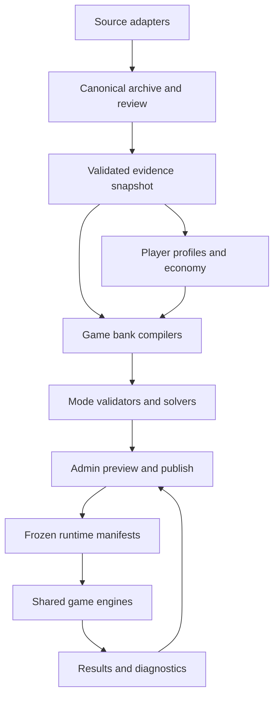

# FAN LIFE — Universal Gate Rulebook and Archive Unlock Specification

**Prepared:** 8 October 2026  
**Purpose:** implementation handoff for Claude / the development team.  
**Language:** English.  
**Scope:** all 13 gates, their game modes, detailed rules, evidence requirements, admin settings, deterministic data preparation and acceptance tests. No AI is required for the proposed compilation, eligibility, rating, pricing or dealing pipeline.

## 1. Decision and evidence

FAN LIFE should use The Worker's richer game engines and interactions, parameterised by club data. A universal gate must be a complete game with the same rules, rather than a simplified screen that happens to use the same name.

The most important change is to stop treating a record count as proof that a game can open. Opening must be decided separately for each mode, using approved evidence, canonical identities, a valid deal, the actual engine mounted on the route, and the required runtime services.

Royal Rumble already has an automatic universal rating function. The problem is its depth and reliability: it mainly uses career span and recorded goals; uses only the first position; derives price directly from rating; does not persist a reviewed evidence profile for every player; and can change the opponent after the user's choices. The detailed replacement contract is in Gate 9.

### 1.1 Source baseline and limits

| Project | Audited source revision | Remote branch checked |
|---|---|---|
| FAN LIFE | `e30fcc7b47a4aca5b6b5e8058de589f23f6fd4ef` | `main`, unchanged at this check |
| The Worker | `edaa80bd300435d31223a8538f52ba27fef2231f` | `main`, unchanged at this check |

This is a source and rules audit with local deterministic probes. It is not a fresh visual review of the deployed website, a production database inspection, or proof that the deployed build matches these commits. Previous visual comparisons remain separate. “Native” below means the richer Worker-style implementation, including inherited modules already available in FAN LIFE; file availability does not prove that universal routes use it.

**Status vocabulary used throughout:**

- **CURRENT:** observed implementation or constants at the audited revisions.
- **REUSE:** an existing native rule/engine worth preserving.
- **REQUIRED:** the proposed universal implementation contract.
- **PROPOSED DEFAULT:** a concrete starting value that needs balance testing; not a measured optimum.

### 1.2 Verified rule defects and important gaps

| Finding | Evidence | Required response |
|---|---|---|
| Equal evidence can become weak ratings | Synthetic 15-player pool: identical two-year spans, no recorded goals; keepers receive rating **9**, outfield players **14**, every price **€1** | Midrank ties, neutral missing evidence, no forced stretch of tiny/flat cohorts |
| Alias collisions misassign goals | Two canonical players share alias `Same`; the current map credits player B, inserted last | Resolve to exactly one ID or quarantine the scorer |
| Goal count errors can still earn full points | Correct two-touch move plus an extra touch returns `8/8`, with `countRight:false` | Count/sequence errors must affect the score and verdict |
| Unknown actor is counted as correct | An unnamed truth touch receives the actor point even for an arbitrary submitted name | Unknown actor must be N/A, with weights renormalised |
| Rumble opponent depends on picks | Hapoel, seed 1: changing one legal defender changes the opponent's defender | Commit opponent before selections; seed and frozen pack determine it |
| Rumble readiness is structurally different from the threshold table | Table says minimum 5 / target 20; actual positional check requires GK2/DF2/MF4/FW2 and calls GK3/DF3/MF6/FW3 full | One shared mode-specific predicate, not conflicting totals |
| Universal lineup is name membership, not the complete native challenge | Current adapter requires 11 distinct starter names and at least 3 other roster names | Canonical starter IDs, verified bands, appropriate decoys, locks and coaching rules |
| Kit recognition is not kit assembly | Universal builder asks season/maker/design; native assembles five parts | Keep recognition as an explicitly named limited mode; implement assembly separately |
| Date-only content can give a misleading impression of breadth | Event compiler generates true/false date questions and event/date memory pairs | Report factual/topic/type diversity, not just question volume |
| Other rich modes are absent from shared routes | Studio, rivalry wall/Black File and graph Thread are not equivalent to kit shelf, derby meeting list and chronology | Open each named mode only after its engine and data contract exist |

### 1.3 Rumble probes on current club providers

100 deterministic draft seeds, numbered 1–100, were checked per provider. “Affordable” only means the cheapest combination costs at most €15; it does not validate the proposed richer draft economy or live mode.

| Club | Canonical players | Currently rated | Current primary-role counts GK/DF/MF/FW | Prices €1/€2/€3/€4/€5 | Full three-card drafts /100 | Affordable /100 |
|---|---:|---:|---|---|---:|---:|
| Hapoel Tel Aviv | 653 | 633 | 57 / 200 / 224 / 152 | 286 / 0 / 130 / 122 / 95 | 100 | 100 |
| Zrinjski Mostar | 30 | 19 | 2 / 6 / 6 / 5 | 5 / 3 / 4 / 4 / 3 | 0 | 100 |
| Hapoel Petah Tikva | 37 | 33 | 4 / 8 / 11 / 10 | 14 / 5 / 8 / 1 / 5 | 100 | 100 |
| Panathinaikos | 52 | 52 | 7 / 11 / 22 / 12 | 17 / 24 / 0 / 6 / 5 | 100 | 100 |
| Olympiacos | 31 | 31 | 3 / 7 / 11 / 10 | 8 / 7 / 6 / 5 / 5 | 100 | 100 |

The missing €2 tier in Hapoel and €3 tier in Panathinaikos are observed results of the current formula, not proof that a specific player deserves a particular price. In Hapoel, 95 automatic €5 players also differs materially from the native reviewed premium model.

Ten existing targeted test files passed: **153 tests** covering Rumble, native ratings/prices, lineup regressions, memory quality, Thread, Blind Cow, XI challenges and chronology. The extra probes above expose cases those tests do not currently cover. No production game code was changed for this report.

## 2. Universal data rules — shared by every gate

### 2.1 One canonical archive, several compiled game views

Keep players, matches, seasons, competitions, trophies, kits, goals, places, culture and dated events as canonical records. A game bank is a derived view with evidence references, plus authored game configuration where required. Do not create a second conflicting history database for each gate.

**Required common envelope:**

| Field | Meaning / validation |
|---|---|
| `clubId`, canonical entity ID | Stable and tenant-scoped; aliases are not IDs |
| `sport` | Football for these game banks; no automatic mixing with basketball records |
| `status` | Draft/review/approved/rejected/conflict or equivalent current statuses |
| `confidence` | Current 0–3 scale; gameplay factual claims normally require at least 2 |
| `sourceRefs` | Resolve to checked evidence, with publisher and underlying source family |
| `value`, unit, scope | Goals in a named competition/season are not career goals; squad seasons are not appearances |
| `precision` | Day/month/year/season/unknown as appropriate; never invent a day |
| research/review metadata | Actor, timestamps, reason and approval policy |
| completeness | Complete / partial / unknown, with coverage denominator where measurable |
| conflict metadata | Contradictory values remain reviewable; no silent last-write truth |

The current event compiler already rejects invalid calendar dates, quarantines duplicate event IDs, checks approval metadata, excludes unchecked sources from gameplay, strips dates from hints and excludes dated chronology titles. Preserve those protections and extend them consistently to all derived banks. A publisher string alone does not establish independent corroboration: two sites copying the same report are one evidence family.

**Unknown is not zero.** `goals:null` means not known. `goals:0` is usable only if a complete, scoped source verifies zero. Empty bench data is not “there were no substitutes.” An unidentified goal participant is not an incorrect participant. An unstated sponsor is not a verified blank sponsor.

**Identity rule:** first use a source/canonical ID; otherwise resolve a normalised alias only when it identifies exactly one candidate in the relevant context. Multiple matches produce `AMBIGUOUS_IDENTITY`, never the last candidate, a fuzzy guess or an automatically selected famous player.

**Time rule:** store real match dates separately from publication dates; opening-year season keys separately from dates; multiple player spells separately from their outer career span. Club-local “today” and daily resets use a configured IANA timezone. Historical dates without a time remain calendar dates.

**Source policy:** a checked authoritative primary record can support confidence 2/3 under a documented review policy. If corroboration is required, count underlying evidence families, not mirrored URLs. Current automated-approval restrictions must remain explicit. This proposal does not grant an importer universal authority to approve disputed or sensitive facts.

### 2.2 Opening is a per-mode decision

```text
playable(mode) =
  adminEnabled
  AND engineImplementedAndMounted
  AND canonicalAndEvidenceValidationPassed
  AND modeStructuralPredicatePassed
  AND requiredRenderingAssetsAvailable
  AND requiredRuntimeServicesHealthy
  AND immutablePackAndRulesVersionAvailable
```

Do not allow an admin toggle to bypass factual or structural validation. A gate can contain a playable limited mode while another mode remains locked. “READY” must name what is ready.

Suggested model: preserve the existing public `READY / PARTIAL / LOCKED / HIDDEN` display states, but compute them from mode manifests. Add separate `enabled`, `runtimeStatus`, `capabilities`, `eligibleCounts`, `blockers`, `warnings` and `version` fields. A paused live service is not missing historical research.

Every blocker returns a stable error code, an exact number where meaningful, affected records, the required archive field and an admin action. For example: **“Full lineup mode blocked: 3 matches have 11 starters, but none has sourced player-to-band assignments. Review Matches → Starting XI → bands.”**

### 2.3 Current thresholds are not the new specification

| Gate | Current minimum → target | Why the count alone is insufficient |
|---|---|---|
| XI | 11 → 22 players | Formation and challenge assignment must be solvable |
| Trivia | 3 → 60 questions | Twelve distinct facts, stage difficulty, topic and template diversity |
| Lineup | 1 → 5 matches | Eleven canonical starters, bands and credible decoys |
| Kit builder | 3 → 5 kits | Five sourced assembly parts and valid alternatives |
| Kits | 1 → 8 kits | Studio needs club identity; historical collection needs historical kits |
| Memory | 2 → 6 pairs | Distinct readable faces, meaningful relations and valid deck |
| Polls | 1 → 6 prompts | Genuine choices; full ballot differs from isolated opinion |
| Goal | 1 → 6 goals | Touch-level truth, uncertainty and sequence grading |
| Rumble | 5 → 20 players in table | Actual role matching, rating coverage, legal boards and price variety |
| Blind Cow | 1 → 30 targets | Clue narrowing, identity uniqueness and mode-specific clue depth |
| Derby | 1 → 1 approved rival | A rival name does not create wall candidates or transfer questions |
| Archive | 1 → 20 entries | Search, sourced relationships, local calendar and browsing depth |
| Timeline | 3 → 11 exact-date events | Chronology and graph Thread have different contracts |

### 2.4 Required mode unlock matrix

All rows also require the common opening predicate above. Counts in this table are **proposed** unless explicitly identified as native rules. These replace a single count per gate; they do not claim the current application already supports these modes.

| Gate / mode | Hard opening condition | Full experience / quality target |
|---|---|---|
| 1 — XI free editor | 11 approved identities; distinct people; unknown positions visibly allowed in free mode | 22+ identities and at least one verified formation assignment |
| XI verified formation | Solver assigns 11 distinct players to accepted roles | Multiple formations independently feasible |
| XI constrained mission | Same solver succeeds after the exact mission filter and saved-player exclusions | Feasible alternatives for at least several slots; no impossible prompt |
| 2 — Trivia practice | 3 distinct eligible facts/questions; valid answer model | No timer/ranking; label short pool |
| Trivia standard | 12 distinct facts with a valid four-question deck at each stage | 60+ eligible questions; diversity report, not 60 reskins |
| Trivia topic/hard/revenge | Requested mode has its own valid deck | Hide absent modes; permit an explicitly labelled short practice deck |
| 3 — Lineup names practice | One verified 11-ID starter set plus 3 credible distinct decoys | Explicitly no band accuracy claim |
| Lineup full | One verified 11-ID starter set, sourced four-band assignments, at least 5 decoys | 5+ eligible fixtures across seasons/competitions |
| 4 — Kit recognition | Existing season/maker/design puzzle predicate | Label recognition, not native assembly |
| Kit assembly single | One kit with all five gradable part bundles and enough plausible wrong alternatives | Sourced tolerance sets, readable shirt renderer |
| Kit assembly Quick / Full | 3 / 5 distinct eligible kits respectively | Bank of 8+ kits for replay variety |
| 5 — Kit studio | Approved club palette, valid crest/wordmark choice, renderer and creative brief | Historical DNA unlocked separately |
| Kit historical shelf | One eligible sourced kit | 8+ eligible kits; photo/reconstruction labels |
| Kit market/auction | Asset identity, ownership and functioning transactional services | Never open merely because a shelf exists |
| 6 — Memory small | 2 valid pairs with no duplicate ambiguous faces | Clearly labelled small deck |
| Memory full | 6 valid pairs; 3+ recognisable relations; deck passes type/face validator | Type caps and sufficient pool to rotate |
| Memory theme | Same valid deck within requested theme | Otherwise disable that theme or show labelled smaller deck |
| 7 — Poll single | One approved opinion prompt with at least 2 distinct eligible choices | No correct answer or fake vote counts |
| Poll full ballot | All 8 native ballot categories resolvable, or a clearly named shorter ballot | Player roles/foreign status and shirt/position choices supported |
| Poll live tally/debate | Real tally/debate store, correct tenant/prompt version and duplicate-vote policy | Personal slip remains available if network tally fails |
| 8 — Goal practice | One eligible goal with 2–5 sourced touches | Zone mode explicitly distinct from richer origin/target mode |
| Goal full run | 3 eligible distinct goals; renderer and replay judge | 6+ goals and staged 100/85/70-second clock |
| 9 — Rumble two-card exhibition | 10 distinct assignable offer identities for GK/DF/MF/MF/FW × 2; legal €15 completion | Explicit provisional economy and no ranked competition |
| Rumble standard draft | 15 distinct assignable offer identities × 3; valid profiles/prices; solver validates boards | Quality-calibrated legal combinations; 20+ identities only a variety target |
| Rumble ranked/live | Standard draft plus comparable profiles, committed match rules and functioning session authority | Provisional offered profiles ≤20% by proposed policy; frozen identical bank for both sides |
| 10 — Blind Cow practice | 5+ sourced semantic clues; 1–3 final candidates, ambiguity explicitly accepted | Single intended target is preferable |
| Blind Cow daily/duel | 10 clues, 3 families, strict narrowing until unique, final candidate count 1 | Real server clock and same bank/clues for competitive peers |
| 11 — Rivalry archive | One approved contextual rival and eligible meeting records | This is a reading mode |
| Rivalry wall | 10 approved distinct opinion candidates; enough contenders for 8 duels | Authored rankings labelled curated unless backed by real votes |
| Black File limited | At least 1 fully verifiable binary item or 1 unambiguous dated pair | Display actual dealt count |
| Black File full | Both binary and date-order modules; 4 distinct dated pairs need 8 dated items | Native whole binary bank plus 4 pairs; no fixed fictional total |
| 12 — Archive reading | One eligible entry with evidence display | 20+ entries as breadth target, not a history completeness claim |
| Archive Dig/graph walk | Source-backed edges and at least one legal next item | Five distinct useful opens required for visit achievement |
| 13 — Chronology short | 3 distinct exact-date events: anchor plus 2 placements | Short-run score category |
| Chronology full | 11 distinct exact-date events: anchor plus 10 placements | No dates in pre-answer IDs/text/accessibility metadata |
| Thread practice | One generated/authored level passes the exact graph solver | Its actual tier/rules are shown |
| Thread full | Five solvable levels, tiers 1–5, from approved relationships | Verified optimum and valid decoys; no silent difficulty downgrade |

## 3. Gate 1 — XI: universal team building

**CURRENT:** the universal roster exists; position coverage is already more than a raw headcount. Native challenge and manager-prompt modules provide richer constraints. Several rule names and defaults remain Hapoel/Israel-specific.

### Required rules

1. **XI-R01 Identity:** one canonical person can occupy only one of the eleven slots, even when they have several names or club spells. A captain is one of those eleven; a twelfth-choice/last-cut artefact is separate.
2. **XI-R02 Opinion:** best and worst XIs are personal judgements. Do not mark a player's historical quality correct/incorrect or present an opinion score as fact. Grade only compliance with the chosen explicit constraints.
3. **XI-R03 Formation:** reuse role compatibility: GK→GK; RB/CB/LB→DF; RWB/LWB→DF or MF; DM/CM→MF; AM/RM/LM/RW/LW→MF or FW; ST→FW. Coarse MF does not prove a documented defensive-midfielder speciality.
4. **XI-R04 Unknown roles:** allow unknowns only in visibly labelled free selection. Unknown is not evidence of formation coverage or constrained role eligibility.
5. **XI-R05 Feasibility:** use bipartite assignment for slots and eligible players. Eleven players with ten forwards and one keeper do not certify 4-4-2. A multirole player can satisfy one slot, not two simultaneously.
6. **XI-R06 Spell selection:** a mission evaluates the selected club spell, not an outer span that fills years away from the club. Changing an era filter selects an eligible spell deterministically or explains the refusal.
7. **XI-R07 Era wording:** native `pre2000` checks when the spell starts; native modern checks its end/overlap. If the UI says “played before 2000,” use documented overlap, not wording implying the whole spell ended before 2000. Define the chosen semantics once in configuration and test boundary years.
8. **XI-R08 Decades:** derive available decades from verified club seasons, not Hapoel's fixed 1940–2020 array. A mission requiring eleven different start decades must remain unavailable if the club lacks eleven feasible decades. Offer a feasible “cover three decades” mission separately; do not silently change the stated rule.
9. **XI-R09 Local/foreign:** nationality, birthplace and league foreign-slot status are different facts. Port the native foreign-slot challenge only where the relevant competition-season rule and player status are documented. Otherwise offer a separately named nationality-based mission with its own predicate, or disable it.
10. **XI-R10 Cup missions:** state whether eligibility means “in the winning season's verified squad” or “documented tournament participant.” Native evidence primarily supports the former. Never advertise participation or a winner's appearance from mere overlapping career dates.
11. **XI-R11 Fresh-five prompt:** freeze five distinct excluded canonical IDs from the user's previous XI. A replacement spell of the same player remains excluded. Re-run feasibility after exclusions.
12. **XI-R12 Saving:** store club, canonical picks, selected spell IDs, formation, captain, constraints, pack and rules version. Missing old picks remain visible as unresolved historical selections instead of being reassigned to another player.

**Archive/admin:** Players → canonical identity, positions with references, actual spells/season membership, nationality and separately foreign-slot status; Seasons/Trophies → competition winner and player membership evidence. Admin previews “eligible players,” “unknown/excluded,” and a witness XI for every offered challenge.

**Mobile:** tap slot → bottom-sheet roster → pick; searchable aliases; persistent formation/captain controls; explain exclusions at the point of selection. Dragging is optional. Final poster must remain readable at phone width.

**Acceptance:** repeated aliases cannot duplicate a player; a 2009–2011 spell satisfies a 2000s overlap mission; unknown foreign status fails foreign-slot missions; impossible decade/formation missions are not dealt; best/worst labels never become factual grades.

## 4. Gate 2 — Trivia: knowledge, not repeated date forms

**REUSE:** native session constants: 3 lives, 12 questions, 3 stages of 4, clocks **20/15/11 seconds**, stage multiplier caps **2/3/4**. Hints cost **40 points**. The current universal board does not provide the whole native hint/topic/practice experience.

### Required rules

1. **TR-R01 Question truth:** compile each question from approved fact IDs, with an exact answer set, explanation and source reveal. Answer IDs and truth stay server-side before commitment.
2. **TR-R02 Answer shape:** support true/false, single answer and multi-answer only when the existing question engine can grade them correctly. Multiselect requires exact set equality unless a versioned partial-credit rule is explicitly introduced; order is irrelevant.
3. **TR-R03 False statements:** changing a date/player/opponent must produce a genuinely false statement. Reject alternatives that accidentally equal the truth, duplicate an alias or are true in a different club-season context.
4. **TR-R04 Variety:** deduplicate underlying fact IDs within a standard run. Ten templates about one event are not ten independent knowledge items. Proposed bank dashboard: distinct facts, topic distribution, question-type distribution, decade distribution, difficulty distribution and reuse rate.
5. **TR-R05 Stage composition:** only open standard if a nonrepeating 4+4+4 deck satisfies stage difficulty filters. If twelve items exist but all are identical date questions, show a narrow history mode rather than claiming a broad general challenge.
6. **TR-R06 Scoring:** correct answer gains `round((100 × difficulty + 100 × clamp(secondsLeft / totalSeconds, 0, 1)) × multiplier)`. A used hint subtracts 40, floored at zero. A wrong answer gains zero and loses one life.
7. **TR-R07 Combo:** unhinted correct answers increase combo; hinted correct answers preserve rather than increase it; a miss resets it. Multiplier is at least 1 and bounded by stage cap and the global cap 4.
8. **TR-R08 Timeout:** one committed timeout counts once as a miss. An answer arriving after the authoritative deadline does not replace it. Network retries cannot subtract another life.
9. **TR-R09 Hints:** a hint is derived from known context/choices; it cannot invent a story or reveal the exact answer accidentally. Build the missing fact lookup for the universal question engine; do not call a hint supported when its evidence resolver is absent.
10. **TR-R10 Practice:** no hard clock and no standard leaderboard. Short runs, hard mode and different topic/difficulty pools have separate result categories. Native raw rank cutoffs are not portable to three-question practice.
11. **TR-R11 Revenge:** queue actual incorrectly answered question/fact IDs for that club and version. If retired/conflicted, explain its removal. Do not secretly substitute unrelated questions as “your mistakes.”
12. **TR-R12 Surprise/replay:** seed plus cursor selects a frozen deck; avoid repeats until the eligible cycle is exhausted. Source corrections create a new bank version, preserving or explicitly retiring prior receipts.

**Archive/admin:** facts with topic, entities, date precision, competition/season context, sources; compiled question quality checks and hand-reviewed exceptions. Show missing stage counts and the exact mode each imported fact helps unlock.

**Mobile:** readable answer targets, explicit multiselect commit button, stable HUD and keyboard-safe layout. Reveal sources after grading, with an expandable explanation; auto-advance timing must permit reading and pause in practice/accessibility mode.

**Acceptance:** an answer submitted twice settles once; two aliases of the same answer cannot become distinct choices; a false-date mutation equal to truth is rejected; a hint cannot increase combo; standard and practice scores cannot share a ranking bucket.

## 5. Gate 3 — Lineup: the locker-room challenge

**CURRENT:** universal eligibility uses eleven unique starter names and at least three other roster names; pool generation can top up from the club-wide historical roster. The native game uses a four-band sheet and richer reveal/coaching rules.

### Required rules

1. **LI-R01 Truth:** exactly eleven distinct canonical starters for one fixture. Bench and substitution data are separate. A line-up copied as free text must be resolved to identities before full mode opens.
2. **LI-R02 Bands:** GK / defence / midfield / attack assignments come from this fixture's verified record. A player's general career position is not sufficient to invent the match formation or starting role. Display formation only when documented.
3. **LI-R03 Pool:** all starters plus at least five credible, distinct decoys for full mode. Prefer documented substitutes and same-season squad members. All-time unrelated players can appear only in an explicitly different easier mode, not as an authentic match-day bench.
4. **LI-R04 Placement:** maximum eleven occupied places; each person once. Moving an existing player moves the same identity and carries its lock state. Band order within one line is not a factual left/right position unless the source supports that.
5. **LI-R05 Grading:** distinguish right starter/right band; right starter/wrong band; nonstarter; missed starter. A team containing all eleven in wrong bands is not “perfect.” Perfect means exact identity set and correct sourced bands.
6. **LI-R06 Locks:** at most three captain-style confidence locks. Report starter correctness and band correctness separately. A locked starter in the wrong band is not a perfect placement and does not earn an invented factual bonus.
7. **LI-R07 Coach:** at most two native coach notes. Counts are computed server-side from the current sheet. If bench membership is unknown, omit the bench-trap count rather than reporting zero. Notes cannot directly return the missing eleven.
8. **LI-R08 Malformed input:** reject duplicate IDs, unoffered players, invalid bands and more than eleven selections; do not silently drop forged rows and then grade an apparently valid answer.
9. **LI-R09 Reveal:** reveal by source bands, show missed starters as ghosts, describe correct starters in wrong lines, and cite the fixture. Offer skip/fast reveal; don't force eleven long animations.
10. **LI-R10 Scoring:** reuse native recorded score: **the count of starters placed in their correct sourced band, out of eleven**. Preserve starter membership, perfect status, locks and coaching metadata as separate fields. A coaching/lock bonus is not added unless an explicitly new versioned mode introduces one.
11. **LI-R11 Missing data:** name-only practice remains playable with sourced starters and three credible decoys; clearly remove band grading, coach bench claims and “full lineup” badges.

**Archive/admin:** Matches → starting XI IDs, player-to-band evidence, bench-known flag, bench IDs, substitutions, competition, day/date precision and formation evidence; season squad membership for decoys. Preview a roster sheet plus the precise decoy reasons.

**Mobile:** native-style locker room, tap-to-select/tap-to-place, large band hit areas, sticky “11 selected” indicator, optional drag, undo and visible locks. Wrong-band feedback belongs on the pitch, not only in a text summary.

**Acceptance:** a player spelling variant does not create a twelfth starter; all eleven in wrong bands fail perfect; unknown bench does not become no-bench; a match lacking band evidence opens only name practice; coaching retries consume a note once.

## 6. Gate 4 — Kit Builder: restore assembly as a distinct game

**CURRENT:** universal season/maker/design recognition is much thinner than native five-part shirt assembly. Preserve it as a named recognition mode while migrating the complete builder.

### Required rules

1. **KB-R01 Eligible kit:** canonical club-season/type/variant identity. Home/away/third, goalkeeper and one-off versions must not silently merge into one answer.
2. **KB-R02 Five steps:** body; construction; crest; maker; sponsor. Truth must be sufficient for every scored subfield, including explicit documented “none.” Unknown cannot be rendered as verified blank.
3. **KB-R03 Field weights:** reuse native 100-point field score: base 10, pattern 15, secondary colour 7; collar 6, collar ink 4, sleeves 6, sleeve ink 4; crest 17; maker 13; sponsor 18. Perfect complete reconstruction adds **15**.
4. **KB-R04 Hints:** maximum 3, **8 points** each, with server-signed hint receipts. Final score is `max(0, fieldPoints + perfectBonus − 8 × validHints)`. Client-reported hint count is not authoritative.
5. **KB-R05 DNA:** unlock historical DNA when **fieldPoints ≥75**, not from a client's claimed total. Hint penalty affects displayed score; the existing DNA rule uses field accuracy before penalty/bonus. Show those two concepts separately.
6. **KB-R06 Alternatives:** each step contains one accepted truth bundle plus plausible distractors; opaque option IDs cannot include the season or correctness. Alternatives must be visually distinguishable. Sourced acceptable variants form an explicit tolerance set.
7. **KB-R07 Option ramp:** preserve native 3/4/4/4/5 choices across five shirts. Quick uses three shirts, Full five; both count actual shirts consumed in the rotation cursor, avoiding repeats across mixed run lengths.
8. **KB-R08 Rendering:** begin with a neutral shirt. Reveal the correct construction only after grading. A photographed look is used only if all offered parts can render fairly against it; otherwise use consistent drawn rendering.
9. **KB-R09 Evidence:** label exact documented kit, supported candidate or reconstruction. A loosely dated photograph is not automatically a precise season. No AI image generation is needed for the game renderer.
10. **KB-R10 Partial evidence:** either exclude the kit from full assembly or offer an explicitly reduced-parts practice mode with its own denominator and result category. Do not award all sponsor points for an unknown sponsor.
11. **KB-R11 Unlock proof:** a signed, club-scoped receipt records kit ID, parts earned, pack/rules version and outcome. Reopening a URL, replaying a client request or posting another club's receipt cannot duplicate ownership.
12. **KB-R12 Compatibility:** preserve old shared-link cursor semantics through a migration/version marker. Do not silently redirect an old bragging link to a different shirt.

**Archive/admin:** Kits → season, team/type, variant, body palette/pattern, collar/sleeves, crest variant, maker, sponsor, known-none flags, source photos, tolerance sets, renderer keys and evidence quality. Inspector shows a five-step truth sheet and each generated distractor before publishing.

**Mobile:** keep shirt preview visible, place current step controls in thumb reach, prevent layout shifts between options, show a simple five-step progress strip and a parts reveal. Avoid five separate information forms.

**Acceptance:** field weights total 100; perfect no-hint score is 115; perfect with three hints is 91; 74 field points cannot unlock DNA; a duplicate hint receipt has no second penalty/unlock effect; Quick followed by Full consumes eight shirts under the same versioned rotation policy.

## 7. Gate 5 — Kits: studio, collection and optional commerce

**CURRENT:** shared gate is a historical shelf. Native studio has identity, brief fit, originality, coherence and DNA metrics, with hardcoded Hapoel/red/1923/2010 assumptions. Those assumptions cannot be copied to other clubs.

### Required rules

1. **KS-R01 Separate capabilities:** studio, earned collection, archive shelf, market and auction are independent modes. A sourced shirt opens a shelf, not ownership, auctions or design grading.
2. **KS-R02 Identity:** configure approved club primary/secondary colours, crest variants, display name/wordmark and brand rules. No universal red preference or reward for the word HAPOEL.
3. **KS-R03 Briefs:** free, derby, European night, supporters and historical-memory briefs are parameterised by that club. Historical memory requires a selected eligible kit/season; do not copy `memory2010` to clubs without that reference.
4. **KS-R04 Traits:** reuse the studio's eleven design traits: base, pattern ink, pattern, collar, collar ink, sleeves, sleeve ink, maker, sponsor, crest, nameset. Renderers and font/crest availability are checked before the brief is offered.
5. **KS-R05 Metrics:** these are design heuristics, not factual proof that a shirt is beautiful. Native overall weights are identity .27, brief .28, originality .18, coherence .22, DNA .05. Proposed universal default preserves these only after the individual component functions become club-aware.
6. **KS-R06 Missing DNA:** show DNA use as N/A and renormalise available weights. Missing archive kits must not produce a zero quality penalty. If the brief specifically requires historical DNA, disable that brief instead.
7. **KS-R07 Originality:** compare against the eligible club reference designs only, and label the comparison. Recolouring a rival's crest cannot satisfy this club's identity rule.
8. **KS-R08 Ownership:** historical shelf access and an earned collectible are different. Studio does not unlock historical ownership just by imitating a kit. Unlocks come from valid gameplay receipts or explicit migration policy.
9. **KS-R09 Editions:** save design ID, trait schema, renderer version, club, author and selected brief. Share posters are deterministic and carry the actual design, not whichever default renderer is current.
10. **KS-R10 Transactions:** only mount market/auction after atomic ownership transfer, balances/currency definition, bid deadlines, cancellation, settlement, idempotency and authorisation exist. If currencies are virtual, label them accordingly; do not call a draft score a financial valuation.

**Archive/admin:** club identity settings; kit/crest/wordmark history; creative briefs; optional ownership ledger and transaction settings. A mobile preview must be available for each brief without requiring a desktop inspector.

**Acceptance:** a green club can achieve full identity compliance without red; a club with no historical kits can still use a free studio; unavailable memory seasons are not offered; the same signed unlock cannot mint two items; a failed transaction cannot partially transfer an item.

## 8. Gate 6 — Memory: meaningful archive pairs

**REUSE:** native flash 3,000 ms; reflash 1,300 ms; fusion 1,150 ms; echo 1,400 ms. FAN LIFE explicitly supports the `moment-date` relation type; it is not an invalid pair type.

### Required rules

1. **ME-R01 Relation:** each pair is a verified relation: event/date, trophy/season, goal/year, fixture/season, sourced crest period, maker span or another supported type. The relation must be understandable from its two faces.
2. **ME-R02 Ambiguity:** no duplicate indistinguishable face values inside a dealt board. If two events share the same displayed date, use context-bearing date faces or select only one; do not require a player to guess hidden pair IDs.
3. **ME-R03 Strength:** run native relation-strength validation, not only raw candidate counting. Require at least three recognisable relations for a full six-pair deck. Target no more than three pairs of one relation type; if impossible, label the narrow deck instead of claiming balanced variety.
4. **ME-R04 Deck solving:** select a set whose face and type constraints hold simultaneously. Greedy deduplication can hide a viable deck or overstate capacity; small-deck bounded search is sufficient.
5. **ME-R05 Move:** one completed two-card comparison is one move. A first flip alone is not a move. Matched/open/resolving cards cannot be selected as a new second card.
6. **ME-R06 Mismatch:** increment misses, reset matching streak and increment misses-since-last-pair. A pair found without an intervening miss is a perfect pair.
7. **ME-R07 Echo:** three consecutive matches arm one echo per run; the next eligible first flip briefly reveals its mate, then spends it. It cannot be farmed by tapping already matched cards or armed repeatedly.
8. **ME-R08 Reflash/fusion:** one reflash allowance according to the native run state; fusion timing is feedback, not a race to double-submit. Backgrounding and reduced-motion behaviour are defined consistently.
9. **ME-R09 Morale:** completed pairs / total pairs is the visual crowd-progress ratio. Wall lights at ≥50%. This is game progress, not a real supporter sentiment statistic.
10. **ME-R10 Verdict:** native qualitative verdict: no misses→flawless; moves≤pairs+2→sharp; misses≤pairs→solid; otherwise completion. Native recorded score is **best matching streak**; retain moves, misses and pairs as separate metrics. Version any replacement numeric score and separate 2/4/6-pair and hinted/unhinted modes; don't use the shared basic board's points as if they were the native metric.
11. **ME-R11 Themes:** a decade/topic deck includes only qualifying facts and passes the same uniqueness validator. No irrelevant pair added invisibly just to reach six.
12. **ME-R12 Reveal:** after match/end, expose the relation and source link; before matching, do not put hidden mate IDs or full relation explanations in accessibility labels.

**Archive/admin:** approved relations with semantic type, face labels, entity references, year precision, recognisability and evidence. Inspector previews the actual two-sided card deck, duplicate faces and theme capacity.

**Mobile:** comfortable card sizes at 2-column/3-column layouts as needed; readable short labels rather than microscopic date paragraphs. Tap works throughout. Reduced motion shortens animation without exposing more information in competitive variants.

**Acceptance:** no duplicate ambiguous faces; a one-card flip leaves move count unchanged; a mismatch resets streak; echo activates once; date-only pools are labelled as date memory; a theme cannot count records outside its filter.

## 9. Gate 7 — Polls: personal ballot and real terrace counts

**REUSE:** native eight-category ballot: favourite, goalkeeper, centre-back, midfield, striker, foreign player, your number and your position. Native number choices are 1–99. Shared universal prompts do not yet equal the full ballot/debate wing.

### Required rules

1. **PO-R01 Opinion:** no correct answer, lives, speed bonus or knowledge grade. Completion and participation are separate analytics from skill performance.
2. **PO-R02 Choices:** at least two distinct meaningful choices. Player choices use canonical IDs; displays may translate names without becoming new votes. A single available keeper is not a competitive “best keeper” poll.
3. **PO-R03 Category evidence:** centre-back requires finer position evidence than DF; a coarse-position club can offer “defender” instead, with a different question ID. Foreign status follows its explicitly named definition, not an inferred passport/foreign-slot equivalence.
4. **PO-R04 Personal identity:** shirt number 1–99 and self-chosen position do not assert that a historical player wore that number. A “who wore it?” follow-up requires a sourced player-season-number record.
5. **PO-R05 Ballot length:** full native ballot has eight valid categories; a club with six valid categories gets an explicitly shorter ballot. Progress, summary and analytics use actual dealt length.
6. **PO-R06 Votes:** define one active vote per voter/device and `(clubId, promptId, promptVersion)`. Changing a vote replaces the prior vote rather than incrementing two choices. Device deduplication is not proof of one person, and the admin should state the measurement policy.
7. **PO-R07 Counts:** display percentages only from genuine accepted votes and a disclosed denominator. No invented crowd baseline, random distribution or fake “terrace pick.” Handle zero votes without division errors.
8. **PO-R08 Offline:** keep a personal ballot locally if needed; clearly distinguish locally saved and server-counted states. Retry with an idempotency key so reconnecting cannot double-count.
9. **PO-R09 Prompt changes:** a meaningful change in choices/definition creates a new version. Retired choices stay visible in historical receipts; do not silently transfer their votes to a replacement player.
10. **PO-R10 Debates:** stance and reason IDs are authored separately from factual context. Show sourced context, but do not grade a fan's stance as right/wrong. Live public text, if enabled, needs the existing moderation/visibility flow; fixed reason choices can remain the initial scope.

**Archive/admin:** opinion prompt authoring; canonical choice eligibility; actual tally backend health; reason sets; prompt version history. Separate “eligible historical choice” from “admin prefers this answer.”

**Mobile:** ballot cards with visible selection and undo/change, a readable final slip, real count board accessible after voting, and short context drawers. Do not add timers to emotional/opinion decisions.

**Acceptance:** offline slip is not counted as server acceptance; changing A→B leaves one active vote; no verified centre-backs disables/renames that category; source context does not preselect an opinion answer; percentages sum correctly from the same accepted denominator.

## 10. Gate 8 — Goal: reconstruction with honest uncertainty

**CURRENT:** universal grade uses actor/action/zone, maximum five touches, and positional comparison. It accepts a one-touch truth. Native reconstruction requires **2–5 touches**, origin/target envelopes, sequence alignment and replay. Native full run has 3 goals, 3 lives and clocks **100/85/70 seconds**.

### Required rules

1. **GO-R01 Truth scope:** an eligible goal has a checked report/video and a documented sequence. A scorer and minute alone cannot create the buildup. Each touch records actor identity or explicitly unnamed side, action, supported region(s) and evidence.
2. **GO-R02 Uncertainty:** source wording supports an area, not an invented exact coordinate. Translate controlled region phrases to predefined envelopes; preserve broad/vague evidence. A zone-only source can open zone practice without claiming an exact origin/target reconstruction.
3. **GO-R03 Actors:** club, opponent and unnamed actors are different roles. Resolve named players canonically. Opponent players are not automatically inserted into this club's roster or Rumble pool.
4. **GO-R04 Input:** require 2–5 valid touches for full mode. Distinct touches can involve the same actor; that is a football sequence, not duplicate-player fraud. Reject unknown actions, out-of-pitch coordinates and nondealt actor IDs.
5. **GO-R05 Actions:** reuse pass, through ball, cross, dribble, shot, header, save. Partial similarities: pass/through ball 55, pass/cross 40, pass/header 30, cross/through ball 25, shot/header 45, dribble/pass 15; exact match 100, other pairs zero. No transitive similarity inference.
6. **GO-R06 Touch score:** reuse native actor .24, action .18, origin .22, target .24, origin anchor .05, target anchor .07. If actor is unknown, remove its term and renormalise; do not award an automatic correct-player point.
7. **GO-R07 Sequence score:** reuse alignment, route/continuity and explicit extra/missing penalties. Native overall terms: sequence .46, routes .16, continuity .14, players .12, actions .12, then **7 points per extra/missing touch**. Unavailable route/player metrics return N/A and transfer their weight to sequence according to the engine.
8. **GO-R08 Route:** a source with no meaningful direction cannot support a direction grade. Use the native near-zero route check rather than making the user find an invented vector. Continuity evaluates joined touches, not a claim of historical exactness.
9. **GO-R09 Results:** native good threshold **78%**; near from **50%**. Native points `round(overall × 12 + continuity × 2)`, minus **120 per valid hint**, floored at zero. Quality percentage and arcade points are separate.
10. **GO-R10 Lives:** existing native behaviour loses a life for each matched touch graded bad; it does not lose a life for an absent touch. Preserve this initially and display the cause. Extra/missing touches still reduce quality. If later changing life loss to one per poor goal, introduce a new rules version rather than silently mixing policies.
11. **GO-R11 Hints:** existing start-region and touch-count hints have a defined cost; issue each supported hint once, with server-authoritative receipt/counter. Same hint retry cannot repeatedly charge or reveal more data.
12. **GO-R12 Clock:** start only when the player begins and the challenge has loaded. Define timeout as grading the current valid reconstruction once; zero-touch timeout is a miss with no fabricated truth comparison. Practice has a separate no-clock category.
13. **GO-R13 Collection:** ≥78% can unlock the goal under the existing collection policy. Only a valid server receipt earns it; embedded LIFE/practice distinctions remain explicit.
14. **GO-R14 Replay:** animate the user's move, then the sourced reconstruction and explain the largest mismatch. Summary can skip the long replay; reduced motion remains functional.
15. **GO-R15 Score bounds:** extra touches cannot produce a perfect quality verdict. Adding arbitrary unknown actors cannot improve points. Unknown fields must not increase the numerator simply because the source is incomplete.

**Archive/admin:** Goals → fixture/scorer context, typed touch sequence, actor certainty, controlled action, origin/target region/envelope, source snippet or video timestamp, reconstruction tier and evidence references. Native spatial mode must not open from the current single `zone` field without a deliberate migration.

**Mobile:** full-width pitch, tap origin → tap target, actor/action bottom sheet, visible touch trail, undo, thumb-safe submit and replay controls. Provide tap placement alongside dragging; don't require precision smaller than the supported evidence envelope.

**Acceptance:** exact move plus extra touch loses sequence quality; unnamed actor is N/A; one-touch historical fact fails full reconstruction eligibility; a scorer-only report cannot generate passes; repeated hint call charges once; timer/retry cannot submit two results.

## 11. Gate 9 — Royal Rumble: complete player ratings, a separate economy and valid drafts

This is the largest foundational change. The target is **a profile for every canonical club player**, explainable strength, a deliberate €1–€5 game economy, full role coverage and a fair five-a-side simulation. It must work from sparse and rich archives without presenting missing research as evidence of a poor player.

### 11.1 Current universal versus reusable native mechanisms

| Area | Current universal | Native mechanism / universal requirement |
|---|---|---|
| Player role | `positions[0]` only | All documented positions, resolved offered role |
| Longevity | `toYear−fromYear+1` | Verified season membership / separate spells |
| Output | Scorer entries found in available matches | Scoped player-season facts and coverage-aware use |
| Rating | Span/goals percentiles, first index for ties | Six factors, role weights, tie-safe ranking, evidence confidence |
| Price | Fixed rating cutoffs including automatic €5 | Separate suggested price, role calibration and reviewed overrides |
| Premium | Anyone rating ≥80 becomes €5 | Hapoel native has 10 reviewed premium identities; other clubs need their own policy |
| Dealing | Independent shuffled role lists | Distinct-ID role assignment, board-quality assessment, legal completion |
| Thin pool | Some slots silently have fewer cards | Explicit two-card exhibition or locked full mode |
| Opponent | Excludes selected players, so changes after picks | Seed/round-committed opponent, never a counter-pick |
| Simulation | Team sum → rounded goals | Native probabilistic simulation, role effects and replay adapted to club data |
| Profile visibility | Computed runtime cards only | Versioned admin-visible profile with factors, sources and reasons |

The native six-factor model is a strong starting point, not historical ground truth. It also has data-bias risks: positive evidence counts are not the same as coverage, and using a start year to assign an era can misrepresent long or separated spells. Port its structure while correcting those weaknesses.

### 11.2 Every player receives a profile, even when excluded from play

**RR-R01 Coverage invariant:** `profiles.length === canonicalClubPlayers.length`. Profiles are keyed by canonical ID and club. No silently discarded player.

Each profile must contain:

| Group | Required fields |
|---|---|
| Identity | Player ID, names/aliases, club membership evidence |
| Roles | Sourced playable positions; role-specific ratings where justified |
| Time | Actual verified season IDs, separate spells, era distribution; unknown remains unknown |
| Evidence | Fact IDs, scope, sources, units, completeness, conflict state |
| Strength | Six factor values/availability/reliability, weighted score, rating by role |
| Confidence | High/medium/provisional, numeric coverage and reasons |
| Economy | Suggested price, final price, overrides, icon status, calibration reason |
| Eligibility | Standard/ranked/exhibition eligibility and explicit exclusion codes |
| Reproducibility | Rating model, price model, pack version, cohort ID and review metadata |

An approved player lacking documented position still gets an evidence profile and a **provisional neutral strength**, but is excluded from position-based dealing with `POSITION_UNVERIFIED`. Do not guess GK/MF to make the gate open. A conflicted identity gets a profile without a usable competitive rating/price, and a reason such as `IDENTITY_CONFLICT`; it must not become a bargain by default.

**All-player coverage and all-player playability are different.** This is how to meet the request for complete processing without inventing the missing historical record.

### 11.3 Prepare evidence before calculating a number

1. Join canonical player IDs to actual club season membership; union overlapping stints and deduplicate season IDs. A 2001–2003 spell and a 2010–2012 spell have six verified seasons, not twelve years of continuous service.
2. Resolve scorer identities to canonical IDs with ambiguity rejection. Store each goal event or an explicit scoped count. A scorer row naming a player once is not necessarily one goal if the record actually represents a hat-trick.
3. Separate own goals, penalties, shootout goals, youth/reserve/senior records and competition scope according to the chosen model. Proposed default: senior first-team official match goals, excluding shootouts; penalties remain included and labelled.
4. Compare verified complete season totals with equivalent scope only. An archive containing three famous matches must not label its scorer sum a career total. Partial event samples can support a big-game fact but cannot compete directly against complete career output.
5. Link titles to the player-season membership or participation required by the model. Label “winning squad member” if that is the evidence; don't invent tournament appearances.
6. Distinguish lineup appearances in the archive from verified total appearances. Ten preserved historic lineups do not imply ten career matches.
7. Captaincy is a sourced appointment/fixture fact. Shirt-number evidence is scoped to a season. A song/tribute belongs to a canonical cultural record and a source family, not ten mirrored copies.
8. Reject future seasons/outcomes from historical strength; a current season's membership can count as membership, but future matches cannot become achievements.
9. Compute completeness/reliability from the evidence coverage, including verified zeros. Do not call a player “high confidence” merely because several positive achievements are present.

### 11.4 Six factors and role weights

Reuse the native factor vocabulary, but define each input's scope precisely.

| Factor | Universal evidence interpretation | Missing-data behaviour |
|---|---|---|
| Peak | Strongest adequately covered club season using documented role-relevant performance; simpler proxy only if labelled | Neutral if no comparable covered season; no invented athletic attribute |
| Longevity | Count of unique verified club seasons, capped at 16 as an initial native-compatible scale | Outer span is not accepted as a complete season count |
| Output | Comparable verified goal/output rate or season total, role-specific | Unknown/partial noncomparable totals excluded, not zero |
| Honours | Documented winning season membership/participation plus explicitly configured captaincy component | Verified no honours differs from unknown trophy membership |
| Big games | Reviewed impactful match/moment involvement with canonical event references | Cap repeated evidence; sparse coverage shrinks toward neutral |
| Legacy | Independent approved culture/tribute/captaincy/number associations | Never a popularity scrape or mirrored-song count |

**Proposed starting weights** reuse native V3, in this fixed order:

| Role | Peak | Longevity | Output | Honours | Big games | Legacy |
|---|---:|---:|---:|---:|---:|---:|
| FW | .20 | .10 | .30 | .15 | .15 | .10 |
| MF | .15 | .15 | .20 | .20 | .15 | .15 |
| DF | .05 | .30 | .05 | .28 | .20 | .12 |
| GK | .10 | .35 | .00 | .25 | .20 | .10 |

Each row sums to 1. Goalkeepers are not penalised for not scoring. A multirole player is rated in every documented coarse role, but every selection represents the same person. Do not display a fabricated precise tackling or reflexes rating from these archive proxies.

**Peak implementation rule:** only turn on a role-specific peak feature when the denominator and scope are known. Start with the existing native proxy only in banks whose data supports it, and label it a game proxy. Introducing assists, clean sheets or minutes later requires explicit comparable source coverage and a new model version. These stats must not be inferred from match score alone.

### 11.5 Deterministic coverage-aware strength — proposed formula

This is a proposed replacement formula, not a claim that these numbers have already been balance-tested.

For each feature in a valid cohort:

```text
q = (average zero-based rank among tied values + 0.5) / cohortSize
r = verified feature reliability in [0,1]
adjustedFeature = 0.5 + r × (q − 0.5)
S(role) = sum(roleWeight × adjustedFeature)
rating(role) = clamp(round(9 + 90 × S(role)), 9, 99)
```

- Unknown or incomparable feature: `r=0`, giving neutral **0.5**.
- Verified complete comparable feature: `r=1`.
- Quantified partial coverage may receive bounded intermediate reliability only when its metric remains comparable; a handful of match goals cannot be scaled to a career estimate.
- Tied values use midrank; identical evidence produces identical scores around the neutral midpoint rather than everyone falling to 9.
- Do not add a second global rank stretch that turns tiny differences or missing evidence into a 9–99 spread.
- Keep fixed role weights and shrink missing factors to neutral. This differs deliberately from treating all unknown factors as zero or reallocating all weight to one known achievement.
- Proposed cohort floor: at least **8 comparable players** of the role/era; broaden to adjacent eras then the whole role, recording the fallback. With fewer than 8 comparable players, that feature stays neutral or uses an explicit reviewed absolute rubric. An eight-player cohort is a starting floor, not proof of statistical precision.
- Use actual verified season distribution for era assignment. Unknown era stays unknown; don't default it to “middle.” Retain native early/middle/late boundaries only as an initial configurable scheme, not as universal historical truth.

Neutral all-missing evidence gives **54**, explicitly marked provisional. This is a gameplay baseline, not a historical claim that a poorly documented player was average. Confidence must travel with the number; no high-confidence leaderboard should quietly accept a bank full of such baselines.

**Proposed confidence definition:** weighted reliable coverage `C = Σ(roleWeight × reliability)`, plus identity/role verification and conflict checks. High: `C≥.75`; medium: `.40≤C<.75`; provisional: `C<.40`. These cutoffs are initial policy values. Even high numerical coverage cannot override a material unresolved identity/fact conflict.

### 11.6 Prices are a game economy, not a historical valuation

**RR-R02 Separate price pipeline:** rating/evidence → suggested tier → role/economy calibration → reviewed override → final price. A rating change need not immediately change every price during a live run.

**Proposed starting automatic tiers** within the role's comparable game-value cohort:

| Midrank percentile | Suggested price |
|---|---:|
| `< .25` | €1 |
| `.25 to < .55` | €2 |
| `.55 to < .80` | €3 |
| `≥ .80` | €4 |

The midrank rule avoids splitting tied players arbitrarily. Empty/flat cohorts cannot be forced into five tiers just to decorate the deck. Multirole players have **one price per person**: begin with the maximum justified role tier, then review/calibrate. Do not offer the same player at cheaper prices depending on which slot happened to deal them unless an explicit different-edition game is designed later.

**€5 policy:** no automatic threshold. €5 is a reviewed premium game designation, with club-specific canonical IDs, reason, approver and version. The native Hapoel roster of ten reviewed icons remains a club configuration; do not copy its people or require exactly ten icons for every club. Proposed default premium cap: `min(10, floor(eligiblePoolSize × .10))`; zero premium players is allowed. The cap is configurable and can be raised through recorded review, not automatically filled as a quota.

**Overrides:** proposed automatic-review guard is one ordinary price tier up/down and a bounded strength nudge ±8, both with reason and evidence. Larger changes or €5 designation require explicit review. Historical Hapoel overrides should migrate intact as approved club-specific decisions, not be erased by the universal calculator.

**Bargains:** valid low-cost players with useful strength are deliberate; prices must not be a perfectly rigid copy of strength. But absent evidence is not a discovered bargain. Provisional players receive a visibly provisional neutral price proposal (initial default €2), not €1 for being unresearched; competitive eligibility follows the confidence policy.

**Economy inspector:** per role and confidence, show tier counts, medians, rating spread, repeated prices, premium share, price/rating efficiency and profiles needing review. Do not force exact tier percentages by cutting tied groups; optimise board composition around the real player tiers.

### 11.7 Dealing rules — there must be an actual choice

**RR-R03 Team:** five slots **GK / DF / MF / MF / FW**, exactly five distinct people, total price **≤€15**. The selected offered role is preserved through validation and simulation.

**RR-R04 Standard board:** three offered cards per slot, **15 distinct canonical identities across the board**. Role matching uses all sourced positions and solves assignment globally. Counting three keepers, three defenders, six midfielders and three forwards by primary role is sufficient in a simple disjoint pool, but not a necessary or complete multirole predicate.

**RR-R05 Thin board:** an explicitly labelled two-card exhibition has ten distinct offers and the same five slots/budget. Current mixed two/three/one-card deals should not advertise “three choices per position.” Thin mode is separately recorded and unranked.

**RR-R06 Feasibility:** enumerate all standard combinations (`3^5=243`) and validate unique IDs, offered roles and budget. No “try 24 seeds, then return the original even if invalid” fallback. If no valid board exists, return an actionable blocker or an explicitly different mode.

**RR-R07 Pick feedback:** a card remains selectable only if at least one legal completion exists after selecting it, or the UI clearly allows a temporary overbudget edit while disabling final commitment. No hidden dead end. Show remaining budget and cheapest feasible completion, not only current spend.

**RR-R08 Quality targets:** reuse native board inspection as initial targets: legal-combination share **.30–.65** (preferred **.36–.60**), **3–6 cards costing ≥€4**, **4–7 cards costing ≤€2**, no more than **1 all-same-price slot**, zero unhandled dead prefixes, and open-prefix share with at least two legal next choices **≥.60**. Native €5 target **1–3 per board** applies only when a club has eligible reviewed premium players; zero-icon banks must not fail solely for having no €5.

Separate absolute safety requirements (valid team, correct budget, distinct identities) from quality warnings. A flat-price board that is 100% affordable is mechanically playable but is an exhibition-quality economy, not a full strategic draft. Do not silently publish it as high-quality standard.

**RR-R09 Shuffle:** preserve native diversity preference: target 12/15 new identities and at least 2 new offers per slot, with honest documented fallback for a thin pool. Keep old and shuffled board versions separate under one round; the previous board receipt remains immutable. Set maximum shuffle policy in configuration; repeated shuffling is not a way to reset competitive deadlines.

**RR-R10 Replay variety:** twenty players is a variety target, not proof of repeated quality boards. Measure eligible role assignment, legal share and actual repeat rate over a reproducible seed batch. Do not fabricate additional players/positions to improve these metrics.

### 11.8 Opponent, simulation and live play

1. **RR-R11 Precommit:** fix the opponent from `(clubId, roundId, packVersion, rulesVersion, seed)` before the player selects. Persist a commitment/snapshot. Changing a selected defender cannot change the opponent.
2. **RR-R12 Opponent quality:** native approach samples valid €15 teams and chooses a candidate around the 45th–70th strength percentile, rather than the strongest counter-team. Reuse the principle with the universal pool. Strength percentile is computed within valid candidates under the same model.
3. **RR-R13 Mirror policy:** proposed standard fantasy mode allows the same historical person on opposite teams, while each team's own five are unique. This permits seed-only opponents without reacting to player picks. If exclusive ownership is desired, reserve a disjoint opponent roster before dealing and solve both allocations jointly; that is a distinct mode with larger pool needs, not an after-pick exclusion.
4. **RR-R14 Formation/tactics:** native effects must use the resolved offered role and named documented game modifiers. A player cannot exploit a general FW strength while appearing as an unverified GK.
5. **RR-R15 Simulation:** parameterise the native probabilistic engine and commentary, not a deterministic guarantee that the larger sum wins. Preserve seeded repeatability, bounded odds, role-weighted scorers, coherent score/event frames and GK scorer exclusion under the existing rules. Simulation describes a fictional match, never a historical archive result.
6. **RR-R16 Result:** settling the same roster/round returns the same stored result. A user cannot choose a new hidden seed by retrying grade. A separate rematch gets a new round ID and is explicitly a new game.
7. **RR-R17 Live:** both peers use the same frozen rules/price bank and authoritative session. Host/guest outcomes are mirrored views of one simulation, not two separately rolled games. Validate both five-player sides server-side.
8. **RR-R18 Disconnect:** configuration defines ready timeout, reconnect grace and abandonment outcome. No automatic AI substitution advertised as a real opponent. Lack of live service locks live while retaining Solo.
9. **RR-R19 Competition:** proposed ranked rule: at most 20% provisional profiles among offered cards, no material profile conflict and a comparable confidence policy across banks. A two-card exhibition or entirely provisional bank is excluded from ranked/global records. This stricter competitive policy may leave some existing clubs unranked until research improves.
10. **RR-R20 Privacy of deal:** send offered player identities/prices/roles only; keep undisplayed opponents, seeds enabling result prediction, hidden truth and server-only grading data off public precommit payloads according to the game protocol. Publicly displaying ratings, if desired, is an explicit product decision; admin evidence profiles remain fully inspectable.

### 11.9 Admin controls and archive opening workflow

**Player Ratings workspace:** filter by club/role/era/confidence/exclusion; show every canonical player. Each row: profile status, positions, verified seasons, rating by role, final price, icon marker, coverage and review state. Detail panel shows factors, source links, cohort, current/proposed values and model version.

**Actions:** rebuild evidence; recompute suggestions; compare old/new profiles; review overrides; simulate draft quality; preview Solo; publish immutable bank; rollback published bank. Rebuild does not immediately mutate active sessions.

**Unlock workflow:**

1. In Players, resolve IDs, positions and season membership for every imported player.
2. In Matches/Player Statistics, add properly scoped output and coverage; in Trophies/Culture add linked evidence.
3. Compile one profile for every player. Resolve conflicts or record exclusions.
4. Run role assignment and profile confidence checks for the requested mode.
5. Review price proposals and club premium choices, then inspect draft-quality results.
6. Preview actual mobile drafting and one simulated match using the frozen candidate bank.
7. Publish the bank and enable only certified modes. Admin may enable exhibition before ranked readiness.

Example blocker: **“Standard Rumble unavailable: no 15-person three-choice role assignment exists. Two-card exhibition is feasible. Research GK positions or add one verified keeper; do not change unknown players to GK.”**

### 11.10 Worked rating/economy cases

| Case | Required interpretation |
|---|---|
| Same stats for every player | Equal midrank; neutral score, not all rating 9 and €1 |
| No output record | N/A; no zero-goal penalty or estimated career total |
| Complete official season with zero goals | A verified zero for that scope; role-weighted and comparable |
| 20 goals from an incomplete highlights archive | Big-game/event evidence if valid; not twenty complete career goals |
| Two spells with an eight-year gap | Count verified seasons only |
| Player is DF and MF | Eligible for either offered role; one identity/one team place/one price |
| Club legend with scarce statistics | Reviewed culture/legacy evidence and provisional confidence; no automatic rating 99 |
| Strong unreviewed player | Can receive a strong evidence-based rating and €4 proposal; €5 requires premium review |
| Unknown position | Complete profile coverage; excluded from dealing until researched |
| One existing keeper | GK-specific unlock blocker; no duplicated keeper cards |
| Three keepers, no reserve-exclusive allocation | Standard mirror fantasy mode may be possible; exclusive-opponent mode needs separate proof |

### 11.11 Mandatory Rumble regression suite

- **RR-T01:** output profile coverage equals canonical roster, including excluded IDs.
- **RR-T02:** tied equal values receive equal midrank; identical sparse evidence does not collapse to minimum strength.
- **RR-T03:** missing vs verified zero behave differently and retain source scope.
- **RR-T04:** ambiguous scorer alias is quarantined; reversing player input order does not change credited goals.
- **RR-T05:** scorer count and hat-trick multiplicity are preserved; own goals/shootouts obey configured scope.
- **RR-T06:** separated spells are deduplicated by season, without gap/future inflation.
- **RR-T07:** GK output has zero weight; missing eras do not become a default known era.
- **RR-T08:** multirole assignment can satisfy a feasible board but cannot duplicate one person.
- **RR-T09:** fifteen distinct offers, correct resolved roles and a legal completion for every standard board.
- **RR-T10:** €15 is legal, €16 is rejected; pick outside dealt options is rejected.
- **RR-T11:** all €5 entries have reviewed club-scoped premium records; ordinary ratings never mint premiums.
- **RR-T12:** one price per identity; override is traceable and doesn't mutate an active bank.
- **RR-T13:** same seed/round with different legal picks keeps the opponent fixed.
- **RR-T14:** same committed roster/round gives the same stored simulation after retries.
- **RR-T15:** opposite live peers see mirrored scores/events, including a draw.
- **RR-T16:** provisional percentage and data conflicts lock ranked mode without locking certified exhibition.
- **RR-T17:** failed board search returns a blocker; no unaffordable silent fallback.
- **RR-T18:** initial published-bank audit covers 1,000 deterministic seeds per eligible club/mode: structural validity must be 100%; quality targets and repeats are reported separately. This is a required future acceptance batch, not a test already run in this audit.

**Mobile/brand:** preserve Worker-style card choices, budget bar, pitch assembly and theatrical reveal; apply FAN LIFE paper/ink/club accents without changing the rules. Show scarcity/insufficient budget clearly. Keep factor evidence in optional detail, not a wall of calculations inside the draft.

## 12. Gate 10 — Blind Cow: clue logic, not merely four text strings

**CURRENT:** universal eligibility accepts an approved canonical target with at least four clues. The extracted solo engine provides useful run authority, but four clues alone do not prove uniqueness or native Daily/Duel readiness.

**REUSE:** native bank has 10 clues for competitive questions, at least 3 families, minimum confidence 2; Solo allows at least 5 clues and up to 3 remaining candidates. Competitive questions end at one candidate. Native server scoring: first clue free, **15 seconds per extra clue**, **5 seconds per wrong guess**, Duel hard limit **120 seconds**; Solo has no hard clock.

### Required rules

1. **BC-R01 Target:** approved canonical first-team player for the selected club, with resolved aliases and documented membership. A clue pointing to an opponent doesn't make them a target in this club's roster.
2. **BC-R02 Semantic clues:** store typed fact keys and matching candidate IDs, not only prose. Examples: club season membership, sourced position, season-specific shirt number, documented match involvement, precise goal record or career-club connection with verified evidence.
3. **BC-R03 Scope:** “wore 10” requires a season; “played in Europe” requires its documented competition/event scope; “scored 50 goals” requires complete comparable totals. Native bans undocumented career-total clues; preserve that caution. Partial archived goals can support “scored in this documented fixture,” not a career total.
4. **BC-R04 Intersection:** compute remaining candidates after every prefix. Counts never increase. Until uniqueness, each clue must narrow the pool; reject redundant duplicates and adjacent same-facet clues. Prefer different families and avoid repeated fixture/opponent evidence as artificial variety.
5. **BC-R05 Ambiguity:** preserve unresolved plausible scorer names/identity phantoms in the uniqueness check. Missing records cannot magically make a clue unique. Describe uniqueness as within the declared validated archive domain, not proof that no unknown historical player could fit.
6. **BC-R06 Competitive eligibility:** exactly ten distinct sourced clues, at least three evidence families, final candidate count exactly one, no material unresolved ambiguity, no direct target-name leakage and a functioning authoritative scoring service.
7. **BC-R07 Practice ambiguity:** five or more clues with 1–3 remaining candidates can open practice only. If more than one identity genuinely satisfies all clues, accept every supported remaining answer or label the exercise as exploration without single-answer grading. Do not punish a valid alternative simply because the author privately chose another target.
8. **BC-R08 Name leakage:** check full names, aliases and distinctive tokens across all supported scripts/transliterations in clues, IDs, image filenames, alt text and source-preview metadata. Source title/URL that names the target belongs in the reveal, not the initial payload.
9. **BC-R09 Clock:** server creates the start timestamp; reload/reconnect resumes it. Client receives only necessary state, not an answer-bearing bank. Wrong guesses and extra clues are server events with idempotency keys.
10. **BC-R10 Score:** `weightedMs = elapsedMs + 15000 × max(0, cluesShown−1) + 5000 × wrongGuesses`, under scoring version 1. Reject unknown rules versions rather than silently using the latest formula for an old run.
11. **BC-R11 Guess:** resolve a guess to a canonical ID, accepting verified alias spellings; distinct people with the same name need a disambiguated picker. Duplicate network delivery is one guess, not several penalties.
12. **BC-R12 Daily:** one deterministic club-local date challenge per bank/rules version, with a documented reset timezone and frozen target. Policy for replay, reveal and ranked attempts is explicit; proposed ranked default is one initial competitive attempt, replay practice thereafter.
13. **BC-R13 Duel:** both peers receive the same target and ordered clue set. A solver beats a nonsolver; lower weighted time wins among two solvers; exact equality is a tie; two nonsolvers produce no winner. Disconnection and 120-second timeout follow the versioned session policy.
14. **BC-R14 Reveal:** show why the identity fits, each sourced clue and any scoped caveat. Partial coverage stays partial even after the answer is known.

**Archive/admin:** Player Master facts; season/number/position records; match and scorer identity links; clue family/facet; ordered clue sets; per-prefix candidate counts; unresolved phantom names; eligible mode list. The inspector should show the whole narrowing ladder and explain why Daily/Duel is blocked.

**Mobile:** one visible clue at a time with a compact history, searchable player picker, clear “+15 seconds” clue cost, visible guess penalty and weighted elapsed time. Do not make the player type unfamiliar transliteration exactly.

**Acceptance:** four text clues do not unlock competitive mode; the final ten-clue intersection is one; a mirrored scorer identity remains an ambiguity blocker; duplicate guess requests charge once; two failed duel attempts cannot produce a fabricated winner; 30-second elapsed +3 clues +2 wrong guesses produces **70 seconds weighted**.

## 13. Gate 11 — Rivalry: three separate experiences

**CURRENT:** one approved primary rival opens universal derby context/meetings. That is useful archive content but does not satisfy the native opinion wall or factual Black File.

### 13.1 Rivalry archive

- **DE-R01:** store primary/secondary/contextual rival IDs, rivalry type, dates/periods where appropriate, human approval and source context. A club can have more than one rivalry; don't assume the most recent opponent is its derby.
- **DE-R02:** meeting totals must disclose coverage and competition scope. A selected archive of 15 derbies is not a complete all-time record unless completeness is verified.
- **DE-R03:** match W/D/L derives from the club perspective and known valid scores. Penalty shootout outcomes are separate from regulation/extra-time score policy.
- **DE-R04:** missing meeting data opens a rivalry introduction if sourced, but not invented historical statistics.

### 13.2 The wall: preference bracket

**REUSE:** 8 opinion duels; queue needs 10 candidates: initial holder, eight challengers, one spare. Native special no-mercy rounds are 4 and 7; revenge is once, drawing from up to six recent eliminated candidates.

1. **HW-R01 Candidates:** ten distinct approved club-context candidates with readable artwork or consistent rendered fallback. Clubs/events/sporting decisions can be authored candidates; personal emotion labels require deliberate product/editorial configuration and factual context must remain separate.
2. **HW-R02 Choice:** either current holder or challenger can win. This is fan preference, never a sourced correct answer. Record winner/loser and queue transition exactly once.
3. **HW-R03 Streak:** count consecutive victories by the current holder; visual damage caps at five. These are theatrical progress states, not claims about real people.
4. **HW-R04 Revenge:** once per run, only an eligible recently eliminated candidate, before finish. Reinsert at queue head without losing the pending challenger/history. Repeated requests don't mint another revenge.
5. **HW-R05 Special rounds:** native curated ranks can drive special challenger selection, but universal clubs need their own reviewed candidate/rank configuration. Do not present Maor's/native ordering as a real community poll.
6. **HW-R06 Terrace pick:** call it curated/editorial unless an actual scoped vote count exists. A hidden author rank is not “most fans chose this.”
7. **HW-R07 Ending:** final holder, eight actual choices, revenge state and share artefact. No objective hate score or invented factual leaderboard. Local share codes are not proof of a server-verified result.

### 13.3 Black File: documented crossings and chronology

1. **BF-R01 Binary meaning:** define the question clearly: direct transfer to a named rival, or ever joining that rival later. These are different propositions. An intervening club must be explicit, not erased for drama.
2. **BF-R02 Positive proof:** a “crossed” answer needs sourced club transition records that satisfy the exact wording.
3. **BF-R03 Negative proof:** “did not” requires a verified contrary path or sufficiently complete relevant record. Lack of a transfer row alone is not proof of a negative. Unsupported myths remain archive discussion, not graded binary truth.
4. **BF-R04 Domain:** football only. Do not import basketball ownership/events into a football crossing game without an explicitly different context.
5. **BF-R05 Date pair:** two genuinely ordered, sufficiently precise dated events. Proposed standard pair mode requires distinct exact dates; same-day pairs are excluded or use an explicitly supported tie answer. Year-only facts may be used only when non-overlapping date intervals prove the order and the mode states that precision.
6. **BF-R06 Opaque payload:** keep answer-bearing `kind`, transfer path and date-bearing slugs server-side until grading. The native code already removes these leaks; keep that contract after universalisation.
7. **BF-R07 Count:** native binary half deals its whole eligible bank, then normally up to four date pairs. Use actual `binary.length + pairs.length` for progress/result denominators. Do not hardcode eight/nine/ten as data changes.
8. **BF-R08 Score:** report correct / actually asked with binary and chronology subtotals. No speed/life system is implied by a simple factual file; add one only through an explicit new mode/version.
9. **BF-R09 Reveal:** who, what happened, actual path/date, source, and why this entry exists. Do not turn a documented move into an unsourced moral claim.

**Archive/admin:** rivals, canonical transfers with from/to/date/loan/intermediate path, dated club events, binary proposition authoring and proof, wall candidates/ranks and genuine-vote backing if any. Separate the opinion editor from factual evidence review.

**Mobile:** wall gets bold two-card choices and satisfying stamp/revenge actions; Black File gets short evidence cards and clear before/after reveals; archive meeting list remains a reading view. Use each mode's correct result language.

**Acceptance:** approved rival alone cannot unlock wall/Black File; Palermo between Hapoel and a rival remains visible in the path; absence of data cannot grade “did not”; a same-day pair cannot choose one arbitrary earlier item; revenge only once; progress uses actual bank lengths.

## 14. Gate 12 — Archive: discovery as a game, evidence as its foundation

**REUSE:** native Today / Time / Dig / Search / Mine. Meaningful exploration drives a visit; native achievement threshold is five levels/opens. Universal factual reading must also retain unknown precision and source provenance.

### Required rules

1. **AR-R01 Reading:** one eligible approved entry can open reading. An unavailable exact day does not make a year/season-level archive fact worthless; preserve its precision and keep it out of exact-date games.
2. **AR-R02 Today:** match month/day using the club timezone, not server UTC by accident. February 29 appears only under a documented leap-day policy; never move it silently to February 28. Do not conflate today's publication date with the historical event.
3. **AR-R03 Time:** filter by overlapping documented intervals/years; no January 1 fabrication. Unknown dates remain searchable but don't claim an era they cannot prove.
4. **AR-R04 Search:** canonical ID + normalised names/aliases + controlled tags, with tenant isolation. Fuzzy matching can suggest search results but cannot change canonical truth, scorer identity or answer grading.
5. **AR-R05 Dig:** each hop uses an approved typed relation with evidence. Same word in two descriptions is not automatically a factual edge. Pass visited IDs, avoid loops and stop honestly when no eligible neighbour remains.
6. **AR-R06 Progress:** proposed universal visit achievement requires five distinct substantive entries opened, once per visit/session. Reopening the same record or typing five search characters does not create five historical discoveries. Preserve the native threshold while defining events more precisely.
7. **AR-R07 Mine:** saved/collected items persist by club and canonical ID; save/unsave is idempotent. Distinguish bookmarks, items earned through a game and merely visited records.
8. **AR-R08 Sources:** display factual claim, precision/confidence, source title and URL where appropriate. A blocked source can remain provenance for reviewed historical reading under policy, but cannot silently certify a new gameplay truth.
9. **AR-R09 Withdrawal:** when an approved record becomes conflicted/rejected, exclude it from future competitive banks, flag saved copies and preserve audit history. Never silently replace it with a different story under the same ID.
10. **AR-R10 Analytics:** exploration depth and discovery counts are engagement measures, not knowledge scores. They must not win the Trivia leaderboard.

**Archive/admin:** all canonical sections; typed edge editor with source evidence; precision/conflict review; search index freshness; graph connectivity and orphan diagnostics; browse preview. Distinguish canonical evidence edges from editorial “related reading” suggestions so Thread uses only admissible relations.

**Mobile:** search reachable without losing place; source drawer; short clipping cards; back stack with trail, saved state and clear “no further connection” endpoint. Heavy graph layout is optional; the reading journey should not need desktop zoom gestures.

**Acceptance:** five reopens of one clipping do not earn a five-entry achievement; club A searches cannot return private/selected club B records; year-only fact survives archive reading but stays out of exact chronology; no-neighbour Dig ends cleanly; a withdrawn fact is removed from newly compiled games.

## 15. Gate 13 — Timeline: keep chronology and Thread distinct

Native gate 13's primary route is the graph Thread game; chronology also exists at `/timeline/order`. Shared universal chronology is not a substitute for Thread.

### 15.1 Chronology — ordering sourced dates

1. **TI-R01 Pool:** approved, conflict-free exact calendar dates; one dealt card per date under the current strict-order model. Unknown/year precision cannot be promoted to a day.
2. **TI-R02 Run:** one dated anchor plus up to ten unseen placement cards. Full run needs eleven distinct dates; short run with three dates has two actual questions. Progress and score category use actual length.
3. **TI-R03 Insert:** server recomputes the correct insertion slot against the run's current placed truth. Duplicate card, invalid slot or changed bank is rejected. Timeout uses the explicit timeout sentinel, not an invented position.
4. **TI-R04 After mistake:** the card is inserted at its true chronological place before the next question. The board remains truthful; it does not retain a mistaken date order and compound errors.
5. **TI-R05 Same date:** current pool deduplicates dates. If same-day mode is introduced, any equivalent insertion position in that equality group must be accepted, or events must have verified distinct timestamps. Do not silently choose the first tied slot as uniquely correct.
6. **TI-R06 Anti-leak:** date-bearing IDs/slugs, titles, hints, image filenames, source previews and accessibility labels cannot expose the answer. Current compiler strips date patterns from hints and rejects year-bearing titles; extend checks to the complete public payload. Keep full historical titles unchanged in the canonical archive.
7. **TI-R07 Arcade:** preserve shared chronology default 3 lives; timer **22/18/14 seconds** over successive four-question stages; gain `round((120 + 90 × speedFraction) × min(4, nextCombo))`; a miss resets combo and loses a life. Server authority is required for ranked timing.
8. **TI-R08 Reveal:** show true date, new order, explanation/source and next insertion. Allow readable pacing in practice; don't compare two-question practice scores with ten-question competitive runs.

**Archive/admin:** exact-date facts, typed event context, duplicate-date groups and leak diagnostics. Preview the initial payload without truth, then a simulated perfect run and a miss-recovery run.

**Acceptance:** 3 records means 2 placements, not 10; impossible dates are rejected; same-day records do not enter strict-order pool twice; wrong insert leaves the next board correctly sorted; opaque IDs and initial alt text don't contain dates.

### 15.2 Thread — build a verified route through club history

**REUSE:** five levels, native tiers 1–5. Tier generation shapes:

| Tier | Initial route-stop shape | Target decoys | Integrity | Additional intended rule |
|---|---:|---:|---:|---|
| 1 | 2 | 5 | 4 | Free time; bounded stops |
| 2 | 3 | 6 | 4 | Required type |
| 3 | 3 | 7 | 3 | Forward time, tighter stop limit |
| 4 | 4 | 8 | 3 | No consecutive match nodes |
| 5 | 3 | 9 | 2 | Exact optimal stop count |

The native generator checks the solver and can relax forward/no-consecutive constraints when unsound. Universal full-tier certification must either generate a replacement meeting the announced rule or visibly classify the level as the easier actual rule set. Silent relaxation must not be advertised as a difficult tier.

1. **TH-R01 Graph:** every usable edge is a typed, approved relation with evidence and sufficient confidence (native medium-or-better). Editorial association or name co-occurrence is not a legal historical connection.
2. **TH-R02 Level:** start/end/hand/rules/integrity are frozen. Start/end cannot be selected as intermediate stops. A hand card can be used once; duplicated aliases cannot bypass this.
3. **TH-R03 Rules:** maximum/exact stops, required types, must-pass nodes, world/domain, forward time and no consecutive matches are enforced together. Check the complete route, not just the last edge.
4. **TH-R04 Forward time:** native interval rule disallows a destination whose end predates the source start. Overlapping intervals can be allowed; that is not a strictly increasing point-date rule. Timeless places may bridge, but their lack of dates must not certify a dated transition they cannot support.
5. **TH-R05 Solver:** before opening, a bounded deterministic solver proves at least one solution and records the true optimum under the same constraints the grader uses. Five levels must all be solvable in their actual dealt hand, not only somewhere in the full graph.
6. **TH-R06 Decoys/hubs:** native generator excludes press nodes and avoids degree>60 hubs for many intermediate choices. Keep these as configurable quality controls; insufficient decoys produce a quality warning or a different labelled difficulty, not duplicate cards.
7. **TH-R07 Integrity:** invalid edge, backward transition or prohibited consecutive match costs one integrity. Selecting an unoffered/repeated/full-hand card is a rejected UI action, not a second integrity charge from network retry. Exact event policy stays versioned.
8. **TH-R08 Closing:** enforce last edge to destination and every required rule. Missing required type/stops is explained; native close validation does not automatically subtract integrity for every incomplete close. Preserve or explicitly version that policy.
9. **TH-R09 Score:** `max(10, 100 − 15 × max(0, stops−optimum) + 20 × remainingIntegrity)` for a closed route. Don't call a merely open/incomplete path a solved level. Full result reports five actual outcomes and total score.
10. **TH-R10 Exhaustion:** at zero integrity a level fails, with reveal of a sourced valid route; the next level follows the configured run policy. No negative integrity or repeated failure settlement.
11. **TH-R11 Client contract:** public payload contains cards and rules, not the full edge graph or solved optimum path. Server validates each move and final route; graph browsing outside competitive play remains an explicitly separate archive capability.
12. **TH-R12 Limited graph:** one sound level opens practice; absence of tiers 4/5 locks the full five-tier mode. Arbitrary 20-entry archive count does not certify Thread.

**Archive/admin:** canonical graph nodes, types, dates/intervals, evidence edges, degree/orphan analysis, authored/generator rules, solved witness and shortest-path proof. Publish levels together with graph/pack versions.

**Mobile:** visible start/end anchors and stop rail, tap-to-add hand cards, concise active-rule chips, undo and integrity feedback. Cards should be readable without displaying a sprawling graph. Source explanations appear on reveal.

**Acceptance:** the solver and grader agree on every published level; repeated alias cannot repeat a node; an unsourced edge never connects; a claimed forward tier isn't silently relaxed; exact-stop tier respects the validated optimum; retries cannot drain integrity twice.

## 16. Settings and admin: how a gate is opened correctly

### 16.1 Gate Control Room

Implement one per-club page with a gate list and mode drill-down. Each gate row shows:

- Actual mounted modes: available / not implemented / disabled / blocked / playable.
- Eligible records **after** validation, compared with mode requirements.
- Structural checks: formation assignment, draft budget combinations, clue uniqueness or graph solvability.
- Evidence status, unknown fields, conflicts and rejected records.
- Required assets and runtime services separately from historical research.
- Current published pack/rules/model versions and pending changes.
- “What to research next” with exact fields and record links.

On desktop, use a searchable compact table and a details panel. On mobile, use gate cards with mode statuses and a full-width drill-down; don't squeeze 13 columns into a horizontal table. Keep publish/pause/preview actions visible but distinct from ordinary data editing.

### 16.2 Immutable rules and settings

**Universal locked invariants:** identity uniqueness, source resolution, mode truth contract, budget enforcement, answer isolation, tenant scope, idempotency, no invented unknowns.

**Editable versioned game rules:** timers, allowed difficulty/topic filters, hints, lives, rotation/repeat policy, economy quality targets, exhibition/competitive eligibility, premium policy and confidence thresholds.

**Club editorial settings:** palette/assets, rivalry choices, historical brief IDs, curated wall ordering, approved premium players, vocabulary and local reset timezone.

**Runtime settings:** Solo/Live activation, store availability, reconnect policy, pause state and monitoring. Don't put production secrets/API keys in public club packs.

**Configuration validation:** lives and run lengths are positive integers; timed-mode durations are positive; penalties are nonnegative; percentages lie in [0,1]; minimum ≤ target; factor weights sum to 1 per role; prices are integer tiers 1–5; ordinary override caps cannot grant unreviewed premium status. A change that violates a fixed game invariant is rejected, not accepted as an admin preference. Use shared presets for competitive comparisons; club-specific clock/budget differences create distinct rules categories rather than quietly sharing one ranking.

### 16.3 Proposed schema example — not an existing API

This is a design example for a new manifest; current `ClubData` is schema version 1 and lacks several required fields. Either extend it compatibly or introduce a versioned v2 adapter. Do not paste this into a current pack and assume existing code consumes it.

```json
{
  "schemaVersion": 2,
  "clubId": "panathinaikos",
  "calendar": {"timeZone": "Europe/Athens", "dailyResetHour": 0},
  "versions": {
    "pack": "content-hash",
    "rules": "universal-gates-v1",
    "ratingModel": "coverage-role-v1",
    "priceModel": "role-economy-v1"
  },
  "gates": {
    "royal-rumble": {
      "enabled": true,
      "modes": {"exhibition": true, "solo": true, "ranked": false, "live": false},
      "slots": ["GK", "DF", "MF", "MF", "FW"],
      "budget": 15,
      "standardOffers": 3,
      "exhibitionOffers": 2,
      "mirrorPlayersAcrossSides": true,
      "rankedMaxProvisionalShare": 0.2,
      "quality": {"legalShareMin": 0.3, "legalShareMax": 0.65},
      "premiumPlayerIds": [],
      "overridePolicy": {"ordinaryPriceStep": 1, "ratingNudge": 8}
    },
    "blind-cow": {
      "enabled": true,
      "practiceMinClues": 5,
      "competitiveClues": 10,
      "competitiveMinFamilies": 3,
      "competitiveFinalCandidates": 1,
      "scoringVersion": 1
    }
  }
}
```

The example's enabled flags are requests, not certification: a validator can still return `BLOCKED`. Array IDs must resolve to canonical records. Values are validated for ranges and supported combinations, and changes create a candidate rules version.

### 16.4 Proposed mode manifest output

```json
{
  "clubId": "example-club",
  "gateId": "lineup",
  "modeId": "full",
  "enabled": true,
  "implemented": true,
  "playable": false,
  "state": "LOCKED",
  "eligible": {"verifiedStarterSets": 3, "verifiedBandSheets": 0},
  "blockers": [
    {
      "code": "LINEUP_BANDS_MISSING",
      "required": 1,
      "available": 0,
      "affectedRecordIds": ["example-club:match-a"],
      "archivePath": "matches.startingXI.bands",
      "action": "Review match-day role assignments with evidence"
    }
  ],
  "versions": {"pack": "content-hash", "rules": "universal-gates-v1"}
}
```

### 16.5 Required blocker catalogue

| Code | Meaning | Correct admin destination |
|---|---|---|
| `MODE_NOT_IMPLEMENTED` | Named game engine is not mounted | Development/capability status |
| `SOURCE_UNCHECKED` / `FACT_CONFLICT` | Evidence fails gameplay policy | Research/source review |
| `AMBIGUOUS_IDENTITY` | Alias/source identity resolves to several players | Player/match identity resolution |
| `XI_ASSIGNMENT_IMPOSSIBLE` | No 11-person formation/challenge solution | Positions/spells/challenge filter |
| `TRIVIA_STAGE_POOL_SHORT` | A stage lacks distinct eligible facts | Question facts and difficulty |
| `LINEUP_BANDS_MISSING` | Starters known, source bands missing | Match-day XI |
| `LINEUP_DECOYS_SHORT` | Too few credible nonstarters | Season squad/bench |
| `KIT_PART_UNVERIFIED` | A scored part has no truth evidence | Kit construction |
| `MEMORY_AMBIGUOUS_FACE` | Board contains indistinguishable mates | Relation labels/deck selection |
| `POLL_CHOICES_SHORT` | Fewer than two eligible choices | Prompt eligibility |
| `GOAL_SEQUENCE_UNSUPPORTED` | Scorer known but buildup not sourced | Goal report/touch evidence |
| `RUMBLE_PROFILE_COVERAGE_SHORT` | Canonical players omitted from profiling | Ratings compiler |
| `RUMBLE_ROLE_ASSIGNMENT_IMPOSSIBLE` | Full offer board cannot be allocated | Positions/roster research |
| `RUMBLE_NO_LEGAL_BOARD` | Budget/choice constraints have no valid board | Price review/board compiler |
| `RUMBLE_CONFIDENCE_TOO_LOW` | Competitive policy fails | Player evidence coverage |
| `BLIND_COW_NOT_UNIQUE` | Final clue set has several possible targets | Clue evidence/identity resolution |
| `BLACKFILE_NEGATIVE_UNPROVEN` | “Did not” inferred from missing data | Transfer proof |
| `TIMELINE_EXACT_DATES_SHORT` | Not enough distinct exact dates | Event date research |
| `THREAD_NO_VALID_LEVEL` | Solver cannot satisfy actual level rules | Graph relationships/level authoring |
| `RUNTIME_UNAVAILABLE` | Store/session service unavailable | Operations, not research |
| `VERSION_UNSUPPORTED` | Run/model version cannot be honoured | Migration/retained rules |

### 16.6 Practical opening checklist per gate

| Gate | Enter/review these archive fields first | Validate before enabling |
|---|---|---|
| 1 XI | Player IDs, sourced positions, season membership/spells, mission facts | Formation and mission witness assignment |
| 2 Trivia | Fact IDs, truth/answer shape, topic, difficulty, explanation, sources | Distinct stage deck; false-option and payload-leak checks |
| 3 Lineup | Match fixture, 11 canonical starters, source bands, bench/season roster | Distinct XI, credible decoys, grader/reveal |
| 4 Kit Builder | Canonical shirt variant and five part truth bundles | Renderable choices, tolerance sets, hint/unlock receipt |
| 5 Kits | Club palette/assets, creative briefs, historical DNA references | No Hapoel defaults, absent-DNA N/A, ownership separation |
| 6 Memory | Typed sourced relation, unambiguous faces, year/theme | Actual deck uniqueness and recognisability |
| 7 Polls | Prompt definition, eligible choices, roster/number contexts | Actual choice count; real tally service if advertised |
| 8 Goal | Report/video, sourced 2–5 touches, actor/action/regions | Uncertainty-aware sequence grading and replay |
| 9 Rumble | All-player evidence profiles, role ratings, reviewed prices | Global role assignment, budget solver, fixed opponent, quality report |
| 10 Blind Cow | Typed clues, source/facet/family, candidate sets | Prefix narrowing, final uniqueness, real clock |
| 11 Rivalry | Rival context; wall candidates; transfers/date proof | Each submode's separate predicate |
| 12 Archive | Approved facts, precision, evidence, typed graph edges | Search scope, valid Dig neighbours, unique-visit progress |
| 13 Timeline | Exact-date cards and separately graph levels/edges | Chronology pool and Thread solver independently |

## 17. Technical implementation — reuse the code, without AI

### 17.1 Proposed deterministic pipeline



Use existing research/ingestion adapters, canonical player and match masters, kit master, question generator and archive graph. Generalise the club input/output rather than rewriting their extraction logic. Preserve owner-reviewed Hapoel data as the reference fixture, not universal defaults.

1. **Collect/stage:** adapters produce raw source snapshots and parsed candidate records. Do not have a UI component scrape facts when the game mounts.
2. **Resolve:** canonical IDs, season membership, units, scope and source-family provenance. Typed records permit deterministic joins and conflict detection.
3. **Review:** approved facts and documented automation policy; unresolved material conflicts cannot feed competitive truth.
4. **Compile:** pure game banks and player profiles from the approved snapshot. Store dependencies so editing one kit doesn't rebuild every club's Rumble ratings.
5. **Validate:** structural solvers, payload anti-leak checks, source/asset references and candidate-set integrity. Derive exact blockers and research tasks.
6. **Preview:** deterministic seeds for both mobile and desktop, truth/reveal inspectors for admins only.
7. **Publish:** immutable version with integrity hash. Do not mix cards from one version and grading from another.
8. **Run:** minimal public deals; authoritative grading/time/receipts; idempotent result storage.
9. **Observe:** mode-specific failures and game balance. Adjust config under a new version after reviewing evidence; no silent retroactive score changes.

### 17.2 Reuse and refactor targets

| Existing area | Keep | Required change |
|---|---|---|
| `lib/clubs/compiler.ts`, contract/resolver | Approval/date/source protections, immutable cached packs | Extend typed evidence and mode manifests; centralise eligibility |
| `lib/clubs/thresholds.ts`, `gate-data.ts`, `gate-content.ts` | Shared control-room/research vocabulary | Replace raw-only predicates with shared per-mode validators |
| `lib/clubs/rumble.ts` | Universal entry point and canonical pool integration | Extract evidence profiles; fix ties/aliases/multiroles; separate prices/opponent |
| Native rating/prices/Rumble engine | Role factors, economy overrides, quality checker, simulation/reveal | Pass club bank/config; remove global Hapoel dependencies |
| XI challenge/role modules | Constraint semantics and formation matching | Club-derived decades, precise foreign/cup definitions, feasibility checks |
| Trivia session/question engine | Staged clock/combo/hints and server grading | Fact lookup, breadth controls, short/practice modes |
| Lineup sheet/grading | Bands, locks, coaching and reveal | Canonical universal fixture adapter with actual role evidence |
| Kit build run/grader/unlocks | Parts score, hints, rotation and proof | Typed universal kit truth and renderer bundles |
| Kit studio | Trait editor and component structure | Club-specific identity/brief metrics and missing-DNA handling |
| Memory engine/run/quality | Relation grading, flash/echo and deterministic deck | Full pair-bank validator and honest themes |
| Replay judge/envelope/vocab | Sequence alignment and region-aware partial credit | Universal truth touch adapter; retire buggy positional full-score path |
| Blind Cow build/validate/solo engine | Semantic clues, candidate narrowing, server run state | Club-scoped masters, comprehensive competitive bank, version checks |
| Poll stores/ballot/debates | Personal slip versus real counts | Club/prompt version scope and capability-specific unlocks |
| Hate-run/Black File | Bracket state and factual opaque payloads | Per-club editorial bank/transfer proof; actual denominator |
| Archive graph/Thread generator | Sourced relationship model and solver | Universal node/edge adapter and actual-tier certification |

Prefer one shared engine with a club data provider over one fork per club. Keep pure scoring/state functions separate from React boards, and server-only truth separate from client-safe UI contracts. Migration must preserve historical receipts through explicit adapters.

### 17.3 Performance and cost

- Compile expensive evidence joins, clue candidate sets, graph levels and pricing when the approved snapshot changes, not on every request or React render.
- Cache immutable banks by `(clubId, packVersion, rulesVersion, modelVersion)`. Existing deployment-level immutable caching is useful; avoid stale static caches for newly published dynamic packs.
- Maintain dependency indexes: fact → derived questions/pairs/profiles/levels. Rebuild only affected banks, then validate manifest changes.
- Match identities using maps and source IDs; role assignment is small bipartite matching; standard Rumble budget search is only 243 combinations per board; memory full-deck search is bounded; graph routes use capped deterministic solvers.
- Persist snapshots, review metadata and receipts with the current storage/database infrastructure where practical. Background jobs need retry, idempotency and progress reporting; no mandatory new AI service or proprietary ranking API is needed.
- Do not promise that every upstream API, all historical coverage, hosting or scheduled processing is free. The proposed game preparation logic itself has no AI requirement; source access and infrastructure remain separate constraints.

### 17.4 Authoritative run contract

Competitive/earned runs record:

```text
runId, clubId, gateId, modeId,
packVersion, rulesVersion, modelVersion,
privateSeed/dealSnapshot, issuedAt, startedAt, deadline,
player/device/session scope,
idempotent ordered actions,
hint/coaching/attempt counters,
resultStatus, scoreComponents, revealSnapshot, receipt
```

Server validates the actual dealt options and rules, not client totals. Settlements are atomic and unique per run. Public share artefacts must not allow arbitrary result writes. Host/path tenant resolution already exists; keep it authoritative in game actions and stored receipts.

Where shared links expose a public draft/rotation seed, use a separate private match seed or stored simulation commitment for competitive settlement. A public deterministic draft seed is not a secret. Keep opponent commitment and result randomness stable without exposing a reusable pre-answer truth payload.

Version withdrawal policy: retain frozen runs when the bank is merely improved; retire/void competitive eligibility explicitly when a material truth error is discovered, explain it, and retain audit history. Do not grade old cards against newly corrected truth without notice.

## 18. Cross-gate quality, analytics and interaction rules

### 18.1 Minimum interaction standard

- One clear explanation of the objective, number of questions/choices, timer and costs before starting.
- Timer starts on intentional start after loading, not while instructions are being read.
- Tap alternatives for all drag actions; keyboard/focus support on desktop; no hover-only critical controls.
- Persistent compact HUD with actual denominator, score/cost/lives appropriate to that gate.
- Explicit commit only when needed for multiselect, lineup, draft, reconstruction or route completion; prevent duplicate settlement.
- Reversible editing before commitment; meaningful feedback after it; source reveal where facts are graded.
- Readable phone-first layouts around 360–430 CSS px; test 320 px fallback, desktop and zoom. Target 44×44 CSS px controls as an initial design goal, not a claim that all current controls meet it.
- Handle loading, offline, lost connection, empty pool, exhausted bank and version withdrawal without a blank board or invented fallback.
- Reduced-motion/mute settings; learning/practice pacing separate from competitive timing. Pause rules cannot allow competitive deadline resets.
- FAN LIFE's old-football-magazine presentation: paper, ink, strong headline typography, restrained halftone, clipping/stamp/scoreboard vocabulary, club accents and native game theatre. Texture must not obscure numbers, evidence or tap targets.

### 18.2 Honest result categories

| Category | Gates / examples | Appropriate metric |
|---|---|---|
| Knowledge | Trivia, Lineup, Goal, Blind Cow, Black File, Chronology | Correctness/quality with rule and bank context |
| Strategic simulation | Rumble | Draft cost, simulated match outcome, mode/model context |
| Construction/design | Kit Builder/Studio | Field accuracy or labelled design heuristics |
| Recognition/puzzle | Memory, Thread | Moves/misses or closed route/integrity |
| Opinion | XI, Polls, Rivalry wall | Chosen artefact/participation; no factual correctness |
| Exploration | Archive | Unique discoveries, depth and saves |

A single global numeric leaderboard must not combine arbitrary design heuristics, poll activity, archive opens and Trivia points. If a shared supporter progression system is desired, define explicit participation rewards separately and cap repeat farming.

### 18.3 Useful instrumentation

Events: `mode_open`, `run_start`, `deal_failed`, `action_committed`, `hint_used`, `coach_used`, `timeout`, `run_completed`, `run_abandoned`, `source_opened`, `unlock_issued`, `result_replayed`, `mode_blocked`, `version_retired`. Include club/gate/mode/version, relevant nonsecret reason and result components.

Measure completion, early exits, timing distribution, mistake distribution, hint use, repeat rates, eligible/excluded counts, board legal share, clue narrowing, unsolvable levels and mobile/desktop differences. Do not log raw secrets, hidden truth or unnecessarily identifying user data into public analytics. Data coverage diagnostics belong to admins; “many people lost” alone is not evidence that archive truth is wrong.

## 19. Implementation sequence and completion criteria

### Phase A — shared validation foundation

1. Define typed canonical evidence/coverage, per-mode registry and rules versions.
2. Build one eligibility layer used by gameplay, admin and research planner.
3. Add canonical identity ambiguity rejection, immutable bank publication and shared blocker codes.
4. Expose Control Room counts/diagnostics and previews without bypass toggles.

**Done when:** the same snapshot gives identical readiness and blockers in UI, planner and runtime; enabled-but-unimplemented modes never appear playable.

### Phase B — Rumble as the reference implementation

1. All-player profile compiler and source/coverage inspector.
2. Midrank/role/era improvements, separate prices and reviewed premium migration.
3. Global role assignment and quality-certified boards.
4. Fixed opponent, native simulation and game presentation.
5. Exhibition/Solo certification first; ranked/live only after confidence and service requirements.

**Done when:** every canonical player is accounted for, all mandatory Rumble tests pass, valid seeds cannot produce an impossible board and changing picks cannot change the opponent.

### Phase C — migrate factual game contracts

Prioritise Lineup, Goal, Kit Builder and Blind Cow because their richer rules require new typed evidence. Retain honest reduced modes until that evidence exists. Then complete Trivia breadth/hints, Memory quality and Chronology leak/version handling.

**Done when:** fixture bands, goal uncertainty, kit parts and clue uniqueness are shown in admin inspectors and validated by the same functions used at runtime.

### Phase D — restore missing experience layers

Generalise Kit Studio, Poll ballot/debates, Rivalry wall/Black File, Archive discovery and graph Thread. Parameterise XI challenges/manager prompts. Mount the shared richer boards and test phone controls.

**Done when:** every advertised mode has both its engine and certified data; shelf/list/chronology substitutes are not labelled as a complete studio/wall/Thread.

### Phase E — end-to-end release checks

For every supported club and mode: import → review → compile → blocked/ready manifest → preview → published bank → mobile play → grade/reveal → result receipt → replay/save. Include a sparse club, a rich club, alias collision, missing roles, contradictory source, unknown date, bad kit asset, lost runtime service and withdrawn version.

**Required cross-gate regressions:**

| Test | Expected behaviour |
|---|---|
| Tenant mismatch | Host/path/action cannot mix club A's data with club B's run |
| Duplicate action/retry | One hint/guess/vote/score/unlock effect |
| Rule edit during run | Active run keeps its frozen version |
| Unsupported version | Explicit error/migration; no silent latest-rule grading |
| Public payload scan | No hidden answers, date-bearing slugs or solution edges before commitment |
| Admin disable | New runs stop; active-run policy remains explicit |
| Source conflict | Affected future modes rebuild/lock with exact blockers |
| Missing optional data | N/A/reduced mode; no fictional zero or invented truth |
| Missing required data | Fail closed with actionable research field |
| Phone keyboard/zoom | Critical controls remain reachable; roster picker usable |
| Drag unavailable | Tap/keyboard alternative completes the game |
| Network interruption | Retry/resume keeps same run and deadlines |
| Short vs full | Actual progress count and separate result category |
| Withdrawn fact | Old receipt is flagged under policy; new bank excludes it |

## 20. Copy-ready development brief

> Implement one universal rules and archive-eligibility system for all thirteen FAN LIFE gates. Reuse the richer Worker-style engines already available, parameterised by club providers and versioned configuration. Preserve canonical history and reviewed Hapoel decisions as a reference fixture. Do not copy Hapoel names, red branding, Israeli foreign-slot semantics, fixed decades or 2010-specific brief requirements into all clubs.
>
> Create a per-mode manifest used by gameplay, admin and research planning. A mode opens only after evidence, structural solver, mounted engine, assets, services and versions pass. Admin enablement cannot bypass those checks. Limited/practice/opinion modes remain explicitly distinct from full competitive experiences.
>
> Start with Royal Rumble: compile a profile for every canonical player, explain missing/excluded records, use tie-safe coverage-aware role ratings, separate prices from strength, review €5 premiums per club, solve fifteen distinct offers under the €15 budget and commit the opponent before picks. Use the native match theatre with the same authoritative rules on mobile and desktop.
>
> Then restore the detailed Lineup, Goal, Kit Builder, Blind Cow, Trivia, Memory, XI, Studio, Poll, Rivalry, Archive, Chronology and Thread contracts in this rulebook. Add the regression fixtures listed here, preserve immutable runs and receipts, and expose precise research blockers in the Control Room. No AI is needed for extraction of structured facts, deterministic validation, game-bank compilation, ratings/prices, dealing or scoring.

## Appendix A — source map for review

Links below are pinned to the audited revisions. Proposed algorithms, fields and settings in this report are specifications, not statements that these files already implement them.

### Universal FAN LIFE layer

- [Contract and current readiness states](https://github.com/maordubel/fanlife/blob/e30fcc7b47a4aca5b6b5e8058de589f23f6fd4ef/lib/clubs/contract.ts)
- [Compiler: date/source/approval/duplicate guards](https://github.com/maordubel/fanlife/blob/e30fcc7b47a4aca5b6b5e8058de589f23f6fd4ef/lib/clubs/compiler.ts)
- [Current gate thresholds](https://github.com/maordubel/fanlife/blob/e30fcc7b47a4aca5b6b5e8058de589f23f6fd4ef/lib/clubs/thresholds.ts)
- [Provider resolver and immutable deployment cache](https://github.com/maordubel/fanlife/blob/e30fcc7b47a4aca5b6b5e8058de589f23f6fd4ef/lib/clubs/resolver.ts)
- [Date questions, memory pairs and shared readiness](https://github.com/maordubel/fanlife/blob/e30fcc7b47a4aca5b6b5e8058de589f23f6fd4ef/lib/clubs/gate-data.ts)
- [Lineup, kit, rivalry and Rumble readiness adapters](https://github.com/maordubel/fanlife/blob/e30fcc7b47a4aca5b6b5e8058de589f23f6fd4ef/lib/clubs/gate-content.ts)
- [Universal Rumble: current rating, pricing, dealing, opponent](https://github.com/maordubel/fanlife/blob/e30fcc7b47a4aca5b6b5e8058de589f23f6fd4ef/lib/clubs/rumble.ts)
- [Universal goal truth and positional judge](https://github.com/maordubel/fanlife/blob/e30fcc7b47a4aca5b6b5e8058de589f23f6fd4ef/lib/clubs/goal.ts)
- [Universal mystery adapter](https://github.com/maordubel/fanlife/blob/e30fcc7b47a4aca5b6b5e8058de589f23f6fd4ef/lib/clubs/mystery.ts)
- [Universal poll eligibility](https://github.com/maordubel/fanlife/blob/e30fcc7b47a4aca5b6b5e8058de589f23f6fd4ef/lib/clubs/polls.ts)

### Rich game mechanisms available in FAN LIFE

- [XI role compatibility](https://github.com/maordubel/fanlife/blob/e30fcc7b47a4aca5b6b5e8058de589f23f6fd4ef/lib/xi/roles.ts) · [constraints](https://github.com/maordubel/fanlife/blob/e30fcc7b47a4aca5b6b5e8058de589f23f6fd4ef/lib/xi/challenge.ts) · [manager prompts](https://github.com/maordubel/fanlife/blob/e30fcc7b47a4aca5b6b5e8058de589f23f6fd4ef/lib/xi/prompt.ts)
- [Trivia staged session](https://github.com/maordubel/fanlife/blob/e30fcc7b47a4aca5b6b5e8058de589f23f6fd4ef/lib/game/session.ts)
- [Lineup sheet and grading rules](https://github.com/maordubel/fanlife/blob/e30fcc7b47a4aca5b6b5e8058de589f23f6fd4ef/lib/game/lineup-sheet.ts)
- [Kit run constants](https://github.com/maordubel/fanlife/blob/e30fcc7b47a4aca5b6b5e8058de589f23f6fd4ef/lib/game/kit-build-run.ts) · [deal/grade/hints](https://github.com/maordubel/fanlife/blob/e30fcc7b47a4aca5b6b5e8058de589f23f6fd4ef/lib/game/kitBuild.ts) · [studio heuristics](https://github.com/maordubel/fanlife/blob/e30fcc7b47a4aca5b6b5e8058de589f23f6fd4ef/lib/kit/studio.ts)
- [Memory run](https://github.com/maordubel/fanlife/blob/e30fcc7b47a4aca5b6b5e8058de589f23f6fd4ef/lib/game/memory-run.ts) · [pair quality including moment-date](https://github.com/maordubel/fanlife/blob/e30fcc7b47a4aca5b6b5e8058de589f23f6fd4ef/lib/game/memory-quality.ts)
- [Ballot categories](https://github.com/maordubel/fanlife/blob/e30fcc7b47a4aca5b6b5e8058de589f23f6fd4ef/lib/polls/ballot.ts) · [personal versus real vote store](https://github.com/maordubel/fanlife/blob/e30fcc7b47a4aca5b6b5e8058de589f23f6fd4ef/lib/polls/store.ts)
- [Goal replay judge](https://github.com/maordubel/fanlife/blob/e30fcc7b47a4aca5b6b5e8058de589f23f6fd4ef/lib/game/replay/judge.ts) · [action similarity](https://github.com/maordubel/fanlife/blob/e30fcc7b47a4aca5b6b5e8058de589f23f6fd4ef/lib/game/replay/vocab.ts) · [native run/scoring/hints](https://github.com/maordubel/fanlife/blob/e30fcc7b47a4aca5b6b5e8058de589f23f6fd4ef/app/goal/GoalRun.tsx)
- [Native Rumble factors](https://github.com/maordubel/fanlife/blob/e30fcc7b47a4aca5b6b5e8058de589f23f6fd4ef/lib/game/royal-rumble-rating.ts) · [reviewed price economy](https://github.com/maordubel/fanlife/blob/e30fcc7b47a4aca5b6b5e8058de589f23f6fd4ef/lib/game/royal-rumble-prices.ts) · [board quality/opponent/simulation](https://github.com/maordubel/fanlife/blob/e30fcc7b47a4aca5b6b5e8058de589f23f6fd4ef/lib/game/royal-rumble.ts)
- [Blind Cow bank builder](https://github.com/maordubel/fanlife/blob/e30fcc7b47a4aca5b6b5e8058de589f23f6fd4ef/lib/game/blind-cow/build.ts) · [validator](https://github.com/maordubel/fanlife/blob/e30fcc7b47a4aca5b6b5e8058de589f23f6fd4ef/lib/game/blind-cow/validate.ts) · [weighted clock and duel winner](https://github.com/maordubel/fanlife/blob/e30fcc7b47a4aca5b6b5e8058de589f23f6fd4ef/lib/game/blind-cow/scoring.ts)
- [Opinion wall state](https://github.com/maordubel/fanlife/blob/e30fcc7b47a4aca5b6b5e8058de589f23f6fd4ef/lib/game/hate-run.ts) · [Black File propositions/pairs](https://github.com/maordubel/fanlife/blob/e30fcc7b47a4aca5b6b5e8058de589f23f6fd4ef/lib/game/blackfile.ts)
- [Archive interaction and visit threshold](https://github.com/maordubel/fanlife/blob/e30fcc7b47a4aca5b6b5e8058de589f23f6fd4ef/components/archive/ArchiveApp.tsx) · [chronology engine](https://github.com/maordubel/fanlife/blob/e30fcc7b47a4aca5b6b5e8058de589f23f6fd4ef/lib/game/timeline-engine.ts) · [Thread state/solver/generator](https://github.com/maordubel/fanlife/blob/e30fcc7b47a4aca5b6b5e8058de589f23f6fd4ef/lib/game/thread-run.ts)

### Original Worker reference

- [Worker revision](https://github.com/maordubel/The-Worker/tree/edaa80bd300435d31223a8538f52ba27fef2231f)
- [Worker native Rumble](https://github.com/maordubel/The-Worker/blob/edaa80bd300435d31223a8538f52ba27fef2231f/lib/game/royal-rumble.ts)
- [Worker rating V3](https://github.com/maordubel/The-Worker/blob/edaa80bd300435d31223a8538f52ba27fef2231f/lib/game/royal-rumble-rating.ts)
- [Worker reviewed prices](https://github.com/maordubel/The-Worker/blob/edaa80bd300435d31223a8538f52ba27fef2231f/lib/game/royal-rumble-prices.ts)

## Appendix B — audit reproducibility

Commands used for the existing targeted tests:

```bash
npx vitest run \
  tests/clubs/rumble.test.ts \
  tests/clubs/rumble-show.test.ts \
  tests/royal-rumble-rating.test.ts \
  tests/royal-rumble-pricing.test.ts \
  tests/lineup-grading-regression.test.ts \
  tests/memory-pair-quality.test.ts \
  tests/thread.test.ts \
  tests/blind-cow.test.ts \
  tests/xi-challenge.test.ts \
  tests/timeline.test.ts
```

**Result:** 10 files / 153 tests passed. No full build, production-data integrity sweep or fresh browser verification was performed for this rules report.

**Probe inputs:** current resolver's five core providers; Rumble seeds 1–100; the exact `ratedPool`, `dealDraft`, `rumbleReadiness`, `goalsByPlayer`, `play`, `clubGoals` and `judgeGoal` functions at the FAN LIFE revision above.

Synthetic tied-rating fixture: GK3/DF3/MF6/FW3; every player has a unique canonical ID, its one stated role, `fromYear:2000`, `toYear:2001`, no aliases and no match goal records. Current output: GK rating9/price1, all other roles rating14/price1. Synthetic alias fixture: Alpha and Beta both alias `Same`, one scorer row named `Same`; current result credits Beta. Synthetic goal fixture: sourced A/pass/A1 then B/shot/B2; submitting those plus a third A/pass/A1 touch returns full8/8 with `countRight:false`.

Fixed-opponent regression witness, Hapoel seed1: two legal teams differ only in DF `p_a028ffaa5f` versus `p_8155ae390e`; costs12 and15 respectively. The current opponent DF changes from `p_936c703295` to `p_ff6658c1ea`. This proves dependence on selected players, not any claim about which opponent is historically stronger.

The proposed formula, manifests, richer universal modes and future regression suites are **not implemented by this audit**. They are the concrete implementation specification and review criteria.
